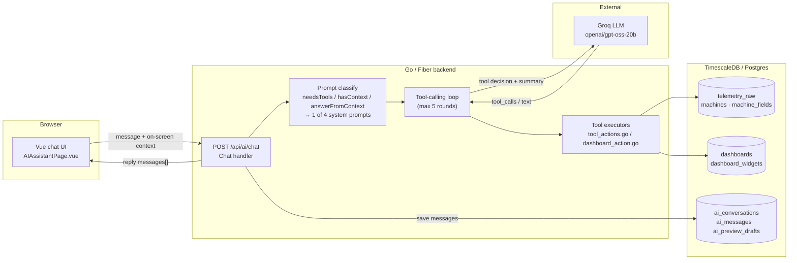
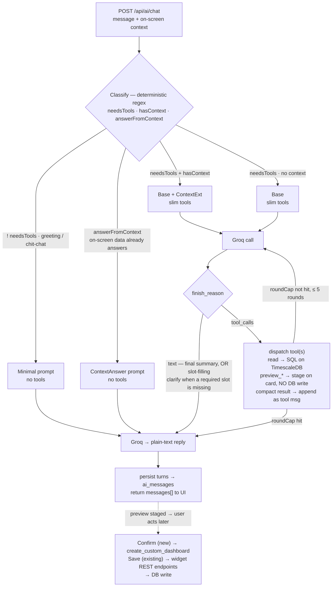
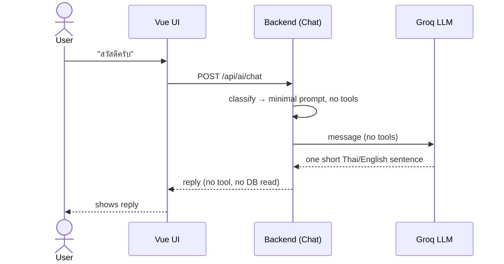
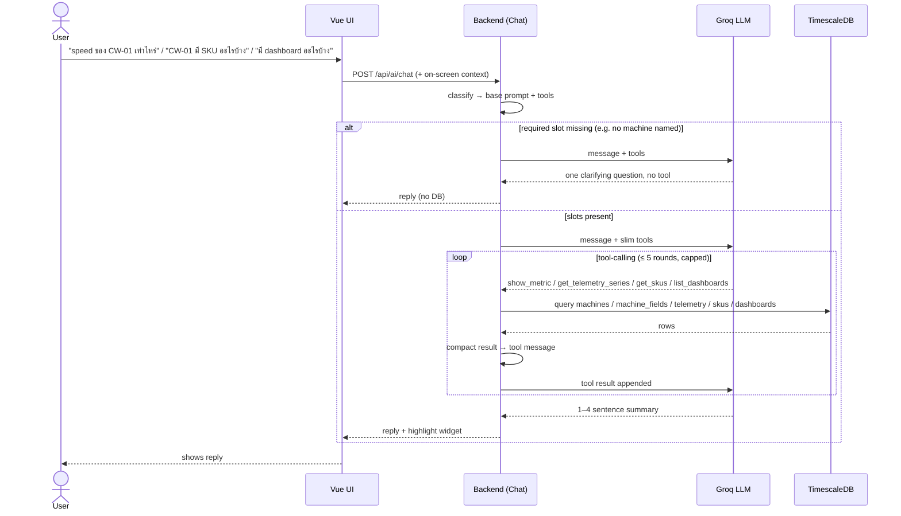
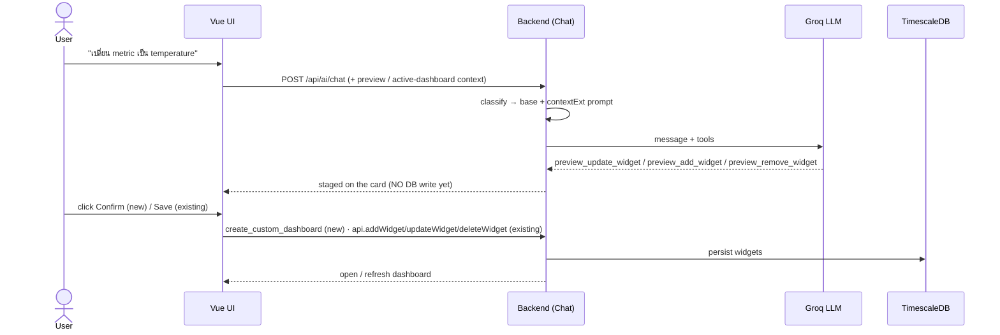
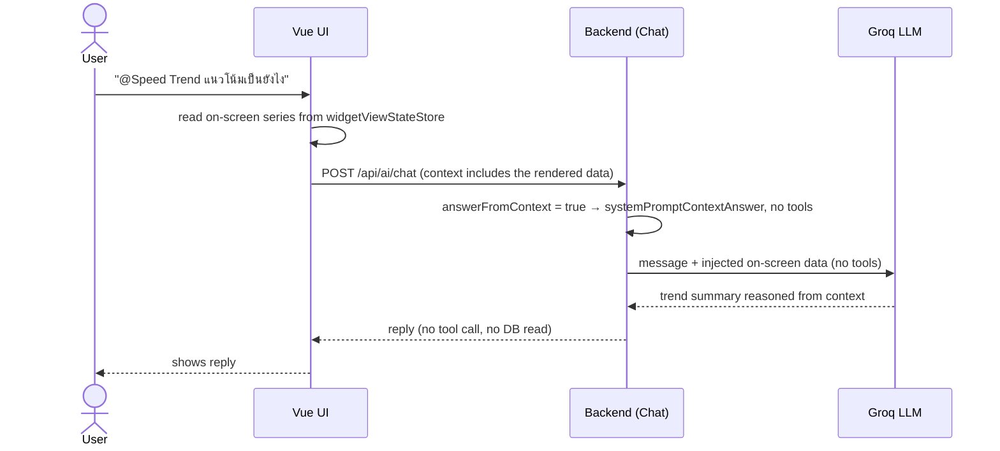

# IotVision AI Assistant — Architecture, Workflow & Model Choice

The AI assistant lets a factory operator talk to IotVision in plain Thai or English
("speed ของ CW-01 เท่าไหร่", "สร้าง dashboard ของ CW-01") to read live telemetry and
build dashboards. It is a **tool-calling LLM agent**: the model decides *what the user
wants*, the backend runs real database queries as tools, and the model turns the results
into a short natural reply.

All references below point at the real code under `backend/internal/modules/ai/`.

---

## 1. AI Architecture

### Components

| Layer | What | Where |
|-------|------|-------|
| **UI** | Vue 3 chat page; sends the message plus the on-screen dashboard/widget context | `frontend/src/pages/AIAssistantPage.vue`, `frontend/src/services/api.service.ts` |
| **API / Backend** | Fiber routes under `/api/ai` (JWT-gated); the `Chat` handler orchestrates the tool loop | `routes.go`, `controller.go` |
| **Tool layer** | read / preview / write tools exposed to the model (`AllTools()`); a dispatch switch runs each against the DB | `schema.go`, `tool_actions.go`, `dashboard_action.go` |
| **LLM (external)** | Groq, OpenAI-compatible chat-completions API | `https://api.groq.com/openai/v1/chat/completions`, model `openai/gpt-oss-20b` |
| **Database** | TimescaleDB / Postgres — telemetry + dashboards + AI conversation history | shared `database.Pool` |

**External services / secrets:** the only AI secret is `GROQ_API_KEY` (`config/env.go`).
The model id itself is a hardcoded constant (`controller.go:25`), not an environment
variable. If the key is empty the endpoint returns `503 AI_UNAVAILABLE`.

### Tool catalog

`AllTools()` (`schema.go:194`) hands the model the read / preview / write tools below.
Write tools require admin/editor (`writeTools`, `schema.go:214`); preview tools are only
sent when a dashboard context is present. `create_custom_dashboard` is deliberately **not**
in `AllTools()` — the UI calls it directly via `POST /api/ai/tools/execute` only after the
user clicks Confirm.

| Tool | What it does | Group | Flow |
|------|--------------|-------|------|
| `get_machines` | List machines (name, type, status, numeric field keys) | read | 2b |
| `show_metric` | Resolve a machine + metric to a widget spec / current value | read | 2b |
| `get_telemetry_trend` | avg / min / max over a time range | read | 2b |
| `get_telemetry_series` | Time-bucketed series (what a line chart shows) | read | 2b / 2d |
| `get_production_count` | Bucketed piece counts (daily-count widget) | read | 2b |
| `get_skus` | Distinct SKU values for a machine | read | 2b |
| `list_dashboards` | Dashboards with names + widget counts | read | 2b |
| `preview_dashboard` | Build a preview plan from a template (no DB write) | preview | 2c |
| `preview_add_widget` | Stage a widget onto the preview / open active dashboard (no DB write) | preview | 2c |
| `preview_update_widget` | Stage an edit (rename / metric / bucket / …) on the preview / active dashboard | preview | 2c |
| `preview_remove_widget` | Stage a widget removal from the preview / active dashboard | preview | 2c |
| `create_custom_dashboard` | Persist a confirmed preview as a new dashboard (frontend-only, post-Confirm) | write | 2c |

### Data flow

1. The browser POSTs `{ conversationId, message, context }` to `POST /api/ai/chat`
   (120 s client timeout).
2. The backend classifies the request, picks a system prompt, and calls Groq with the
   message history + a **slimmed tool catalog**.
3. When Groq asks for a tool, the backend runs the corresponding SQL against TimescaleDB,
   compacts the result, and feeds it back to Groq.
4. Groq produces a final natural-language reply; the backend persists the new messages and
   returns them to the UI.

Groq calls are **non-streaming** (single POST, whole body read), sent with
`reasoning_format: hidden`. A 429 whose wait is short (≤ 3 s) is retried silently up to 3×;
a longer wait (capped at 30 s by `parseRetryAfter`, `controller.go:688-707`) aborts instead and
surfaces to the UI as HTTP 429 `RATE_LIMIT` with a `retryAfter` hint (`rateLimitError`,
`controller.go:447-451,649-655`) so the user is told to retry rather than sitting on a hung request.

The on-screen preview / selected Active dashboard is also persisted per user in
`ai_preview_drafts` (`GET/PUT/DELETE /api/ai/preview-draft`, `PUT /api/ai/selected-dashboard` —
`repository.go:113-170`) so it survives a page refresh; this is UI view-state plumbing, not part
of the LLM loop.

### Architecture diagram



### System-prompt strategy

Routing is **deterministic keyword matching**, not a semantic/LLM router — the classifier is
pure regex over the message + a `strings.Contains` on the context (`controller.go:714-733`).
There is no "ask the model what it needs" step; the prompt is chosen before Groq is called.

The core principle is **pay only the tokens a message actually needs.** The system prompt is
built in **layers** and only the necessary ones are assembled (`controller.go:388-395`):

| Layer | Const | Sent when | Carries |
|-------|-------|-----------|---------|
| **Minimal** | `systemPromptMinimal` | `needsTools == false` (greeting / chit-chat) | identity + language rule + "one short sentence" only |
| **Base** | `systemPromptBase` | always (default actionable path) | `TOOL SELECTION` + `SLOT FILLING` + `WIDGET TYPES` rules |
| **+ ContextExt** | `systemPromptBase + systemPromptContextExt` | `needsTools && hasContext && !answerFromContext` | Base **plus** preview-staging + `@Widget`/`[FOCUSED]` routing rules |
| **ContextAnswer** | `systemPromptContextAnswer` | `answerFromContext` (on-screen data answers) | identity + language + *"Do NOT call any tool; answer from context"* |

**Selection inputs** (all deterministic):
- `needsToolsFlag = needsTools(msg)` — regex for metric/action keywords or an `@` mention (`:714`).
- `hasContext = body.Context != ""` — a dashboard/preview snapshot was sent.
- `answerFromContext = inlineData || contextRead` — either the focused chart's series was inlined
  (`"on-screen data"` in context) **or** an `@`-focused read that isn't an edit/range/SKU
  (`editRe`/`rangeRe`/`skuRe`, `:728-733`).

**Why layered.** The full `TOOL SELECTION` / `SLOT FILLING` / `WIDGET` rules are dead weight without
tools, so a bare greeting drops them (~300 tokens saved). The preview/`CONTEXT` rules are useless
with no dashboard open, so they're only appended when `hasContext` (~100 tokens saved). `Base` is
kept **byte-stable** so Groq's prompt cache reuses the prefix across turns.

**Token techniques that ride along** (all in service of the 8k-tokens/min Groq budget):
- **Slim tool schemas** — simple tools send name + description only (arg hints embedded), full JSON
  schema only for widget-nested tools (`toGroqToolSlim`, `:539`); ~50–80 tokens/tool.
- **Context injected last** — the authoritative dashboard state is appended *after* history so
  recency makes it win over any stale earlier turn (`:401-404`).
- **Round cap** — a focused `@widget` question gets 0 extra tool rounds, others 1, because each
  round re-sends the ~3k context block (`:504-510`).
- **History trimmed to the last few turns**, past tool payloads not replayed (the prior summary
  already captured them).

---

## 2. AI Workflow

How the architecture actually operates, per request. The stages map onto the classic
`User Request → Intent Detection → Tool Selection → Data Retrieval → LLM Reasoning →
Dashboard Generation → User Feedback` shape, driven by `Chat` in `controller.go`
(≈ lines 332–514).

1. **User Request** — the UI sends the message plus a serialized snapshot of the
   on-screen dashboard/preview/focused widget (`buildDashboardContext`). For analytical
   questions about a focused chart it even inlines the rendered data series, so the model
   can answer without a second fetch.
2. **Intent Detection** — the backend computes `needsTools`, `answerFromContext`, and
   `hasContext`, then selects **one of four system prompts**:
   `minimal` (greeting/chit-chat), `contextAnswer` (the on-screen data already answers),
   `base` (default actionable rules), or `base + contextExt` (preview-editing rules added).
   This is where a bare "สวัสดีครับ" is routed to a no-tool path and a metric read is
   routed to `show_metric`.
3. **Tool Selection** — Groq's first turn returns either `tool_calls` (e.g.
   `show_metric`, `preview_dashboard`, `get_production_count`) or plain text if no tool is
   needed.
4. **Data Retrieval** — the dispatch switch runs each requested tool against TimescaleDB
   (org-scoped SQL via the domain services). Large series/count results are compacted
   (`compactSeriesResult` / `compactBucketResult`) into column+tuple form to cut tokens,
   then appended back as `tool` messages.
5. **LLM Reasoning** — results are fed back and the model runs again. The loop allows up
   to 5 rounds but a `roundCap` (0 for a focused `@widget` question, 1 otherwise) forces a
   text summary early to stay under Groq's 8k-tokens/min rate limit.
6. **Dashboard Generation** — for create/edit intents the model returns `preview_*`
   specs; the UI **stages** them on the card but writes nothing. A **new** dashboard
   persists only when the user clicks **Confirm** (`POST /api/ai/tools/execute` →
   `create_custom_dashboard`, gated to admin/editor); an **existing** dashboard persists
   only on **Save** (`saveDashboardCard` → the plain widget REST endpoints). The retired
   `add_widget_to_dashboard` / `remove_widget` tools mean the model can never mutate a saved
   dashboard on its own.
7. **User Feedback** — the assistant's reply is shown and the new turns
   (user + tool + assistant) are persisted to `ai_messages`.

### Workflow at a glance

The whole request lifecycle in one picture: deterministic classify → one of four prompts →
(for actionable paths) the tool-calling loop → persist + reply. The four sequence diagrams
below zoom into each branch.



### Sequence diagram

Every request starts the same way — the UI POSTs to `/api/ai/chat`, the backend
classifies intent and picks 1 of 4 system prompts — then follows one of four flow shapes:

- **2a Greeting** — no tool, no DB.
- **2b Read** — any read (metric value/trend, SKUs, dashboard list) → read tool → DB → summary.
- **2c Change / Add / Delete** — stage via `preview_*` → Confirm (new) / Save (existing) → write.
- **2d Answer-from-context** — the on-screen data already answers → no tool, no DB.

One behavior is **not** a separate shape but a **cross-cutting guard**: if a read or an
edit is missing a required slot (which machine? which widget? change it to what?), the
`SLOT FILLING` rules (`controller.go:56-59`) make the model **ask one clarifying question
and call no tool** — e.g. `"speed เท่าไหร่"` (no machine) or `"แก้ให้หน่อย"` (no target).
It applies to both 2b and 2c, so it is shown once as a note rather than its own diagram.

All flows persist the turn to `ai_messages` at the end (omitted from each diagram for
brevity).

#### 2a. Greeting / chit-chat  — `"สวัสดีครับ"`



#### 2b. Read — metric / analytical / list  — `"speed ของ CW-01 เท่าไหร่"`, `"CW-01 มี SKU อะไรบ้าง"`

All reads share one shape — the model picks a **read tool**, the backend queries the DB,
the model summarizes. Only the tool differs by what's asked:
`show_metric` / `get_telemetry_trend` / `get_telemetry_series` (metric value or trend),
`get_production_count` (piece counts), `get_skus` (SKU list), `list_dashboards`,
`get_machines` (machine list). Missing a machine → the clarify guard fires (no tool).



#### 2c. Change / Add / Delete widget  — `"เพิ่ม / ลบ / เปลี่ยน widget"`

"Change a widget" and "edit a widget setting" are the **same** operation here:
`preview_update_widget` patches any of `new_title` (rename), `metric`, `bucket`
(time bucket), `unit`, `min`, `max`, `start_date`/`end_date`, `sku`, `status`, `machine`,
`type`, plus the chart-widget fields `fields` (overlaid metrics), `chartType` (line/bar/area),
`points`, and `scaling` (`schema.go:165-191`). It **stages** the change — on a new preview *or* an open Active
dashboard — and nothing is written until the user clicks Confirm/Save (see "Preview vs
Active dashboard" below).



**Preview vs Active dashboard.** 2c edits two targets, and **both stage first — nothing is
written to the DB until the user acts.** A **preview** is a new, unsaved plan; an **Active
dashboard** is an existing saved one the user opened in the AI page (card `kind: 'dashboard'`,
labelled `"Active dashboard"` — `AIAssistantPage.vue:548`). Chat edits to either use the
same `preview_*` staging tools; the only difference is the persistence action.

| | Preview (new, unsaved) | Active dashboard (existing, saved) |
|---|---|---|
| Card kind | `preview` | `dashboard` |
| Comes from | "สร้าง dashboard" / create flow | selected from the dashboard list into the AI page |
| AI edit tools (chat) | `preview_add_widget` / `preview_update_widget` / `preview_remove_widget` | same `preview_*` tools |
| Edit a widget's settings? | ✅ `preview_update_widget` | ✅ `preview_update_widget` |
| DB write | on **Confirm** → `create_custom_dashboard` | on **Save** → `saveDashboardCard` diffs via `api.addWidget/updateWidget/deleteWidget` |

There is **no immediate-write path** anymore: the old `add_widget_to_dashboard` /
`remove_widget` tools (which wrote on the spot) have been retired, so a chat request can
never mutate a saved dashboard before Save. If the dashboard the user names isn't the one
open on screen, the model asks them to open it first (`controller.go` `systemPromptBase`),
and writes nothing.

The card's **"+ Add widget" button** is the manual counterpart: it calls the frontend
`addPreviewWidget` (stages in memory) and also persists only on **Save** — same guarantee as
the chat path.

#### 2d. Answer from context — no tool, no DB  — `"@Speed Trend แนวโน้มเป็นยังไง"`

The difference from 2b is **not** "is a widget focused" — it is **"is the answer already
on screen."** The backend sets `answerFromContext` (`controller.go:376-384`) when either
`inlineData` (an analytical question whose focused chart's rendered series the UI inlined
as `"on-screen data"`) **or** `contextRead` (an `@`-focused plain current-value/config
question) holds. It then selects `systemPromptContextAnswer` — *"Do NOT call any tool"* —
and the model answers from the injected context, skipping the redundant fetch-then-
summarize round (a token + rate-limit optimization).

Guardrails: an `@`-focus alone does **not** force this path. If the focused question is an
**edit** (`editRe`) it goes to 2c; if it asks a **range/aggregate** (`rangeRe`) or **SKU**
(`skuRe`) not shown on screen, it falls back to the 2b tool path to fetch the data.



---

## 3. AI Model Comparison

The model choice is **data-driven**: the repo contains a bake-off harness,
`eval_test.go` (`TestBakeOff`), that runs **23 Thai-first intent cases** (greeting / reads /
change-add-delete / slot-fill traps / focused-widget routing) against the candidate Groq models
and auto-scores each model's **first decision** — the tool it picks, or `""` for a correct
no-tool reply (`got == want`). First-decision accuracy is the metric that matters here,
because "understand what the user wants" *is* the assistant's hard problem; the rest is
deterministic SQL. Run it with:

```
GROQ_API_KEY=… go test ./internal/modules/ai/ -run TestBakeOff -v -count=1 -timeout 1800s
```

`-count=1` is required: the test hits the live API, but Go caches test results per unchanged
package, so a re-run without it just replays the previous scoreboard instead of calling Groq.

The harness sleeps **10 s between cases** and **120 s between models** so the shared
8k-tokens/min Groq budget recovers before each model starts. It times **only the successful
HTTP round** of each call — `callGroqModel` returns that duration, so the internal 3× 429 retry
sleeps are *excluded* and the reported **median latency reflects model compute, not rate-limit
backoff**. A full run is ~20 min.

### Candidates and results

Measured on the live Groq API (run of 2026-07-06, 23 cases, `-count=1`, 10 s inter-case + 120 s
inter-model throttle; scoreboard printed by the harness). **Rate-limited cases (⏳) are excluded
from the denominator, not counted as failures**, so sample sizes differ. This is the first run
of the **reworked suite**: 5 redundant easy dupes were trimmed and **7 harder discriminators**
added — `all-metrics` (→ `get_machines`, not `show_metric`), `active-alerts`, an `alert-rule-trap`
(rule management → plain-text redirect, **no tool**), three focused-widget routing traps
(`get_telemetry_series` / `get_production_count` / `get_active_alerts` by widget type, where a
weak model defaults to `show_metric`), and a `compound-read-write` (serve the read first). **All 7
passed on both gpt-oss models.** The only gpt-oss miss was `120b` on `change-preview-edit`
(→ `preview_dashboard`), a case `20b` passed — free-tier run-to-run non-determinism (the prior run
`120b` instead missed `delete-preview-widget`), not a systematic weakness, and non-destructive.
`qwen` lost 10/23 to rate limits.

| Model | Score | Completed / 23 | Avg prompt tok | Median latency | Verdict |
|-------|-------|----------------|----------------|----------------|---------|
| `qwen/qwen3-32b` | **13 / 13** | 13 (10 ⏳) | ~3,282 | ~0.90 s | **replaced** — heaviest tokens, most rate-limited (completed only 13) |
| `openai/gpt-oss-20b` | **23 / 23** | 23 (0 ⏳) | ~2,697 | **~0.83 s** | **live** (`controller.go:25`) — cheapest + fastest; perfect this run |
| `openai/gpt-oss-120b` | **21 / 22** | 22 (1 ⏳) | ~2,698 | ~0.92 s | step-up; 1 nondeterministic preview miss, no accuracy edge |

#### Full per-case results

`✅` = picked the expected first tool (or correctly answered with no tool); `❌` = wrong
decision (shown); `⏳` = case lost to a rate limit, excluded from the denominator. Cases 4, 15, 16
and 20–23 are the **new hard discriminators**. `20b` is clean (23/23); `120b`'s only miss is #6.

| # | Case | Expected | qwen3-32b | gpt-oss-20b | gpt-oss-120b |
|---|------|----------|-----------|-------------|--------------|
| 1 | greeting | (no tool) | ✅ | ✅ | ✅ |
| 2 | read-speed | `show_metric` | ✅ | ✅ | ✅ |
| 3 | english-read | `show_metric` | ⏳ | ✅ | ✅ |
| 4 | all-metrics | `get_machines` | ✅ | ✅ | ✅ |
| 5 | detail-analytical-focused | `get_telemetry_series` | ⏳ | ✅ | ✅ |
| 6 | change-preview-edit | `preview_update_widget` | ✅ | ✅ | ❌ `preview_dashboard` |
| 7 | add-preview-widget | `preview_add_widget` | ⏳ | ✅ | ✅ |
| 8 | delete-preview-widget | `preview_remove_widget` | ✅ | ✅ | ✅ |
| 9 | add-to-active-dashboard | `preview_add_widget` | ✅ | ✅ | ✅ |
| 10 | remove-from-active-dashboard | `preview_remove_widget` | ⏳ | ✅ | ✅ |
| 11 | add-custom-chart | `preview_add_widget` | ✅ | ✅ | ✅ |
| 12 | create | `preview_dashboard` | ⏳ | ✅ | ✅ |
| 13 | list-dashboards | `list_dashboards` | ✅ | ✅ | ✅ |
| 14 | list-skus | `get_skus` | ⏳ | ✅ | ⏳ |
| 15 | active-alerts | `get_active_alerts` | ✅ | ✅ | ✅ |
| 16 | alert-rule-trap | (no tool) | ⏳ | ✅ | ✅ |
| 17 | trap-action-but-read | `get_machines` | ✅ | ✅ | ✅ |
| 18 | ambiguous-fix | (no tool) | ✅ | ✅ | ✅ |
| 19 | read-no-machine | (no tool) | ⏳ | ✅ | ✅ |
| 20 | focused-gauge-analytical | `get_telemetry_series` | ✅ | ✅ | ✅ |
| 21 | focused-count-now | `get_production_count` | ⏳ | ✅ | ✅ |
| 22 | focused-alarm-panel | `get_active_alerts` | ✅ | ✅ | ✅ |
| 23 | compound-read-write | `show_metric` | ⏳ | ✅ | ✅ |

Reading the results — three things stand out this run:
- **The harder cases did not separate the gpt-oss pair.** All 7 new discriminators (all-metrics,
  active-alerts, the alert-rule redirect, the three focused-widget routing traps, and the compound
  read+write) routed correctly on both `20b` and `120b`. The cases the suite was toughened to catch —
  where a weak model defaults to `show_metric` or reaches for a write tool — are handled cleanly.
  **Accuracy alone no longer discriminates; latency and rate-limit survival do.**
- **`120b`'s single miss is run-to-run noise, not a pattern.** It mis-routed #6
  (`change-preview-edit` → `preview_dashboard`); `20b` got it right. In the prior run `120b` instead
  missed `delete-preview-widget` and passed #6 — the slip shuffles between `preview_*` cases at
  temperature, and is non-destructive (a preview writes nothing).
- **Latency is now clean.** With the 429 retry sleeps excluded from timing, all three sit at
  ~0.83–0.92 s median — real model-decision speed. `20b` is quickest (~0.83 s). The old "mean
  inflated to 3–4 s by backoff" caveat is gone: backoff is no longer inside the timed window.

Net: no *dangerous* actions from any model. First-decision accuracy is ~100% on completed cases
for both gpt-oss models; the one residual miss shuffles between `preview_*` cases run-to-run rather
than concentrating on one hard case. `20b` stays the cheapest and fastest; `120b` buys no
measurable accuracy edge.

### The requested axes

- **Quality** — the differentiator is not whether a model *can* call functions (all three
  can) but whether it picks the *correct* tool on a Thai sentence the first time. This run
  `20b` scored **23/23**, `120b` **21/22** (one nondeterministic `preview_*` slip), and `qwen`
  **13/13** on the cases it completed. Every new hard case — the count-widget/analytical routing
  traps, the alert-rule redirect, the all-metrics fan-out — routed correctly on both gpt-oss
  models. Raw accuracy no longer separates `20b` from `120b`; both are effectively saturated on
  first-decision tool choice.
- **Cost** — `gpt-oss-20b` has the smallest prompts (~2,697 vs ~3,282 tokens for qwen) and
  is the cheapest per token; because the large `base` prompt prefix stays byte-stable, Groq's
  prompt cache is reused across turns, cutting effective input cost further. Qwen's larger prompts
  also made it the biggest free-tier rate-limit victim in the run (10/23 cases lost).
- **Latency** — the harness times **only the successful HTTP round** of each `callGroqModel`
  (the returned duration), so 429 retry sleeps no longer pollute the number. **Median first-decision
  latency is ~0.83 s for `20b`, ~0.92 s for `120b`, ~0.90 s for `qwen`** — all fast for a
  single-turn tool decision, and `20b` is the quickest. (Before this fix the per-model *mean* read
  3–4 s because a few calls absorbed a 429 backoff *inside* the timed window; excluding the sleep
  removed that artifact.) Calls are non-streaming with a 90 s client timeout; short 429 waits
  (≤ 3 s) retry silently up to 3×, longer ones surface to the UI as a 429 with a `retryAfter`
  hint (`parseRetryAfter`). To stay under Groq's 8k-tokens/min limit the backend replays only the
  **last 3 turns**, sends **slim tool schemas** (name + description for simple tools, full schema
  only for widget-nested ones), and caps tool rounds — all of which also reduce per-request latency.
- **Context window** — the Groq `gpt-oss` family offers a long context, but the design
  deliberately does **not** rely on it: history is trimmed to 3 turns and past tool
  payloads are not replayed (the assistant's prior summary already captured them), so the
  effective prompt stays small and cache-friendly.
- **Tool calling** — all candidates support OpenAI-compatible function calling, which is
  why the OpenAI-compatible Groq endpoint is used unchanged.

### Decision (applied)

The decision stands after this run (2026-07-06), now with no systematic weakness surfaced:

- The live constant (`controller.go:25`) runs **`openai/gpt-oss-20b`**. With the direct-write
  tools retired, the case for `20b` rests on **cost, cache-friendliness, and speed** — cheapest
  per token, prompt-cache-friendly, and the fastest median first-decision latency (~0.83 s). This
  run it scored a clean **23/23**, including all 7 new hard discriminators. `120b` buys no accuracy
  edge (21/22, one nondeterministic slip) and is slightly slower, so paying for the larger model is
  not justified by the data.
- **No single hard case defeats the gpt-oss pair.** The toughened suite targets the boundaries a
  weak model slips on — analytical-vs-current-value reads, count-widget routing, an action-looking
  request that is really a text redirect — and both models handle them. The only residual misses
  are nondeterministic `preview_*` slips that shuffle between cases run-to-run, all non-destructive
  (a preview writes nothing; nothing persists until the user clicks Save/Confirm).
- The "ask the user to open the dashboard" rule in `systemPromptBase` is **scoped** to fire only
  when no preview/Active-dashboard context is on screen. The preview/active-edit cases (#7–#12) all
  routed correctly on `20b` this run, so that scoping holds.
- The suite no longer discriminates on accuracy alone — both gpt-oss models are saturated on
  first-decision tool choice. If a future run needs to separate them, the next lever is
  **argument-level** scoring (right `metric` vs `viz`, correct `bucket`), which the current
  name-only `got == want` check does not inspect.

> Reproduce: `GROQ_API_KEY=… go test ./internal/modules/ai/ -run TestBakeOff -v -count=1 -timeout 1800s`
> (~20 min). `-count=1` is mandatory — without it Go replays the cached scoreboard instead of
> calling the live API. The harness sleeps 10 s between cases and 120 s between models, and times
> only the successful HTTP round of each call (429 retry sleeps excluded). Because it hits the live
> free-tier API, some cases can still be lost to rate limits on any given run (they are skipped, not
> failed) — for a clean denominator, re-run or raise the inter-case `time.Sleep`.
> Exact model spec numbers (parameter counts, per-token pricing, hard context-window token
> limits) are per Groq's published docs; the ranking here rests on this in-repo bake-off.
