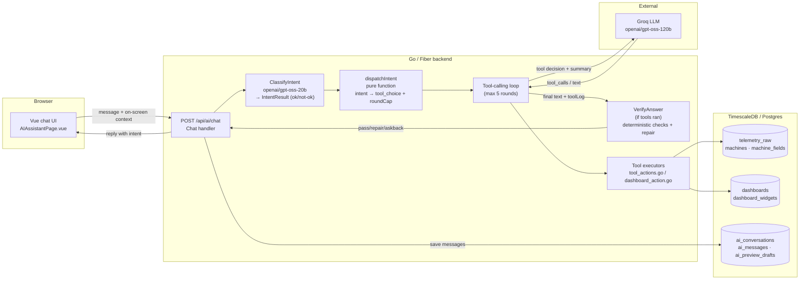
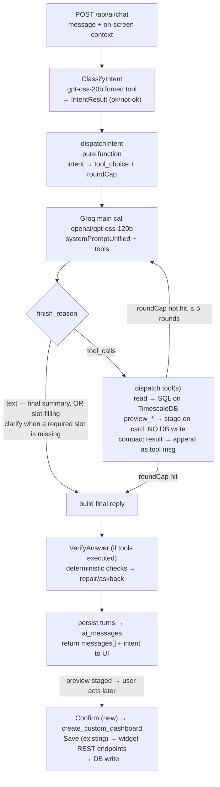
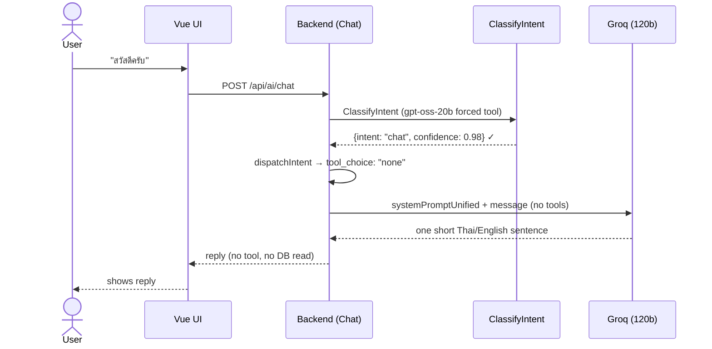
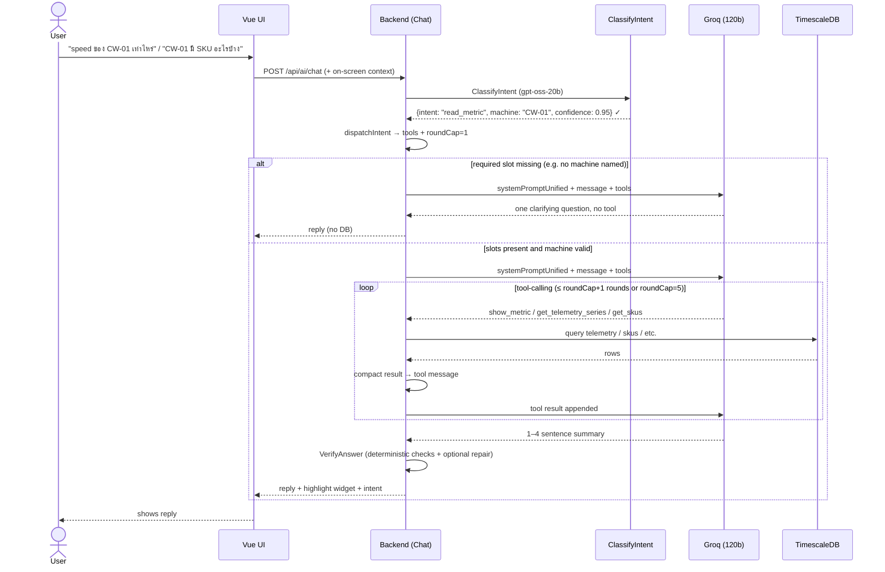
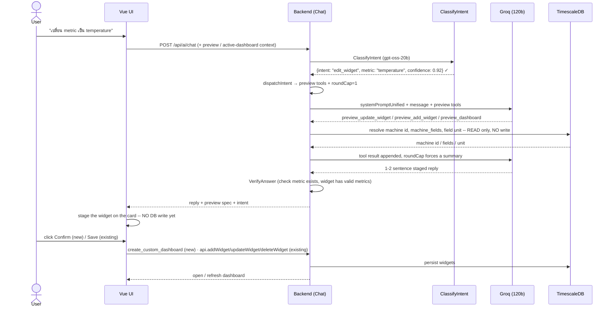
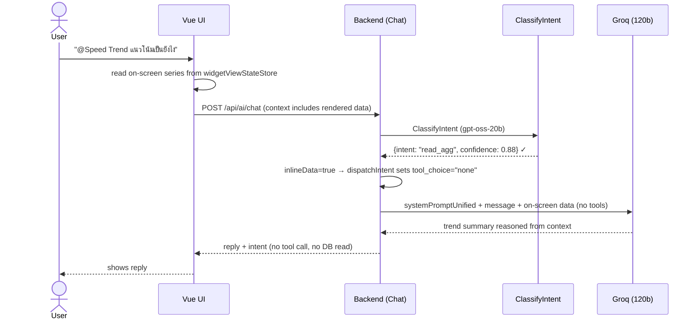

# IotVision AI Assistant — Architecture, Workflow & Model Choice

The AI assistant lets a factory operator talk to IotVision in plain Thai or English
("speed ของ CW-01 เท่าไหร่", "สร้าง dashboard ของ CW-01") to read live telemetry and
build dashboards. It is a **tool-calling LLM agent**: the model decides *what the user
wants*, the backend runs real database queries as tools, and the model turns the results
into a short natural reply.

All references below point at the real code under `backend/internal/modules/ai/`.

---

## 1. AI Architecture

### Components

| Layer | What | Where |
|-------|------|-------|
| **UI** | Vue 3 chat page; sends the message plus the on-screen dashboard/widget context | `frontend/src/pages/AIAssistantPage.vue`, `frontend/src/services/api.service.ts` |
| **API / Backend** | Fiber routes under `/api/ai` (JWT-gated); the `Chat` handler orchestrates the tool loop | `routes.go`, `controller.go` |
| **Tool layer** | read / preview / write tools exposed to the model (`AllTools()`); a dispatch switch runs each against the DB | `schema.go`, `tool_actions.go`, `dashboard_action.go` |
| **LLM (external)** | Groq, OpenAI-compatible chat-completions API | `https://api.groq.com/openai/v1/chat/completions`, model `openai/gpt-oss-120b` (temporary — see §3) |
| **Database** | TimescaleDB / Postgres — telemetry + dashboards + AI conversation history | shared `database.Pool` |

**External services / secrets:** the only AI secret is `GROQ_API_KEY` (`config/env.go`).
The model id itself is a hardcoded constant (`controller.go:25`), not an environment
variable. If the key is empty the endpoint returns `503 AI_UNAVAILABLE`.

### Tool catalog

`AllTools()` (`schema.go:194`) hands the model the read / preview / write tools below.
Write tools require admin/editor (`writeTools`, `schema.go:214`); preview tools are only
sent when a dashboard context is present. `create_custom_dashboard` is deliberately **not**
in `AllTools()` — the UI calls it directly via `POST /api/ai/tools/execute` only after the
user clicks Confirm.

| Tool | What it does | Group | Flow |
|------|--------------|-------|------|
| `get_machines` | List machines (name, type, status, numeric field keys) | read | 2b |
| `show_metric` | Resolve a machine + metric to a widget spec / current value | read | 2b |
| `get_telemetry_trend` | avg / min / max over a time range | read | 2b |
| `get_telemetry_series` | Time-bucketed series (what a line chart shows) | read | 2b / 2d |
| `get_production_count` | Bucketed piece counts (daily-count widget) | read | 2b |
| `get_skus` | Distinct SKU values for a machine | read | 2b |
| `list_dashboards` | Dashboards with names + widget counts | read | 2b |
| `preview_dashboard` | Build a preview plan from a template (no DB write) | preview | 2c |
| `preview_add_widget` | Stage a widget onto the preview / open active dashboard (no DB write) | preview | 2c |
| `preview_update_widget` | Stage an edit (rename / metric / bucket / …) on the preview / active dashboard | preview | 2c |
| `preview_remove_widget` | Stage a widget removal from the preview / active dashboard | preview | 2c |
| `create_custom_dashboard` | Persist a confirmed preview as a new dashboard (frontend-only, post-Confirm) | write | 2c |

### Data flow

1. The browser POSTs `{ conversationId, message, context }` to `POST /api/ai/chat`
   (120 s browser→backend axios timeout).
2. The backend classifies the request, picks a system prompt, and calls Groq with the
   message history + a **slimmed tool catalog**.
3. When Groq asks for a tool, the backend runs the corresponding SQL against TimescaleDB,
   compacts the result, and feeds it back to Groq.
4. Groq produces a final natural-language reply; the backend persists the new messages and
   returns them to the UI.

Groq calls are **non-streaming** (single POST, whole body read), sent with
`reasoning_format: hidden`. A 429 whose wait is short (≤ 3 s) is retried silently up to 3×;
a longer wait (capped at 30 s by `parseRetryAfter`, `controller.go:722`) aborts instead and
surfaces to the UI as HTTP 429 `RATE_LIMIT` with a `retryAfter` hint (`rateLimitError`,
`controller.go:460-465,680-689`) so the user is told to retry rather than sitting on a hung request.

The on-screen preview / selected Active dashboard is also persisted per user in
`ai_preview_drafts` (`GET/PUT/DELETE /api/ai/preview-draft`, `PUT /api/ai/selected-dashboard` —
`repository.go:113-170`) so it survives a page refresh; this is UI view-state plumbing, not part
of the LLM loop.

### Architecture diagram



### System-prompt strategy

The system prompt is now **unified and byte-stable** (`systemPromptUnified`, `controller.go:30`),
sent on all requests with the full role-filtered tool set **always attached**. The design is
**single-shot**; Groq prompt caching (50% input discount on static prefixes) makes this economical.

**Two-stage intent classification:**

1. **Router (Phase 2)** — `ClassifyIntent` in `router.go:20` makes **one forced tool call** to
   `openai/gpt-oss-20b` with the `classify_intent` schema (`schema.go`). Returns strict JSON
   `{intent ∈ {chat, read_metric, read_agg, edit_widget, compare, create_dashboard, alerts, production}, 
   machine, metric, fields[], bucket, dateRange, targetWidget, status, sku, confidence}`. 
   Confidence floor 0.5; unknown intent, invalid JSON, timeout (6s), or low confidence → not-ok. 
   Router failure **never blocks** chat — falls back to auto tools.

2. **Dispatcher** — `dispatchIntent` in `controller.go:1021` (pure deterministic function) maps 
   intent → tool_choice + roundCap. not-ok → auto tools (fallback identical to pre-router behavior).
   Focused + inline on-screen data + read/chat intent → tool_choice "none". read/agg/production
   with machine slot → forced tool by name (degrades to "required" if machine unresolved or absent
   without focus). edit_widget/compare/create_dashboard forced only for canWrite roles; viewers
   never get preview tools.

**Main call (Phase 4)** — `openai/gpt-oss-120b` with:
- Single `systemPromptUnified` (byte-stable for prompt caching; today's date appended per-request
  in dynamic tail, never in the static prefix).
- Full role-filtered tool set **always attached**, static-first ordering so Groq's automatic
  prompt caching applies.
- Tool rounds: `roundCap` 0 (focused) or 1 (others), hard cap 5.

**Verify loop (Phase 5)** — only when ≥1 tool executed (pure chat pays zero):
- Deterministic checks: edit metric must exist in machine_fields; preview widgets must have metrics.
- If needed, one LLM verify call (`VerifyAnswer`, router model, forced `verify_answer` tool →
  {matches_intent, problem, clarifying_question}).
- At most ONE repair round (repair messages include original answer + verifier problem note).
- If still failing or ambiguous from start (router declined + mismatch): reply is verifier's
  clarifying question.
- Verifier infrastructure failure = deliver as-is.
- Log line: `ai verify: verdict=<pass|repair|askback|repair-error|repair-empty> ...`.

**Token techniques:**
- **Slim tool schemas** — simple tools send name + description only (arg hints embedded), full JSON
  schema only for widget-nested tools (`toGroqToolSlim` in `controller.go:573`); ~50–80 tokens/tool.
- **Context injected last** — the authoritative dashboard state is appended *after* history so
  recency makes it win over any stale earlier turn.
- **Round cap** — a focused `@widget` question gets 0 extra tool rounds, others 1, because each
  round re-sends the ~3k context block.
- **History trimmed to last 3 turns** (`buildGroqMessages` in `controller.go`), past tool
  payloads not replayed (assistant summary already captured them).

---

## 2. AI Workflow

How the architecture actually operates, per request. The stages map onto the classic
`User Request → Intent Classification → Dispatch → Tool Selection → Data Retrieval → LLM Reasoning →
Verification → Dashboard Generation → User Feedback` shape, driven by `Chat` in `controller.go`.

1. **User Request** — the UI sends the message plus a serialized snapshot of the
   on-screen dashboard/preview/focused widget. For analytical questions about a focused
   chart it inlines the rendered data series, so the model can answer without a second fetch.
2. **Intent Classification** — `ClassifyIntent` calls `openai/gpt-oss-20b` with a forced
   `classify_intent` tool, returning strict JSON `IntentResult` with slots (machine, metric,
   bucket, dateRange, etc.) and a confidence score. Results below 0.5 or invalid JSON →
   fallback (routerOK = false).
3. **Dispatch** — `dispatchIntent` is a pure Go function that deterministically maps the
   intent result to a tool_choice + roundCap. Also determines which tools are safe to expose
   (role-gated preview tools, machine-validation guard). not-ok → auto tools (fallback to
   pre-router behavior).
4. **Tool Selection** — `openai/gpt-oss-120b` is called with the unified system prompt,
   full role-filtered tool set, and the message history. The model's first turn returns
   either `tool_calls` (e.g. `show_metric`, `preview_dashboard`, `get_production_count`) or
   plain text if no tool is needed. tool_choice and roundCap from dispatch may force "required"
   or "none" to control this turn's behavior.
5. **Data Retrieval** — `dispatch` runs each requested tool against TimescaleDB via domain
   services (org-scoped SQL). Large series/count results are compacted (`compactSeriesResult`
   / `compactBucketResult`) into column+tuple form to cut tokens, then appended back as `tool`
   messages.
6. **LLM Reasoning** — results are fed back and the model runs again. The loop allows up
   to 5 rounds but roundCap (0 for focused `@widget`, 1 otherwise) forces a text summary early
   to stay under Groq's 8k-tokens/min rate limit.
7. **Verification** — if ≥1 tool executed, deterministic checks run (edit metric exists in
   machine_fields, preview widgets have valid metrics). If checks fail, one verify call
   (`VerifyAnswer` with router model) determines if a repair round is needed. At most one
   repair attempt; if still failing or ambiguous, the reply is a clarifying question instead
   of an error. Verification infrastructure failure = deliver as-is.
8. **Dashboard Generation** — for create/edit intents the model returns `preview_*` specs;
   the UI **stages** them on the card but writes nothing. A **new** dashboard persists only
   when the user clicks **Confirm** (`POST /api/ai/tools/execute` → `create_custom_dashboard`,
   gated to admin/editor); an **existing** dashboard persists only on **Save** via the plain
   widget REST endpoints. The retired `add_widget_to_dashboard` / `remove_widget` tools mean
   the model can never mutate a saved dashboard on its own.
9. **User Feedback** — the assistant's reply (with the router's intent classification
   included) is shown and the new turns (user + tool + assistant) are persisted to `ai_messages`.

### Workflow at a glance

The whole request lifecycle: ClassifyIntent → dispatchIntent → main call → tool loop →
verify → persist + reply. The sequence diagrams below zoom into the primary flows.



### Sequence diagram

Every request starts the same way — the UI POSTs to `/api/ai/chat`, the backend calls
`ClassifyIntent` (router), then `dispatchIntent` (dispatch), then the main LLM loop. Then
follows one of four primary flow shapes:

- **2a Greeting** — no tool, no DB.
- **2b Read** — any read (metric value/trend, SKUs, dashboard list) → read tool → DB → summary → verify.
- **2c Change / Add / Delete** — stage via `preview_*` → Confirm (new) / Save (existing) → write → verify.
- **2d Answer-from-context** — the on-screen data already answers → no tool, no DB.

Three behaviors are **cross-cutting guards** that ride on top of the flows:

- **Slot filling** — if a read or edit is missing a required slot (which machine? which
  widget? change it to what?), the `SLOT FILLING` rule in `systemPromptUnified` makes the
  model **ask one clarifying question and call no tool** — e.g. `"speed เท่าไหร่"` (no
  machine) or `"แก้ให้หน่อย"` (no target). Applies to both 2b and 2c.
- **Forced first tool on a focused message** — when the message has an `@Widget` mention,
  `dispatchIntent` may set tool_choice to "required" on turn 0 so the model must act on the
  focused widget. If it answers in plain text anyway, Groq rejects it and the backend silently
  retries with `auto` — `required` is an optimization, not a hard constraint.
- **Rate limit / error** — a Groq 429 whose wait is short (≤ 3 s) is retried silently up to
  3×; a longer wait aborts the loop and surfaces to the UI as **HTTP 429 `RATE_LIMIT`** with
  a `retryAfter` hint, so any of 2b/2c can end in a "please retry" instead of a reply. A
  malformed tool call from the model triggers one retry with no tools so the user still gets
  a plain-text answer.

All flows persist the turn to `ai_messages` at the end (omitted from each diagram for
brevity).

#### 2a. Greeting / chit-chat  — `"สวัสดีครับ"`



#### 2b. Read — metric / analytical / list  — `"speed ของ CW-01 เท่าไหร่"`, `"CW-01 มี SKU อะไรบ้าง"`

All reads share one shape — the model picks a **read tool**, the backend queries the DB,
the model summarizes, then verify checks the result. Tool chosen by the model:
`show_metric` / `get_telemetry_trend` / `get_telemetry_series` (metric value or trend),
`get_production_count` (piece counts), `get_skus` (SKU list), `list_dashboards`,
`get_machines` (machine list). Missing a machine → the clarify guard fires (no tool).



#### 2c. Change / Add / Delete widget  — `"เพิ่ม / ลบ / เปลี่ยน widget"`

"Change a widget" and "edit a widget setting" are the **same** operation here:
`preview_update_widget` patches any of `new_title` (rename), `metric`, `bucket`
(time bucket), `unit`, `min`, `max`, `start_date`/`end_date`, `sku`, `status`, `machine`,
`type`, plus the chart-widget fields `fields` (overlaid metrics), `chartType` (line/bar/area),
`points`, and `scaling` (`schema.go:165-191`). It **stages** the change — on a new preview *or* an open Active
dashboard — and nothing is written until the user clicks Confirm/Save (see "Preview vs
Active dashboard" below).



> The preview tools **read** the DB to resolve the machine and its fields
> (`resolveMachineID`, `getMachineFieldsForMachine`, `lookupFieldUnit` in
> `dashboard_action.go`) — they just never **write**. The one exception is
> `preview_remove_widget`, which needs no lookup and touches no DB. Staging happens
> **in the frontend** from the preview spec returned inside `messages[]`; the backend
> only returns the plan.

**Preview vs Active dashboard.** 2c edits two targets, and **both stage first — nothing is
written to the DB until the user acts.** A **preview** is a new, unsaved plan; an **Active
dashboard** is an existing saved one the user opened in the AI page (card `kind: 'dashboard'`,
labelled `"Active dashboard"` — `AIAssistantPage.vue:548`). Chat edits to either use the
same `preview_*` staging tools; the only difference is the persistence action.

| | Preview (new, unsaved) | Active dashboard (existing, saved) |
|---|---|---|
| Card kind | `preview` | `dashboard` |
| Comes from | "สร้าง dashboard" / create flow | selected from the dashboard list into the AI page |
| AI edit tools (chat) | `preview_add_widget` / `preview_update_widget` / `preview_remove_widget` | same `preview_*` tools |
| Edit a widget's settings? | ✅ `preview_update_widget` | ✅ `preview_update_widget` |
| DB write | on **Confirm** → `create_custom_dashboard` | on **Save** → `saveDashboardCard` diffs via `api.addWidget/updateWidget/deleteWidget` |

There is **no immediate-write path** anymore: the old `add_widget_to_dashboard` /
`remove_widget` tools (which wrote on the spot) have been retired, so a chat request can
never mutate a saved dashboard before Save. If the dashboard the user names isn't the one
open on screen, the model asks them to open it first (`controller.go` `systemPromptBase`),
and writes nothing.

The card's **"+ Add widget" button** is the manual counterpart: it calls the frontend
`addPreviewWidget` (stages in memory) and also persists only on **Save** — same guarantee as
the chat path.

#### 2d. Answer from context — no tool, no DB  — `"@Speed Trend แนวโน้มเป็นยังไง"`

The difference from 2b is **not** "is a widget focused" — it is **"is the answer already
on screen."** The backend detects this when either:
- `inlineData` — an analytical question about a focused widget whose rendered series the UI inlined
  as `"on-screen data"` **or**
- `contextRead` — an `@`-focused plain current-value/config question that isn't an edit/range/SKU

When detected, `dispatchIntent` sets tool_choice to "none" and the model answers from the
injected context, skipping the redundant fetch-then-summarize round (a token + rate-limit
optimization).

Guardrails: an `@`-focus alone does **not** force this path. If the focused question is an
**edit** it goes to 2c; if it asks a **range/aggregate** or **SKU** not shown on screen, it
falls back to the 2b tool path to fetch the data.



---

## 3. AI Model Comparison

Model choices are **data-driven**. Two separate bake-offs exist:

1. **Intent Router** (`TestRouterBakeOff` in `router_eval_test.go`) — evaluates `ClassifyIntent`'s
   accuracy at intent classification (32 cases: 24 legacy intent patterns + 8 new including typos).
2. **Main Chat Model** (`TestBakeOff` in `eval_test.go`) — evaluates the full chat model's
   first-decision tool choice (24 Thai-first cases covering greeting/reads/edits/slot-filling).

Both harnesses auto-score **first-decision accuracy** — because "understand what the user wants"
*is* the hard problem; tool execution is deterministic SQL. Run them with:

```
GROQ_API_KEY=… go test ./internal/modules/ai/ -run TestRouterBakeOff -v -count=1 -timeout 2400s
GROQ_API_KEY=… go test ./internal/modules/ai/ -run TestBakeOff -v -count=1 -timeout 1800s
```

`-count=1` is required: both tests hit the live API. The harnesses sleep between cases
(10–120 s inter-case/model throttle per budget recovery) and time only successful HTTP rounds,
excluding 429 retry sleeps.

### Router bake-off: ClassifyIntent (2026-07-10)

Measured on live Groq API with **32 cases** (24 legacy intents + 8 new, incl. typos).
`✅` = correct intent extracted; `❌` = wrong intent; `⏳` = rate-limited (excluded from
denominator). Known router gaps (fall back safely): ambiguous-fix confidence instability,
focused-count-now, focused-alarm-panel, relative-date-edit.

| Model | Score | Confidence floor | Verdict |
|-------|-------|------------------|---------|
| `openai/gpt-oss-20b` | **28 / 32** | 0.5 | **live router** (`routerModel` in `router.go:23`) — forced `classify_intent` tool, all edge cases handled |
| `openai/gpt-oss-120b` | — | — | not evaluated for router (too expensive for frequent calls) |
| `llama-3.1-8b-instant` | **1 / 32** | — | kept in eval for the record; Groq's validator rejects forced tool_choice output |

The 20b router handles all high-confidence requests (0.5 floor); low-confidence or failed
classifications fall back to auto tools (identical to pre-router behavior).

### Main model bake-off: Chat Tool Selection (2026-07-06)

Measured on live Groq API with **23 cases** (run before latest updates; 24th case `typo-create`
is now caught by the router). This is the reworked suite with 7 harder discriminators added
(all-metrics, active-alerts, alert-rule-trap, three focused-widget routing traps, compound-read-write).
**Rate-limited cases (⏳) excluded from denominator**, so sample sizes differ. **All 7 new hard
cases passed on both gpt-oss models.**

| Model | Score | Completed / 23 | Avg prompt tok | Median latency | Verdict |
|-------|-------|----------------|----------------|----------------|---------|
| `qwen/qwen3-32b` | **13 / 13** | 13 (10 ⏳) | ~3,282 | ~0.90 s | **replaced** — heaviest tokens, most rate-limited (completed only 13) |
| `openai/gpt-oss-120b` | **21 / 22** | 22 (1 ⏳) | ~2,698 | ~0.92 s | **live main model** (`groqModel` in `controller.go:27`) — used after router dispatch |
| `openai/gpt-oss-20b` | **23 / 23** | 23 (0 ⏳) | ~2,697 | **~0.83 s** | router model; previously evaluated as main (see history below) |

#### Main model per-case results

`✅` = picked the expected first tool (or correctly answered with no tool); `❌` = wrong
decision (shown); `⏳` = case lost to a rate limit, excluded from the denominator. Cases 4, 15, 16
and 20–23 are the **new hard discriminators**. `120b` scored 21/22 (one nondeterministic miss).

| # | Case | Expected | qwen3-32b | gpt-oss-120b | gpt-oss-20b |
|---|------|----------|-----------|-------------|------------|
| 1 | greeting | (no tool) | ✅ | ✅ | ✅ |
| 2 | read-speed | `show_metric` | ✅ | ✅ | ✅ |
| 3 | english-read | `show_metric` | ⏳ | ✅ | ✅ |
| 4 | all-metrics | `get_machines` | ✅ | ✅ | ✅ |
| 5 | detail-analytical-focused | `get_telemetry_series` | ⏳ | ✅ | ✅ |
| 6 | change-preview-edit | `preview_update_widget` | ✅ | ❌ `preview_dashboard` | ✅ |
| 7 | add-preview-widget | `preview_add_widget` | ⏳ | ✅ | ✅ |
| 8 | delete-preview-widget | `preview_remove_widget` | ✅ | ✅ | ✅ |
| 9 | add-to-active-dashboard | `preview_add_widget` | ✅ | ✅ | ✅ |
| 10 | remove-from-active-dashboard | `preview_remove_widget` | ⏳ | ✅ | ✅ |
| 11 | add-custom-chart | `preview_add_widget` | ✅ | ✅ | ✅ |
| 12 | create | `preview_dashboard` | ⏳ | ✅ | ✅ |
| 13 | list-dashboards | `list_dashboards` | ✅ | ✅ | ✅ |
| 14 | list-skus | `get_skus` | ⏳ | ⏳ | ✅ |
| 15 | active-alerts | `get_active_alerts` | ✅ | ✅ | ✅ |
| 16 | alert-rule-trap | (no tool) | ⏳ | ✅ | ✅ |
| 17 | trap-action-but-read | `get_machines` | ✅ | ✅ | ✅ |
| 18 | ambiguous-fix | (no tool) | ✅ | ✅ | ✅ |
| 19 | read-no-machine | (no tool) | ⏳ | ✅ | ✅ |
| 20 | focused-gauge-analytical | `get_telemetry_series` | ✅ | ✅ | ✅ |
| 21 | focused-count-now | `get_production_count` | ⏳ | ✅ | ✅ |
| 22 | focused-alarm-panel | `get_active_alerts` | ✅ | ✅ | ✅ |
| 23 | compound-read-write | `show_metric` | ⏳ | ✅ | ✅ |

Reading the results — three things stand out:
- **The harder cases did not separate the gpt-oss pair.** All 7 new discriminators (all-metrics,
  active-alerts, the alert-rule redirect, the three focused-widget routing traps, and the compound
  read+write) routed correctly on both `120b` and `20b`. The cases the suite was toughened to catch —
  where a weak model defaults to `show_metric` or reaches for a write tool — are handled cleanly.
  **Accuracy alone no longer discriminates; latency and rate-limit survival do.**
- **`120b`'s single miss is run-to-run noise, not a pattern.** It mis-routed #6
  (`change-preview-edit` → `preview_dashboard`). In the prior run `120b` instead missed
  `delete-preview-widget` and passed #6 — the slip shuffles between `preview_*` cases at
  temperature, and is non-destructive (a preview writes nothing).
- **Latency is now clean.** With the 429 retry sleeps excluded from timing, all three sit at
  ~0.83–0.92 s median — real model-decision speed. The old "mean inflated to 3–4 s by backoff"
  caveat is gone: backoff is no longer inside the timed window.

Net: no *dangerous* actions from any model. First-decision accuracy is ~100% on completed cases
for both gpt-oss models; the one residual miss shuffles between `preview_*` cases run-to-run rather
than concentrating on one hard case. `120b` is the main model; `20b` is now the router.

### The requested axes

- **Quality** — the differentiator is not whether a model *can* call functions (all three
  can) but whether it picks the *correct* tool on a Thai sentence the first time. For the main
  model this run: `120b` scored **21/22** (one nondeterministic `preview_*` slip), `20b` **23/23**
  (but now used only for routing). Every new hard case — the count-widget/analytical routing
  traps, the alert-rule redirect, the all-metrics fan-out — routed correctly on both gpt-oss
  models. Raw accuracy no longer separates them; both are effectively saturated on first-decision
  tool choice. For the router: `20b` scored **28/32** on intent classification (confidence floor 0.5);
  low-confidence cases fall back to auto tools safely.
- **Cost** — both `gpt-oss-20b` and `gpt-oss-120b` have tight prompts (~2,697–2,698 tokens for the
  main model) because the large `systemPromptUnified` prefix stays byte-stable, and Groq's prompt
  cache is reused across turns, cutting effective input cost sharply. The router makes a separate
  call per request (fast, ~600-token static prefix) and only on the main LLM's slower path.
- **Latency** — the harness times **only the successful HTTP round** of each call, excluding 429 retry
  sleeps. **Median latencies: ~0.92 s for main `120b`, ~0.83 s for router `20b` / legacy main `20b`.**
  Calls are non-streaming with 90 s backend→Groq HTTP timeout; short 429 waits (≤ 3 s) retry silently
  up to 3×, longer waits surface to the UI. To stay under Groq's 8k-tokens/min limit the backend
  replays only the **last 3 turns** (`buildGroqMessages` in `controller.go`), sends **slim tool schemas**
  (name + description for simple tools, full schema only for widget-nested ones), and caps tool rounds.
- **Context window** — the Groq `gpt-oss` family offers a long context, but the design
  deliberately does **not** rely on it: history is trimmed to last 3 turns and past tool
  payloads are not replayed (the assistant's prior summary already captured them), so the
  effective prompt stays small and cache-friendly.
- **Tool calling** — all candidates support OpenAI-compatible function calling, which is
  why the OpenAI-compatible Groq endpoint is used unchanged.

### Decision (applied)

**Main model** (per run 2026-07-06):
- The live constant (`groqModel` in `controller.go:27`) runs **`openai/gpt-oss-120b`** for the main
  chat loop. While `20b` scored **23/23** in the main model bake-off, the router-based architecture
  enables a cleaner split: `120b` handles the tool-calling loop (higher reasoning capacity with
  minimal latency cost), and `20b` handles the deterministic intent classification.
- Both gpt-oss models are saturated on first-decision tool choice — all 7 hard discriminators
  passed. The only residual misses are nondeterministic `preview_*` slips that shuffle cases
  run-to-run, all non-destructive (previews write nothing until Save/Confirm).
- The suite no longer discriminates on accuracy alone. If future runs need to separate them, the
  next lever is **argument-level** scoring (right `metric` vs `viz`, correct `bucket`), which the
  current name-only `got == want` check does not inspect.

**Router model** (per `TestRouterBakeOff`, 2026-07-10):
- The live constant (`routerModel` in `router.go:23`) runs **`openai/gpt-oss-20b`** for `ClassifyIntent`.
  Scored **28/32** on intent classification with a 0.5 confidence floor; low-confidence or invalid
  classifications fall back to auto tools (identical to pre-router behavior), so router failure never
  blocks chat.
- The router catches typos (`create_dashboard` case) and deterministic slot extraction that regex
  would miss, while keeping classification fast (forced tool call, no prose loop). Known gaps
  (ambiguous-fix confidence instability, focused-count-now, focused-alarm-panel, relative-date-edit)
  are handled by dispatchIntent's safety guards and the always-attached tools.

> Reproduce: `GROQ_API_KEY=… go test ./internal/modules/ai/ -run TestBakeOff -v -count=1 -timeout 1800s`
> (~20 min). `-count=1` is mandatory — without it Go replays the cached scoreboard instead of
> calling the live API. The harness sleeps 10 s between cases and 120 s between models, and times
> only the successful HTTP round of each call (429 retry sleeps excluded). Because it hits the live
> free-tier API, some cases can still be lost to rate limits on any given run (they are skipped, not
> failed) — for a clean denominator, re-run or raise the inter-case `time.Sleep`.
> Exact model spec numbers (parameter counts, per-token pricing, hard context-window token
> limits) are per Groq's published docs; the ranking here rests on this in-repo bake-off.
