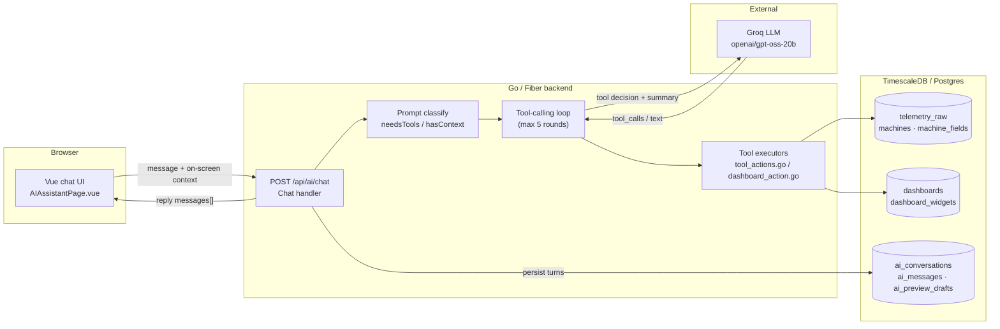
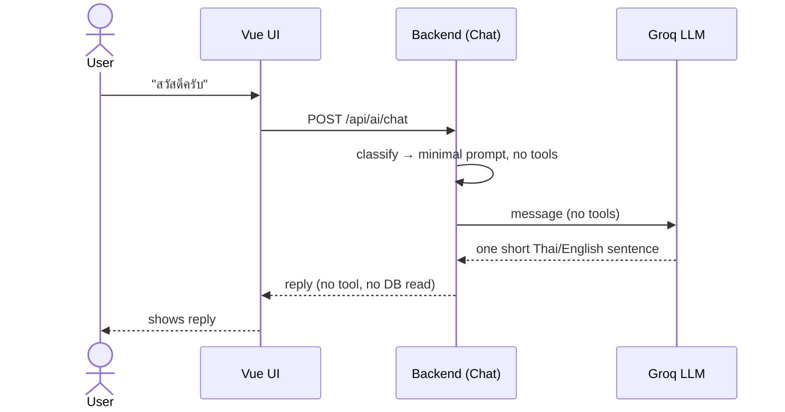
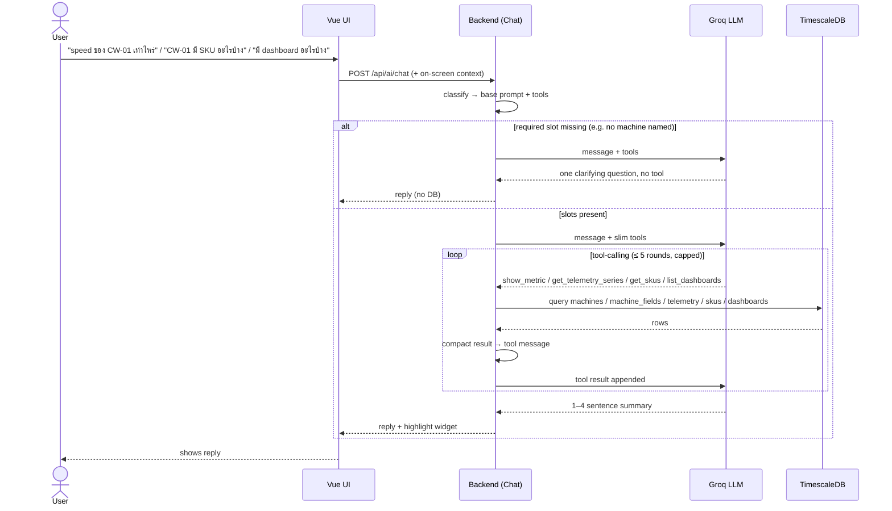
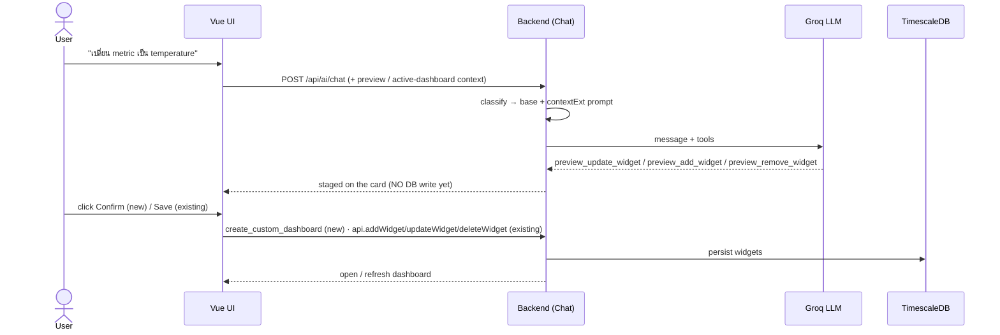
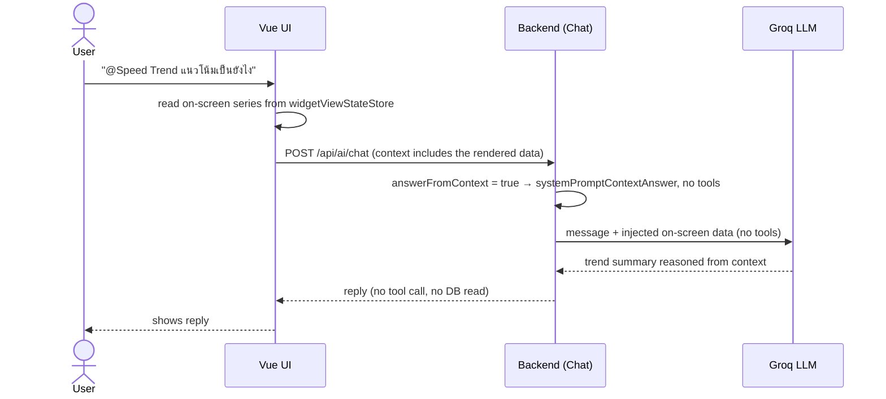

# IotVision AI Assistant — Architecture, Workflow & Model Choice

The AI assistant lets a factory operator talk to IotVision in plain Thai or English
("speed ของ CW-01 เท่าไหร่", "สร้าง dashboard ของ CW-01") to read live telemetry and
build dashboards. It is a **tool-calling LLM agent**: the model decides *what the user
wants*, the backend runs real database queries as tools, and the model turns the results
into a short natural reply.

All references below point at the real code under `backend/internal/modules/ai/`.

---

## 1. AI Architecture

### Components

| Layer | What | Where |
|-------|------|-------|
| **UI** | Vue 3 chat page; sends the message plus the on-screen dashboard/widget context | `frontend/src/pages/AIAssistantPage.vue`, `frontend/src/services/api.service.ts` |
| **API / Backend** | Fiber routes under `/api/ai` (JWT-gated); the `Chat` handler orchestrates the tool loop | `routes.go`, `controller.go` |
| **Tool layer** | read / preview / write tools exposed to the model (`AllTools()`); a dispatch switch runs each against the DB | `schema.go`, `tool_actions.go`, `dashboard_action.go` |
| **LLM (external)** | Groq, OpenAI-compatible chat-completions API | `https://api.groq.com/openai/v1/chat/completions`, model `openai/gpt-oss-20b` |
| **Database** | TimescaleDB / Postgres — telemetry + dashboards + AI conversation history | shared `database.Pool` |

**External services / secrets:** the only AI secret is `GROQ_API_KEY` (`config/env.go`).
The model id itself is a hardcoded constant (`controller.go:23`), not an environment
variable. If the key is empty the endpoint returns `503 AI_UNAVAILABLE`.

### Tool catalog

`AllTools()` (`schema.go:186`) hands the model the read / preview / write tools below.
Write tools require admin/editor (`writeTools`, `schema.go:206`); preview tools are only
sent when a dashboard context is present. `create_custom_dashboard` is deliberately **not**
in `AllTools()` — the UI calls it directly via `POST /api/ai/tools/execute` only after the
user clicks Confirm.

| Tool | What it does | Group | Flow |
|------|--------------|-------|------|
| `get_machines` | List machines (name, type, status, numeric field keys) | read | 2b |
| `show_metric` | Resolve a machine + metric to a widget spec / current value | read | 2b |
| `get_telemetry_trend` | avg / min / max over a time range | read | 2b |
| `get_telemetry_series` | Time-bucketed series (what a line chart shows) | read | 2b / 2d |
| `get_production_count` | Bucketed piece counts (daily-count widget) | read | 2b |
| `get_skus` | Distinct SKU values for a machine | read | 2b |
| `list_dashboards` | Dashboards with names + widget counts | read | 2b |
| `preview_dashboard` | Build a preview plan from a template (no DB write) | preview | 2c |
| `preview_add_widget` | Stage a widget onto the preview / open active dashboard (no DB write) | preview | 2c |
| `preview_update_widget` | Stage an edit (rename / metric / bucket / …) on the preview / active dashboard | preview | 2c |
| `preview_remove_widget` | Stage a widget removal from the preview / active dashboard | preview | 2c |
| `create_custom_dashboard` | Persist a confirmed preview as a new dashboard (frontend-only, post-Confirm) | write | 2c |

### Data flow

1. The browser POSTs `{ conversationId, message, context }` to `POST /api/ai/chat`
   (120 s client timeout).
2. The backend classifies the request, picks a system prompt, and calls Groq with the
   message history + a **slimmed tool catalog**.
3. When Groq asks for a tool, the backend runs the corresponding SQL against TimescaleDB,
   compacts the result, and feeds it back to Groq.
4. Groq produces a final natural-language reply; the backend persists the new messages and
   returns them to the UI.

Groq calls are **non-streaming** (single POST, whole body read), sent with
`reasoning_format: hidden`, and retried up to 3× on HTTP 429 with `Retry-After` backoff.

### Architecture diagram



---

## 2. AI Workflow

How the architecture actually operates, per request. The stages map onto the classic
`User Request → Intent Detection → Tool Selection → Data Retrieval → LLM Reasoning →
Dashboard Generation → User Feedback` shape, driven by `Chat` in `controller.go`
(≈ lines 335–508).

1. **User Request** — the UI sends the message plus a serialized snapshot of the
   on-screen dashboard/preview/focused widget (`buildDashboardContext`). For analytical
   questions about a focused chart it even inlines the rendered data series, so the model
   can answer without a second fetch.
2. **Intent Detection** — the backend computes `needsTools`, `answerFromContext`, and
   `hasContext`, then selects **one of four system prompts**:
   `minimal` (greeting/chit-chat), `contextAnswer` (the on-screen data already answers),
   `base` (default actionable rules), or `base + contextExt` (preview-editing rules added).
   This is where a bare "สวัสดีครับ" is routed to a no-tool path and a metric read is
   routed to `show_metric`.
3. **Tool Selection** — Groq's first turn returns either `tool_calls` (e.g.
   `show_metric`, `preview_dashboard`, `get_production_count`) or plain text if no tool is
   needed.
4. **Data Retrieval** — the dispatch switch runs each requested tool against TimescaleDB
   (org-scoped SQL via the domain services). Large series/count results are compacted
   (`compactSeriesResult` / `compactBucketResult`) into column+tuple form to cut tokens,
   then appended back as `tool` messages.
5. **LLM Reasoning** — results are fed back and the model runs again. The loop allows up
   to 5 rounds but a `roundCap` (0 for a focused `@widget` question, 1 otherwise) forces a
   text summary early to stay under Groq's 8k-tokens/min rate limit.
6. **Dashboard Generation** — for create/edit intents the model returns `preview_*`
   specs; the UI **stages** them on the card but writes nothing. A **new** dashboard
   persists only when the user clicks **Confirm** (`POST /api/ai/tools/execute` →
   `create_custom_dashboard`, gated to admin/editor); an **existing** dashboard persists
   only on **Save** (`saveDashboardCard` → the plain widget REST endpoints). The retired
   `add_widget_to_dashboard` / `remove_widget` tools mean the model can never mutate a saved
   dashboard on its own.
7. **User Feedback** — the assistant's reply is shown and the new turns
   (user + tool + assistant) are persisted to `ai_messages`.

### Sequence diagram

Every request starts the same way — the UI POSTs to `/api/ai/chat`, the backend
classifies intent and picks 1 of 4 system prompts — then follows one of four flow shapes:

- **2a Greeting** — no tool, no DB.
- **2b Read** — any read (metric value/trend, SKUs, dashboard list) → read tool → DB → summary.
- **2c Change / Add / Delete** — stage via `preview_*` → Confirm (new) / Save (existing) → write.
- **2d Answer-from-context** — the on-screen data already answers → no tool, no DB.

One behavior is **not** a separate shape but a **cross-cutting guard**: if a read or an
edit is missing a required slot (which machine? which widget? change it to what?), the
`SLOT FILLING` rules (`controller.go:54-57`) make the model **ask one clarifying question
and call no tool** — e.g. `"speed เท่าไหร่"` (no machine) or `"แก้ให้หน่อย"` (no target).
It applies to both 2b and 2c, so it is shown once as a note rather than its own diagram.

All flows persist the turn to `ai_messages` at the end (omitted from each diagram for
brevity).

#### 2a. Greeting / chit-chat  — `"สวัสดีครับ"`



#### 2b. Read — metric / analytical / list  — `"speed ของ CW-01 เท่าไหร่"`, `"CW-01 มี SKU อะไรบ้าง"`

All reads share one shape — the model picks a **read tool**, the backend queries the DB,
the model summarizes. Only the tool differs by what's asked:
`show_metric` / `get_telemetry_trend` / `get_telemetry_series` (metric value or trend),
`get_production_count` (piece counts), `get_skus` (SKU list), `list_dashboards`,
`get_machines` (machine list). Missing a machine → the clarify guard fires (no tool).



#### 2c. Change / Add / Delete widget  — `"เพิ่ม / ลบ / เปลี่ยน widget"`

"Change a widget" and "edit a widget setting" are the **same** operation here:
`preview_update_widget` patches any of `new_title` (rename), `metric`, `bucket`
(time bucket), `unit`, `min`, `max`, `start_date`/`end_date`, `sku`, `status`, `machine`,
`type` (`schema.go`). It **stages** the change — on a new preview *or* an open Active
dashboard — and nothing is written until the user clicks Confirm/Save (see "Preview vs
Active dashboard" below).



**Preview vs Active dashboard.** 2c edits two targets, and **both stage first — nothing is
written to the DB until the user acts.** A **preview** is a new, unsaved plan; an **Active
dashboard** is an existing saved one the user opened in the AI page (card `kind: 'dashboard'`,
labelled `"Active dashboard"` — `AIAssistantPage.vue:207,495`). Chat edits to either use the
same `preview_*` staging tools; the only difference is the persistence action.

| | Preview (new, unsaved) | Active dashboard (existing, saved) |
|---|---|---|
| Card kind | `preview` | `dashboard` |
| Comes from | "สร้าง dashboard" / create flow | selected from the dashboard list into the AI page |
| AI edit tools (chat) | `preview_add_widget` / `preview_update_widget` / `preview_remove_widget` | same `preview_*` tools |
| Edit a widget's settings? | ✅ `preview_update_widget` | ✅ `preview_update_widget` |
| DB write | on **Confirm** → `create_custom_dashboard` | on **Save** → `saveDashboardCard` diffs via `api.addWidget/updateWidget/deleteWidget` |

There is **no immediate-write path** anymore: the old `add_widget_to_dashboard` /
`remove_widget` tools (which wrote on the spot) have been retired, so a chat request can
never mutate a saved dashboard before Save. If the dashboard the user names isn't the one
open on screen, the model asks them to open it first (`controller.go` `systemPromptBase`),
and writes nothing.

The card's **"+ Add widget" button** is the manual counterpart: it calls the frontend
`addPreviewWidget` (stages in memory) and also persists only on **Save** — same guarantee as
the chat path.

#### 2d. Answer from context — no tool, no DB  — `"@Speed Trend แนวโน้มเป็นยังไง"`

The difference from 2b is **not** "is a widget focused" — it is **"is the answer already
on screen."** The backend sets `answerFromContext` (`controller.go:374-382`) when either
`inlineData` (an analytical question whose focused chart's rendered series the UI inlined
as `"on-screen data"`) **or** `contextRead` (an `@`-focused plain current-value/config
question) holds. It then selects `systemPromptContextAnswer` — *"Do NOT call any tool"* —
and the model answers from the injected context, skipping the redundant fetch-then-
summarize round (a token + rate-limit optimization).

Guardrails: an `@`-focus alone does **not** force this path. If the focused question is an
**edit** (`editRe`) it goes to 2c; if it asks a **range/aggregate** (`rangeRe`) or **SKU**
(`skuRe`) not shown on screen, it falls back to the 2b tool path to fetch the data.



---

## 3. AI Model Comparison

The model choice is **data-driven**: the repo contains a bake-off harness,
`eval_test.go` (`TestBakeOff`), that runs **20 Thai-first intent cases** (greeting /
reads / change-add-delete / slot-fill traps) against the candidate Groq models and
auto-scores each model's **first decision** — the tool it picks, or `""` for a correct
no-tool reply (`got == want`). First-decision accuracy is the metric that matters here,
because "understand what the user wants" *is* the assistant's hard problem; the rest is
deterministic SQL. Run it with:

```
GROQ_API_KEY=… go test ./internal/modules/ai/ -run TestBakeOff -v -timeout 1200s
```

### Candidates and results

Measured on the live Groq API (run of 2026-07-02, 20 cases, 10 s inter-case throttle;
scoreboard printed by the harness). This run is **after** retiring the two immediate-write
tools — the smaller catalog trimmed ~80 tokens/prompt vs earlier runs. **Rate-limited cases
(⏳) are excluded from the denominator, not counted as failures**, so sample sizes differ.
`qwen`'s larger prompts (~2.9k vs ~2.45k for the gpt-oss models) made it the biggest
free-tier rate-limit victim (6 of 20 lost).

| Model | Score | Completed / 20 | Avg prompt tok/call | Verdict |
|-------|-------|----------------|---------------------|---------|
| `qwen/qwen3-32b` | **13 / 14** | 14 (6 ⏳) | ~2,930 | **replaced** — heaviest tokens, most rate-limited |
| `openai/gpt-oss-20b` | **17 / 20** | 20 (0 ⏳) | ~2,450 | **now live** (`controller.go:23`) — cheapest, completed clean, only soft misses |
| `openai/gpt-oss-120b` | **15 / 16** | 16 (4 ⏳) | ~2,460 | previous default, replaced by `20b` |

#### Full per-case results

`✅` = picked the expected first tool (or correctly answered with no tool); `❌` = wrong
pick (shown); `⏳` = lost to a rate limit on this run.

| # | Case | Expected | qwen3-32b | gpt-oss-20b | gpt-oss-120b |
|---|------|----------|-----------|-------------|--------------|
| 1 | greeting | (no tool) | ✅ | ✅ | ✅ |
| 2 | greeting-informal | (no tool) | ✅ | ✅ | ✅ |
| 3 | read-speed | `show_metric` | ✅ | ✅ | ✅ |
| 4 | read-speed-thai | `show_metric` | ⏳ | ✅ | ✅ |
| 5 | read-temp-informal | `show_metric` | ✅ | ✅ | ✅ |
| 6 | english-read | `show_metric` | ⏳ | ✅ | ✅ |
| 7 | detail-analytical-focused | `get_telemetry_series` | ✅ | ✅ | ✅ |
| 8 | change-preview-edit | `preview_update_widget` | ✅ | ✅ | ✅ |
| 9 | add-preview-widget | `preview_add_widget` | ✅ | ❌ `show_metric` | ✅ |
| 10 | delete-preview-widget | `preview_remove_widget` | ⏳ | ❌ asked to open (no tool) | ✅ |
| 11 | add-to-active-dashboard | `preview_add_widget` | ✅ | ✅ | ❌ `show_metric` |
| 12 | remove-from-active-dashboard | `preview_remove_widget` | ✅ | ✅ | ✅ |
| 13 | create | `preview_dashboard` | ⏳ | ✅ | ✅ |
| 14 | list-dashboards | `list_dashboards` | ✅ | ✅ | ✅ |
| 15 | list-skus | `get_skus` | ✅ | ✅ | ✅ |
| 16 | trap-action-but-read | `get_machines` | ⏳ | ❌ asked which machine (no tool) | ✅ |
| 17 | ambiguous-fix | (no tool) | ✅ | ✅ | ⏳ |
| 18 | ambiguous-change | (no tool) | ✅ | ✅ | ⏳ |
| 19 | read-no-machine | (no tool) | ⏳ | ✅ | ⏳ |
| 20 | read-no-machine-en | (no tool) | ❌ `get_machines` | ✅ | ⏳ |

Reading the failures — the refactor **removed** `add_widget_to_dashboard` / `remove_widget`,
so **the destructive mis-route class is gone**: no model can call a direct-write tool on a
saved dashboard any more (last run's 120b `delete-preview → remove_widget` is now
impossible). Every residual miss is *soft* — a wrong-but-harmless tool or an over-cautious
no-tool reply, never a bad write:
- **"Add widget" is ambiguous** — `show_metric` (show a metric card) vs `preview_add_widget`
  (stage it onto the dashboard). Each gpt-oss model missed exactly **one** of the two add
  variants — `20b` on the preview case (#9), `120b` on the active-dashboard case (#11) — so
  this is intent ambiguity, not a model gap.
- **`20b` over-applied the new "ask to open" rule** on `delete-preview-widget` (#10): a
  preview was already on screen, yet it asked the user to open the dashboard. Harmless (it
  asked, didn't mis-write) but a **prompt side-effect** — the rule should fire only when *no*
  preview/active context is present. *(Follow-up.)*
- Minor slot-fill misses: `20b` asked "which machine" on the compound trap (#16) instead of
  `get_machines`; `qwen` guessed `get_machines` on `read-no-machine-en` (#20).

Net: with the direct-write tools retired, **no run produced a dangerous action**. Scores are
close and rate-limit noise blurs exact ranking, but `gpt-oss-20b` completed all 20 cases with
zero rate-limits, at the lowest token cost, and every one of its misses is soft.

### The requested axes

- **Quality** — the differentiator is not whether a model *can* call functions (all three
  can) but whether it picks the *correct* tool on a Thai sentence the first time. Scores are
  close (`20b` 17/20, `120b` 15/16 with 4 ⏳, `qwen` 13/14) and — now that the direct-write
  tools are gone — **none of the failures are destructive**. The residual misses are the
  ambiguous "add widget" intent (each gpt-oss model missed one add variant) and a couple of
  over-cautious no-tool replies. Raw pass-rate no longer separates the models on safety.
- **Cost** — `gpt-oss-20b` has the smallest prompts (~2,450 vs ~2,930 tokens for qwen) and
  is the cheapest per token; because the large `base` prompt prefix stays byte-stable, Groq's
  prompt cache is reused across turns, cutting effective input cost further. Qwen's larger
  prompts also made it the biggest free-tier rate-limit victim in the run.
- **Latency** — calls are non-streaming with a 90 s client timeout and a 3× 429
  retry/backoff (`parseRetryAfter`). To stay under Groq's 8k-tokens/min limit the backend
  replays only the **last 3 turns**, sends **slim tool schemas** (name + description for
  simple tools, full schema only for widget-nested ones), and caps tool rounds — all of
  which also reduce per-request latency.
- **Context window** — the Groq `gpt-oss` family offers a long context, but the design
  deliberately does **not** rely on it: history is trimmed to 3 turns and past tool
  payloads are not replayed (the assistant's prior summary already captured them), so the
  effective prompt stays small and cache-friendly.
- **Tool calling** — all candidates support OpenAI-compatible function calling, which is
  why the OpenAI-compatible Groq endpoint is used unchanged.

### Decision (applied)

Both follow-ups from this run have been applied (2026-07-03):

- The live constant (`controller.go:23`) now runs **`openai/gpt-oss-20b`**. With the
  direct-write tools retired, the old decisive argument (120b's destructive mis-route) was
  moot; the case for `20b` rests on **cost and cache-friendliness at parity intent quality**
  — cheapest, and the only model that completed all 20 cases with zero rate-limits and only
  soft misses.
- The "ask the user to open the dashboard" rule in `systemPromptBase` is now **scoped**: it
  fires only when no preview/Active-dashboard context is on screen (or the user names a
  different dashboard), fixing the prompt side-effect behind `20b`'s #10 miss. Re-run
  `TestBakeOff` to confirm the case now passes.

> Reproduce: `GROQ_API_KEY=… go test ./internal/modules/ai/ -run TestBakeOff -v -timeout 1200s`.
> The harness sleeps 10 s between cases and prints a per-model scoreboard. Because it hits
> the live free-tier API, some cases can still be lost to rate limits on any given run (they
> are skipped, not failed) — for a clean denominator, re-run or raise the inter-case
> `time.Sleep`.
> Exact model spec numbers (parameter counts, per-token pricing, hard context-window token
> limits) are per Groq's published docs; the ranking here rests on this in-repo bake-off.
