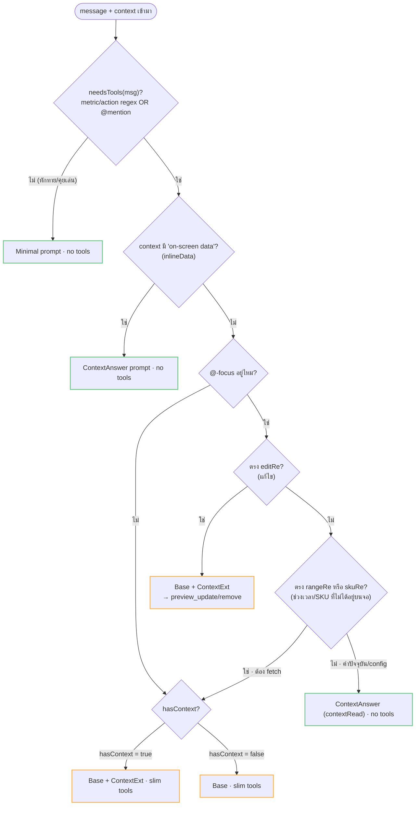
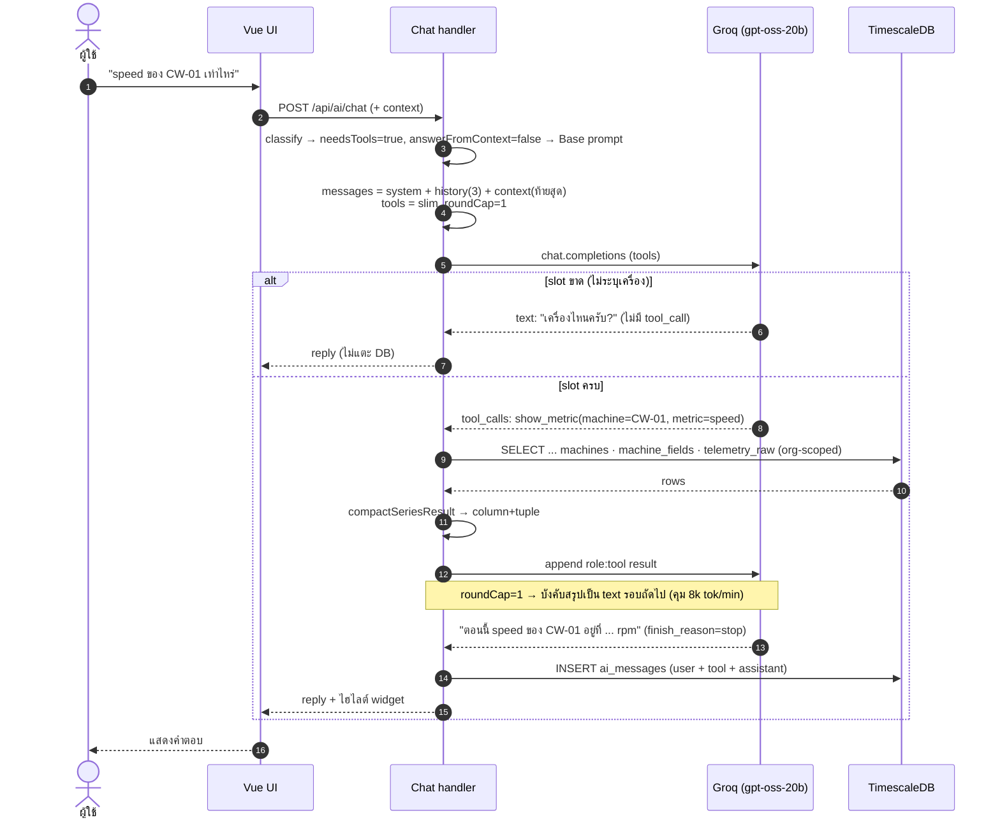
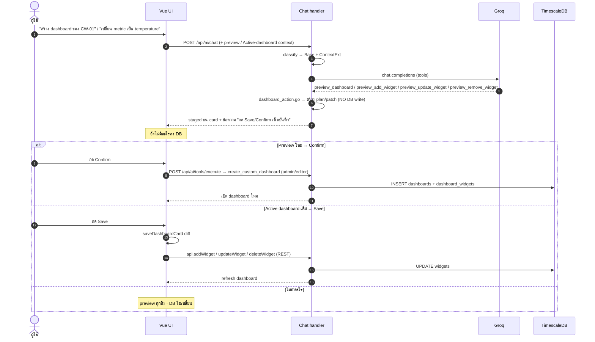

# IotVision AI — Ultra-detailed Flow (Mermaid)

ไดอะแกรมชุดนี้ลงลึกทุกจุดของ `Chat` handler (`backend/internal/modules/ai/controller.go`)
พร้อม tool layer (`schema.go`, `tool_actions.go`, `dashboard_action.go`).
render ได้บน GitHub / VS Code (Markdown Preview Mermaid) / mermaid.live

---

## 1. Master flow — end to end (ทุก branch, ทุก guard)

```mermaid
flowchart TB
    %% ============ CLIENT ============
    subgraph CLIENT["🌐 Frontend · AIAssistantPage.vue"]
        U(["ผู้ใช้พิมพ์ข้อความ<br/>ไทย / อังกฤษ"])
        CTX["buildDashboardContext()<br/>serialize dashboard · preview · [FOCUSED] widget<br/>+ inline 'on-screen data' series ถ้าเป็นคำถามเชิงวิเคราะห์"]
        POST["POST /api/ai/chat<br/>{ conversationId, message, context }<br/>client timeout 120s"]
        U --> CTX --> POST
    end

    %% ============ AUTH ============
    POST --> JWT{"middleware/auth.go<br/>JWT ถูกต้อง?"}
    JWT -- "ไม่" --> E401(["401 Unauthorized"])
    JWT -- "ใช่ · inject userId/orgId/role" --> KEY{"GROQ_API_KEY ว่าง?"}
    KEY -- "ว่าง" --> E503(["503 AI_UNAVAILABLE"])

    %% ============ CLASSIFY ============
    KEY -- "มีคีย์" --> CLS
    subgraph CLASSIFY["🧠 Classify — deterministic regex (controller.go:693-712)"]
        direction TB
        CLS["needsToolsFlag = needsTools(msg)<br/>regex: metric/action keyword หรือมี @mention"]
        HC["hasContext = body.Context != &quot;&quot;"]
        INL["inlineData = context มี 'on-screen data'"]
        CR["contextRead = @-focus ที่ไม่ใช่ edit/range/sku<br/>(ไม่แมตช์ editRe / rangeRe / skuRe)"]
        AFC["answerFromContext = inlineData OR contextRead"]
        CLS --> HC --> INL --> CR --> AFC
    end

    %% ============ PROMPT SELECT ============
    AFC --> SEL{"เลือก system prompt<br/>(controller.go:387-394)"}
    SEL -- "needsTools == false" --> P1["📄 systemPromptMinimal<br/>identity + ภาษา + 'ตอบ 1 ประโยค'<br/>NO tools · ~300 tok เบากว่า base"]
    SEL -- "answerFromContext == true" --> P2["📄 systemPromptContextAnswer<br/>'Do NOT call any tool — ตอบจาก context'<br/>NO tools"]
    SEL -- "needsTools && hasContext<br/>&& !answerFromContext" --> P3["📄 systemPromptBase + systemPromptContextExt<br/>TOOL SELECTION + SLOT FILLING + WIDGET<br/>+ preview-staging + @Widget/[FOCUSED] routing<br/>slim tools"]
    SEL -- "needsTools · no context" --> P4["📄 systemPromptBase<br/>TOOL SELECTION + SLOT FILLING + WIDGET<br/>slim tools"]

    %% ============ ASSEMBLE ============
    P1 --> ASM
    P2 --> ASM
    P3 --> ASM
    P4 --> ASM
    ASM["ประกอบ messages[]<br/>system + history (3 เทิร์นล่าสุด) + context ต่อท้ายสุด (recency wins)<br/>tools = toGroqToolSlim (name+desc; full schema เฉพาะ widget-nested)<br/>role gate: writeTools เฉพาะ admin/editor<br/>roundCap = 0 ถ้า @widget focus, มิฉะนั้น 1"]

    %% ============ GROQ CALL ============
    ASM --> CALL
    subgraph LOOP["🔁 Tool-calling loop · สูงสุด 5 รอบ"]
        direction TB
        CALL["callGroqModel()<br/>POST api.groq.com/openai/v1/chat/completions<br/>model=openai/gpt-oss-20b · reasoning_format=hidden · non-stream"]
        R429{"HTTP 429?"}
        RETRY["parseRetryAfter → sleep<br/>retry สูงสุด 3×"]
        FIN{"finish_reason"}
        CALL --> R429
        R429 -- "ใช่ (≤3×)" --> RETRY --> CALL
        R429 -- "ไม่" --> FIN
    end

    FIN -- "tool_calls" --> DISP
    FIN -- "stop / text" --> TXT

    %% ============ DISPATCH ============
    subgraph DISPATCH["⚙️ Tool dispatch (tool_actions.go / dashboard_action.go)"]
        direction TB
        DISP{"tool ไหน?"}
        DISP -- "read" --> RD["get_machines · show_metric · get_telemetry_trend<br/>get_telemetry_series · get_production_count<br/>get_skus · get_active_alerts · list_dashboards"]
        DISP -- "preview" --> PV["preview_dashboard · preview_add_widget<br/>preview_update_widget · preview_remove_widget<br/>➜ สร้าง plan/patch เท่านั้น · NO DB write"]
        RD --> SQL[("org-scoped SQL<br/>TimescaleDB")]
        SQL --> CMP["compactSeriesResult / compactBucketResult<br/>→ column+tuple ลด token"]
        PV --> STG["stage บน card (in-memory)"]
        CMP --> APP["append เป็น role:tool message"]
        STG --> APP
    end

    APP --> CAP{"roundCap ถึงเพดาน<br/>หรือครบ 5 รอบ?"}
    CAP -- "ยัง" --> CALL
    CAP -- "ถึงแล้ว" --> TXT

    %% ============ FINALIZE ============
    TXT["Groq final text<br/>(1 ประโยค read · 2-4 ประโยค analytical)<br/>SLOT FILLING: ขาด slot → ถาม 1 คำถาม ไม่เรียก tool"]
    TXT --> SAVE[("persist turns → ai_messages")]
    SAVE --> RESP["ตอบ messages[] → UI<br/>+ ไฮไลต์ widget / แสดง preview card"]

    %% ============ USER ACTION (deferred write) ============
    RESP --> ACT{"มี preview staged?"}
    ACT -- "read เฉย ๆ" --> DONE(["จบ"])
    ACT -- "staged · ผู้ใช้ตัดสินใจภายหลัง" --> CONF{"ผู้ใช้กดอะไร?"}
    CONF -- "Confirm (dashboard ใหม่)" --> W1["POST /api/ai/tools/execute<br/>create_custom_dashboard (admin/editor)"]
    CONF -- "Save (dashboard เดิม)" --> W2["saveDashboardCard → REST<br/>api.addWidget/updateWidget/deleteWidget"]
    CONF -- "ไม่ทำอะไร" --> DONE
    W1 --> WDB[("เขียน dashboards / dashboard_widgets")]
    W2 --> WDB
    WDB --> DONE

    %% ============ STYLES ============
    classDef read stroke:#4fc3d9,stroke-width:2px;
    classDef write stroke:#f2765c,stroke-width:2px;
    classDef prev stroke:#b58cff,stroke-width:2px;
    classDef acc stroke:#ffb54d,stroke-width:2px;
    classDef err stroke:#f2765c,fill:#3a1f1f,color:#fff;
    class RD,SQL,CMP read;
    class W1,W2,WDB write;
    class PV,STG prev;
    class CLS,SEL,CALL acc;
    class E401,E503 err;
```



---

## 2. Classification internals — ลำดับการตัดสิน (ทำไมได้ prompt นั้น)



---

## 3. Read path — sequence เต็ม (2b) พร้อม compaction & round cap



---

## 4. Create / Edit path — staging → persist (2c) พร้อม Preview vs Active



> **การันตีความปลอดภัย:** tool เขียนตรงของเดิม (`add_widget_to_dashboard` / `remove_widget`) ถูกปลดแล้ว —
> คำขอผ่านแชทเขียน dashboard ที่เซฟไว้เองไม่ได้ ต้องผ่าน Save/Confirm ของผู้ใช้เสมอ

---

## 5. Tool catalog + argument surface (mindmap)

```mermaid
mindmap
  root(("AllTools()<br/>12 tools"))
    READ
      get_machines
        รายชื่อ+field keys
      show_metric
        machine · metric → ค่า/widget spec
      get_telemetry_trend
        avg/min/max ตาม time_range
      get_telemetry_series
        time-bucketed series
      get_production_count
        bucketed piece count
        args: bucket · sku · status
      get_skus
        distinct SKU ของเครื่อง
      get_active_alerts
        alert ที่ active
      list_dashboards
        ชื่อ + จำนวน widget
    PREVIEW
      preview_dashboard
        template machine_overview
      preview_add_widget
      preview_update_widget
        new_title · metric · bucket · unit
        min · max · start/end_date
        sku · status · machine · type
        fields[] · chartType · points · scaling
      preview_remove_widget
    WRITE
      create_custom_dashboard
        ไม่อยู่ใน AllTools()
        UI เรียกตรงหลัง Confirm
        admin / editor เท่านั้น
```

---

**ไฟล์อ้างอิง:** `controller.go` (classify + loop + prompts) · `schema.go` (`AllTools`, `toGroqToolSlim`, `writeTools`) ·
`tool_actions.go` (read executors) · `dashboard_action.go` (preview/create) · `eval_test.go` (bake-off).
ภาพรวมย่อ: [`AI_WORKFLOW_SIMPLE.md`](./AI_WORKFLOW_SIMPLE.md) · เชิงลึก: [`AI_ARCHITECTURE.md`](./AI_ARCHITECTURE.md)
