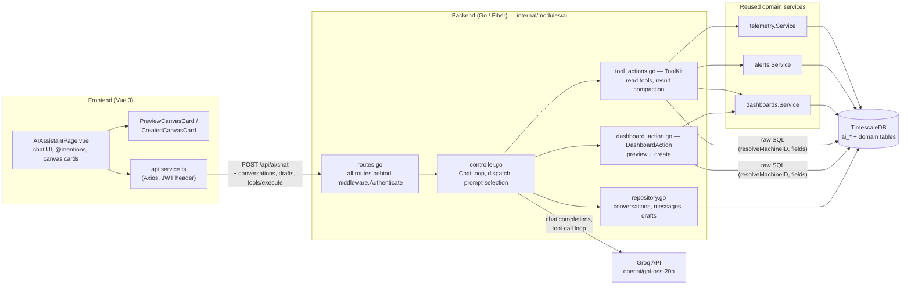
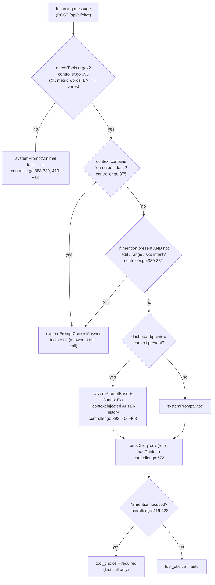
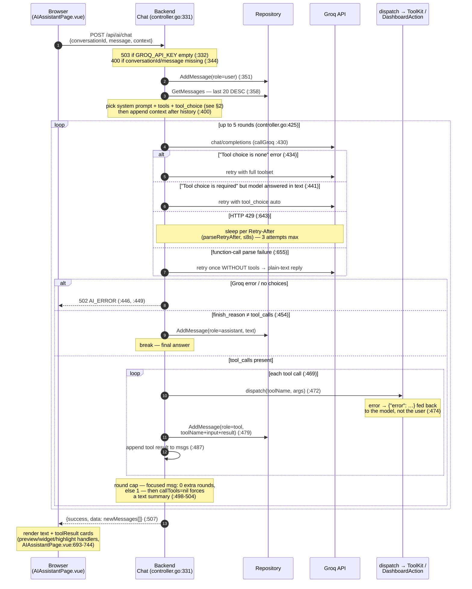
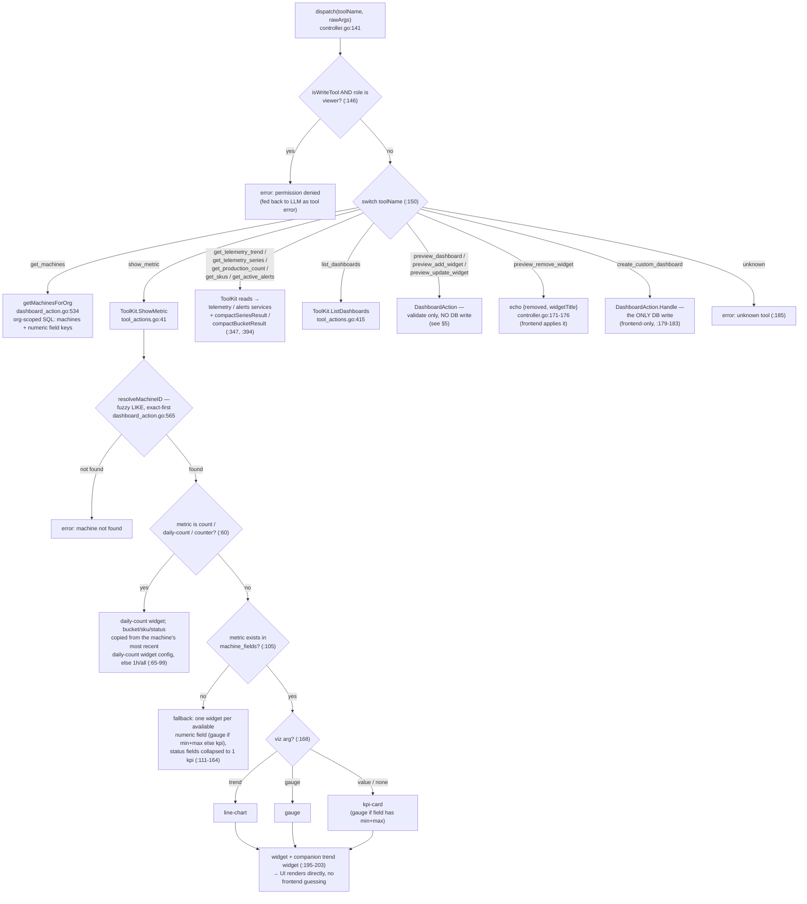
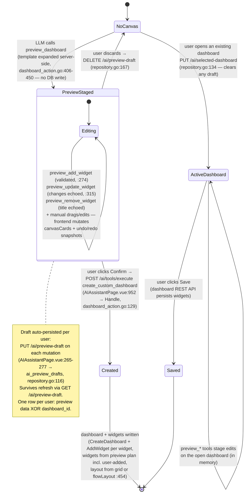
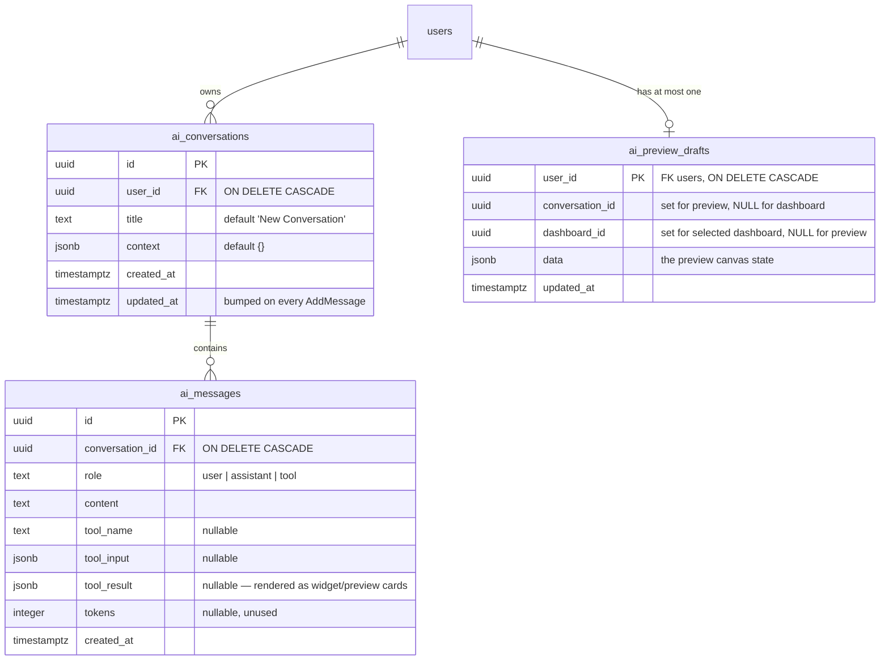

# AI Module — Detailed Documentation

Covers the full AI assistant stack: `backend/internal/modules/ai/` (Go) and `frontend/src/pages/AIAssistantPage.vue` (Vue 3). Every claim is anchored to `file:line` as of this writing.

Sections: [Architecture](#1-ai-module-architecture) · [Prompt strategy](#2-prompt-strategy) · [Chat request flow](#3-chat-request-flow) · [Tool execution pipeline](#4-tool-execution-pipeline) · [Dashboard preview/apply flow](#5-dashboard-previewapply-flow) · [Conversation persistence](#6-conversation-persistence-erd) · [Tool catalog](#7-tool-catalog-reference) · [API endpoints](#8-api-endpoint-reference)

---

## 1. AI module architecture

> **What this diagram is for:** a component map — which pieces exist (frontend page, backend controller, toolkit, Groq, DB) and which talks to which. Use it to orient yourself before diving into any flow below.

Key structural facts:

- **Entry point**: `routes.go:9-27` registers everything under `/api/ai` with JWT auth (`middleware.Authenticate`, `routes.go:11`). The controller is a single instance wiring `DashboardAction`, `ToolKit`, and `Repository` (`controller.go:127-139`).
- **ToolKit reuses domain services** rather than duplicating logic — every AI read inherits the same org-scoping and validation the REST API enforces (`tool_actions.go:17-33`).
- **Model choice**: `openai/gpt-oss-20b`, pinned after a bake-off (23/23 eval pass, ~0.83 s median, smallest prompts; see `controller.go:20-24` and `eval_test.go`).
- **The LLM never writes to the DB.** The only mutating tool, `create_custom_dashboard`, is excluded from the toolset sent to Groq — only the frontend can call it, via `POST /ai/tools/execute` after the user clicks Confirm (`controller.go:179-183`).

---

## 2. Prompt strategy

> **What this diagram is for:** the decision tree that picks which system prompt and which tools each chat message pays for. Use it to understand (or tune) token costs and why a given message did / didn't call a tool.

The module maintains **four system prompts**, chosen per message to keep token cost proportional to what the message actually needs:

| Prompt | Defined at | Sent when | Contents |
|---|---|---|---|
| `systemPromptMinimal` | `controller.go:31` | Message doesn't look tool-worthy (greeting, chit-chat) | Identity + language rule only (~300 tokens cheaper than base) |
| `systemPromptContextAnswer` | `controller.go:38` | The on-screen widget context already answers the question | "Answer from `[FOCUSED]` context, do NOT call tools, describe series shape" |
| `systemPromptBase` | `controller.go:42` | Any tool-worthy message | TOOL SELECTION + SLOT FILLING + WIDGET TYPES rules. Kept byte-stable so Groq prompt-caches it |
| `systemPromptBase + systemPromptContextExt` | `controller.go:65` | Tool-worthy **and** a dashboard/preview is on screen | Adds preview-editing rules and `@WidgetTitle` routing rules |

Token-saving mechanisms beyond prompt selection:

- **Slim tool schemas** — simple tools are sent as name + description only (arg hints embedded in the description, `parameters` = open object), saving ~50–80 tokens per tool (`controller.go:523-552`). The three `preview_*` widget tools keep full schemas because they have nested objects the model must see (`complexSchemaTools`, `controller.go:556-560`).
- **Context-gated tools** — `preview_add/remove/update_widget` are omitted entirely when no dashboard context is on screen (`previewOnlyTools`, `controller.go:564-568, 580-582`). Write tools are omitted for viewer role (`controller.go:577-579`).
- **History cap** — only the last **3** user/assistant text rows are replayed; past tool calls/results are never reconstructed (the assistant's reply already summarizes them) (`buildGroqMessages`, `controller.go:719-750`).
- **Recency trick** — the authoritative dashboard state is injected as a system message *after* history, so the current widget config beats any stale earlier turn (`controller.go:398-403`).
- **Compact tool results** — series/count results are reshaped from object-per-point to `columns` + `[time, values…]` tuples before being fed back to the model (`tool_actions.go:318-409`); timestamps are rendered in fixed +07 plant-local time (`bkkZone`, `tool_actions.go:329`).

---

## 3. Chat request flow

> **What this diagram is for:** the time-ordered message exchange for one chat turn — who calls whom, in what order, including the agentic tool loop and every retry/failure path. Use it when debugging a bad answer or a 502.

Notes:

- The 5-iteration outer loop is the hard stop; the *round cap* (`controller.go:498-504`) is the practical one — a focused-widget message gets exactly 1 tool round because each round re-sends the ~3k-token context and would trip Groq's 8k tokens/min limit.
- Every Groq HTTP attempt has a 90 s client timeout (`controller.go:621`). Rate-limit sleeps are excluded from latency measurements (`controller.go:634-641`).
- The frontend appends `@Widget Title` mention tokens to the outgoing message and builds the `context` string itself (widget list, `[FOCUSED]` marker, current values, shown window, and — for analytical questions — the full `on-screen data` series) (`AIAssistantPage.vue:491-610`).

---

## 4. Tool execution pipeline

> **What this diagram is for:** the control flow inside a single tool call — role gate, name routing, and the branchy `show_metric` resolution. Use it to trace why a tool returned a fallback, an error, or a particular widget type.

- Tool errors never abort the chat: `dispatch` errors are marshalled as `{"error": …}` and returned to the model as the tool result (`controller.go:474-476`), letting it apologize or retry with better args.
- `resolveMachineID` / `resolveDashboardID` do case-insensitive substring matches with exact matches ranked first, so "Overview" can't shadow "CW-01 Overview" (`tool_actions.go:439-453`, `dashboard_action.go:565-583`).

---

## 5. Dashboard preview/apply flow

> **What this diagram is for:** the lifecycle of the preview canvas — every state a dashboard plan passes through from first request to persisted dashboard, and which actor (LLM, frontend, user) drives each transition. Use it to understand why nothing is saved until Confirm/Save.

Enforcement of preview-then-confirm:

1. `create_custom_dashboard` is **not** in `AllTools()` (`schema.go:194-209`) — the LLM cannot invoke it; the system prompt additionally forbids it (`controller.go:48`).
2. It is the only entry in `writeTools` (`schema.go:214-218`), so even via `POST /ai/tools/execute` it requires admin/editor role (`controller.go:146`).
3. `Handle` honors the (possibly user-edited) preview plan: custom widget list with per-widget config — absolute date windows switch line-charts to `liveMode:false` (`dashboard_action.go:167-180`), count widgets carry bucket/sku/status, chart widgets carry fields/chartType/points/scaling — falling back to template expansion when no widget list is passed (`dashboard_action.go:146-263`).

---

## 6. Conversation persistence (ERD)

> **What this diagram is for:** the AI module's own tables and how they hang off `users`. Use it when querying chat history or debugging draft-restore behavior.

- Schema defined in `migrate/migrate.go:211-245`; indexes `idx_aiconv_user (user_id, updated_at DESC)` and `idx_aimsg_conv (conversation_id, created_at ASC)` at `migrate.go:349-350`.
- `ai_preview_drafts` is a one-row-per-user *view state*: either an in-progress preview (`data` set) **or** a selected dashboard (`dashboard_id` set) — each upsert clears the other side (`repository.go:116-145`).
- `GetMessages` reads newest-first with `LIMIT 20` (`repository.go:72-78`); the chat loop then replays only the last 3 text rows to Groq (§2).

---

## 7. Tool catalog reference

All tools handed to the LLM (`AllTools()`, `schema.go:194-209`) plus the one frontend-only tool. **Schema form**: *slim* = name + description only (`controller.go:533`); *full* = complete JSON schema.

| Tool | Kind | Schema form | Args (required in bold) | Returns |
|---|---|---|---|---|
| `get_machines` | read | slim | — | machines with name/type/status + numeric field keys |
| `show_metric` | read | slim | **machine**, **metric**, viz (`value\|gauge\|trend`) | widget spec(s) the UI renders directly; fallback widget list if metric unknown |
| `get_telemetry_trend` | read | slim | **machine_id**, **metric**, time_range (5m…30d) | avg/min/max aggregate |
| `get_telemetry_series` | read | slim | **machine_id**, **metric**, time_range | compact `columns` + `[time,avg,min,max]` rows |
| `get_active_alerts` | read | slim | — | open alert events (event_id, machine, metric, value, severity…) |
| `get_production_count` | read | slim | **machine_id**, **bucket**, points (≤500), sku, status | compact `[time,count]` rows |
| `get_skus` | read | slim | **machine_id** | distinct SKU values for the machine |
| `list_dashboards` | read | slim | — | dashboard names + widget counts + URLs |
| `preview_dashboard` | stage | slim | **machine**, **template** (`machine_overview\|machine_production\|machine_maintenance`) | `PreviewDashboardResult` — plan only, no DB write |
| `preview_add_widget` | stage | full | **machine**, **widget** (nested `widgetItemSchema`, `schema.go:15`) | validated `PreviewWidget` |
| `preview_remove_widget` | stage | full | **widget_title** | echo — frontend removes it |
| `preview_update_widget` | stage | full | **widget_title** + any patch fields (metric, bucket, sku, dates, fields, chartType, scaling…) | `{widgetTitle, changes}` — frontend applies |
| `create_custom_dashboard` | **write** | *not sent to LLM* | machine, template, name, widgets[] | creates dashboard + widgets; admin/editor only |

Context-gated: the three `preview_*` widget tools are omitted when no dashboard/preview is on screen. Allowed widget types: `line-chart, gauge, kpi-card, status-card, table, alarm-panel, daily-count, chart` (`schema.go:3-5`).

---

## 8. API endpoint reference

All routes from `routes.go:9-27`, prefixed `/api/ai`, JWT required (Fiber `Locals`: userId/orgId/role).

| Method | Path | Handler | Purpose |
|---|---|---|---|
| POST | `/chat` | `Chat` (`controller.go:331`) | Main chat turn — runs the Groq tool loop, returns all new messages |
| GET | `/tools` | `ListTools` | Full tool definitions (`AllTools()`) |
| POST | `/tools/execute` | `ExecuteTool` (`controller.go:191`) | Direct tool call `{toolName, params}` — how the frontend fires `create_custom_dashboard` on Confirm |
| GET | `/conversations` | `GetConversations` | Current user's conversations with message counts |
| POST | `/conversations` | `CreateConversation` | New conversation (default title "New Conversation") |
| GET | `/conversations/:id/messages` | `GetMessages` | Last 20 messages, newest first |
| POST | `/conversations/:id/messages` | `AddMessage` | Append a message row (used by the frontend for local events) |
| GET | `/preview-draft` | `GetPreviewDraft` | Restore the user's saved canvas state after refresh |
| PUT | `/preview-draft` | `PutPreviewDraft` | Persist the in-progress preview `{conversationId, data}` |
| DELETE | `/preview-draft` | `DeletePreviewDraft` | Discard the draft |
| PUT | `/selected-dashboard` | `PutSelectedDashboard` | Remember which existing dashboard is open on the AI page |

Error envelope: failures return the app-wide `middleware.NewAppError` shape; notable codes — `503 AI_UNAVAILABLE` (no `GROQ_API_KEY`), `400 VALIDATION_ERROR`, `502 AI_ERROR` (Groq failure after retries).
