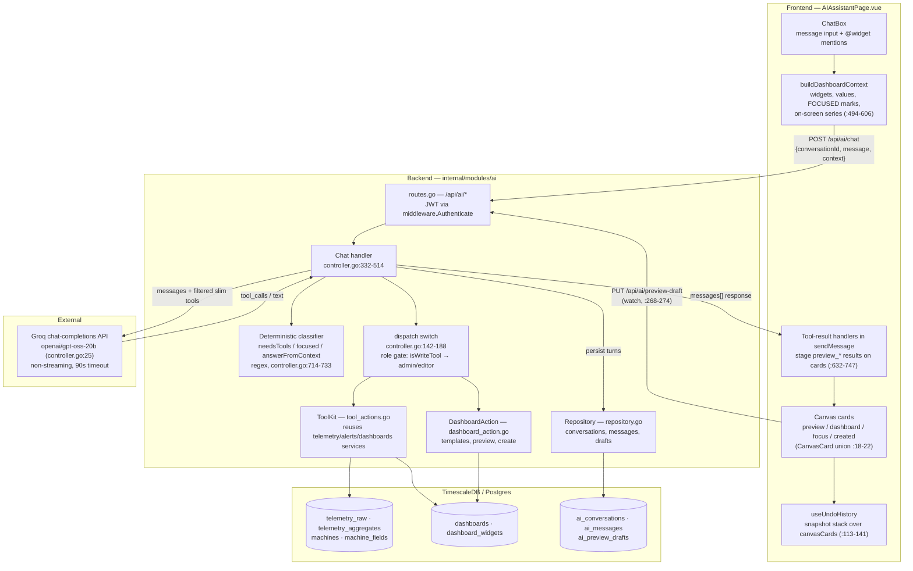
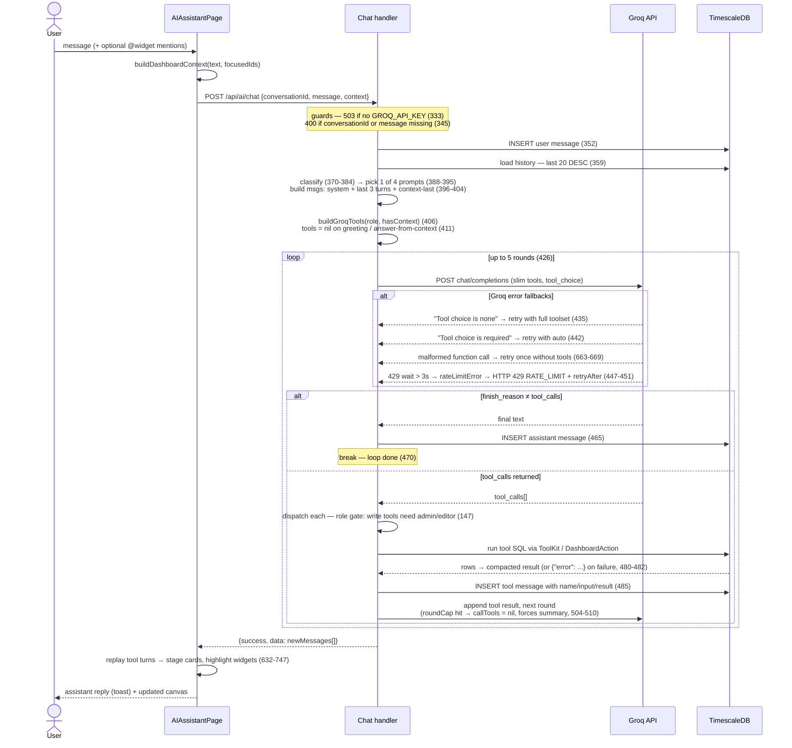
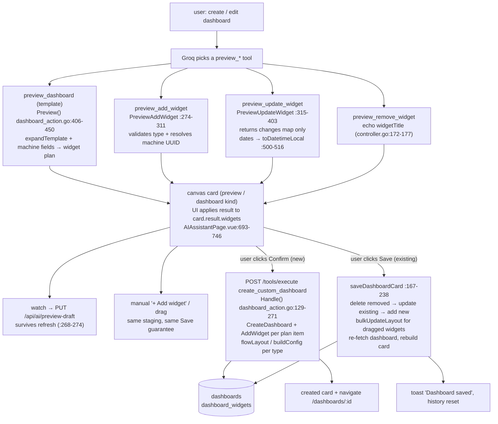

# AI Module — Detailed Reference

Complete reference for the AI assistant module: architecture, API surface, prompt strategy,
the chat tool-call loop, and the dashboard preview/apply pipeline. All references anchor to
current code under `backend/internal/modules/ai/` and `frontend/src/pages/AIAssistantPage.vue`.
For the model bake-off and why `gpt-oss-20b` is the live model, see `AI_ARCHITECTURE.md` §3.

---

## 1. Module architecture

The module is a **tool-calling LLM agent**: the frontend sends the user's message plus a
serialized snapshot of what is on screen; the backend classifies intent deterministically,
calls Groq with a filtered tool catalog, executes any requested tools against TimescaleDB,
and returns the persisted message turns. Nothing the model does writes to a dashboard —
all mutations are staged and persist only on an explicit user click.

Key structural decisions:

- **No new business logic in tools.** `ToolKit` (`tool_actions.go:21-33`) wraps the existing
  `telemetry`, `alerts`, and `dashboards` services, so every tool inherits the same org
  scoping and validation as the REST API.
- **`create_custom_dashboard` is not in `AllTools()`** (`schema.go:194-209`). The LLM cannot
  call it; only the frontend invokes it via `POST /api/ai/tools/execute` after the user
  clicks Confirm (`controller.go:180-184`). This hard-enforces preview-then-confirm.
- **Machine names resolve by substring.** `resolveMachineID` (`dashboard_action.go:565-583`)
  does a case-insensitive `LIKE %name%` with exact matches ranked first, so the model can
  pass "CW-01" against "Checkweigher CW-01".
- **View state survives refresh.** A per-user row in `ai_preview_drafts` stores either the
  in-progress preview JSON or a selected dashboard id — mutually exclusive by upsert
  (`repository.go:116-145`); the page restores it on mount (`AIAssistantPage.vue:240-263`).

---

## 2. API endpoint reference

All routes are registered under `/api/ai` (`cmd/server/main.go:141`) and JWT-gated by
`middleware.Authenticate` (`routes.go:11`), which injects `userId` / `orgId` / `role`.

| Method | Path | Handler (`controller.go`) | Purpose / notes |
|--------|------|--------------------------|-----------------|
| GET | `/api/ai/tools` | `ListTools` :210 | Returns `AllTools()` (LLM-visible catalog — excludes `create_custom_dashboard`) |
| POST | `/api/ai/tools/execute` | `ExecuteTool` :192 | Direct tool dispatch `{toolName, params}`. Frontend-only path for `create_custom_dashboard` (post-Confirm). Write tools require admin/editor |
| GET | `/api/ai/conversations` | `GetConversations` :216 | Current user's conversations with message counts, newest-updated first |
| POST | `/api/ai/conversations` | `CreateConversation` :228 | Body `{title}`, defaults to "New Conversation". 201 |
| GET | `/api/ai/conversations/:id/messages` | `GetMessages` :244 | Last **20** rows, `created_at DESC` (`repository.go:72-77`) |
| POST | `/api/ai/conversations/:id/messages` | `AddMessage` :256 | Manual insert `{role, content, toolName?, toolInput?, toolResult?}`. 201 |
| GET | `/api/ai/preview-draft` | `GetPreviewDraft` :277 | Per-user draft: `{conversationId, dashboardId, data}` or `data: null` |
| PUT | `/api/ai/preview-draft` | `PutPreviewDraft` :307 | Upsert preview JSON, clears any selected dashboard (`repository.go:116-131`) |
| DELETE | `/api/ai/preview-draft` | `DeletePreviewDraft` :322 | Drop the draft row |
| PUT | `/api/ai/selected-dashboard` | `PutSelectedDashboard` :293 | Store an Active-dashboard selection, clears any preview (`repository.go:134-145`) |
| POST | `/api/ai/chat` | `Chat` :332 | The agent loop — see §4 |

Error shapes: validation failures return 400 `VALIDATION_ERROR`; a missing `GROQ_API_KEY`
returns 503 `AI_UNAVAILABLE` (`:333-335`); a long Groq rate-limit wait returns 429
`RATE_LIMIT` with `details.retryAfter` seconds (`:447-451`); other Groq failures return 502
`AI_ERROR` (`:452`).

### Conversation storage

`ai_conversations` (id, user_id, title, timestamps) 1—N `ai_messages` (id, conversation_id,
role `user|assistant|tool`, content, tool_name, tool_input JSONB, tool_result JSONB,
created_at). `ai_preview_drafts` is keyed `user_id` (one row per user). Tool turns are
persisted with the executed tool's name/input/result so the frontend can replay staging
actions from the response (`controller.go:484-490`).

---

## 3. Prompt strategy

Routing is **deterministic regex, not an LLM router** — the prompt is chosen before Groq is
ever called. Four prompt constants (`controller.go:32-90`) are assembled in layers
(`:388-395`) so each message pays only for the rules it can use:

| Prompt | Const (line) | Selected when | Contents |
|--------|--------------|---------------|----------|
| Minimal | `systemPromptMinimal` :32 | `!needsTools` — greeting / chit-chat | identity + language rule only (~300 tokens cheaper than Base) |
| ContextAnswer | `systemPromptContextAnswer` :39 | `answerFromContext` | "answer from the on-screen context, do NOT call any tool" + FOCUSED-widget and trend-shape rules |
| Base | `systemPromptBase` :43 | default actionable path | TOOL SELECTION + SLOT FILLING + WIDGET TYPES rules. Kept **byte-stable** so Groq prompt-caches the prefix |
| Base + ContextExt | `systemPromptContextExt` :66 | `needsTools && hasContext` | Base plus preview-staging rules and `@WidgetTitle` / `[FOCUSED]` routing (which tool per widget type) |

Classifier inputs (all in `Chat`, `:370-384`):

- `needsToolsFlag` — `needsToolsRe` (`:714-721`): metric/action keywords (EN + TH) or an `@` mention.
- `hasContext` — the UI sent a non-empty dashboard/preview snapshot.
- `inlineData` — context contains `"on-screen data"`: the UI inlined the focused chart's
  rendered series (analytical questions only, stride-sampled to ~24 points —
  `AIAssistantPage.vue:503-514`).
- `contextRead` — an `@`-focused message that is **not** an edit (`editRe` :728), **not** a
  range/aggregate ask (`rangeRe` :729), and **not** a SKU ask (`skuRe` :733 — the SKU list
  is never in context).
- `answerFromContext = inlineData || contextRead` — take the no-tool path.

Token-budget techniques (all serving Groq's 8k tokens/min free-tier limit):

- **Slim tool schemas** — simple tools send name + description only, with arg hints embedded
  in the description and `additionalProperties: true` as the schema (`toGroqToolSlim`
  `:539-558`); only the three `preview_*` widget tools keep full nested schemas
  (`complexSchemaTools` `:562-566`). Saves ~50–80 tokens/tool.
- **Context-gated tools** — `preview_*` tools are omitted entirely when no dashboard context
  is on screen (`previewOnlyTools` `:570-574`); write tools are omitted for viewers
  (`buildGroqTools` `:578-596`).
- **No tools at all** on greeting or answer-from-context turns (`:411-413`).
- **History capped to the last 3 user/assistant text rows**; past tool JSON is never
  replayed — the assistant's previous summary already captured it (`buildGroqMessages`
  `:748-766`).
- **Context injected after history** as a second system message marked "Authoritative
  current dashboard state" so recency beats stale earlier turns (`:401-404`).
- **`tool_choice: "required"` only on `@`-mention turns** (`firstToolChoice` `:420-423`) —
  the one signal that guarantees a concrete widget context exists. If the model answers in
  text anyway, Groq's "Tool choice is required" error triggers a retry with auto (`:442-444`).
- **Round cap** — focused turns get 0 extra tool rounds, others 1, then `callTools = nil`
  forces a text summary; the outer loop's 5 iterations are the hard stop (`:504-510`).

---

## 4. Chat request / tool-call loop

`POST /api/ai/chat` end to end, including error paths. Steps anchor to `controller.go`.

Branch details worth knowing:

- **Tool errors are soft.** A failed dispatch (unknown machine, permission denied, bad args)
  is marshalled as `{"error": "..."}` and fed back to the model as the tool result
  (`:480-482`) — the model apologizes or asks a clarifying question instead of the request
  failing with a 5xx.
- **Rate-limit handling is two-tier** (`callGroqModel` `:649-655`): a 429 whose
  `Retry-After` (or body hint, `parseRetryAfter` `:688-707`, capped at 30 s, default 2 s)
  is ≤ 3 s sleeps and retries silently, up to 3 attempts; a longer wait aborts immediately
  as a `rateLimitError` so the user gets a 429 with a countdown instead of a hung request.
- **Malformed generations self-heal.** When Groq's function-call parser rejects the model's
  output ("Failed to call a function" / "Tool call validation failed"), the call is retried
  once with `tools = nil`, yielding a plain-text reply instead of an error (`:663-669`).
- **Read tools by widget type** (from `systemPromptContextExt`): a mentioned daily-count
  widget routes to `get_production_count` with the widget's bucket/sku/status copied from
  context; gauge/kpi/line-chart/table route to `show_metric` (current value) or
  `get_telemetry_series` (analytical); alarm-panel routes to `get_active_alerts`.
- **`show_metric` fallback** (`tool_actions.go:111-165`): if the requested metric doesn't
  exist on the machine, it returns `fallback: true` plus one widget per available numeric
  field (gauge when min+max defined, else kpi-card; at most one status field), so the UI
  still renders something useful.
- **Series compaction** (`tool_actions.go:318-409`): series/count tool results are reshaped
  from object-per-point into a `columns` legend + `[time, values...]` tuples, timestamps
  rendered in fixed +07 plant-local time (`bkkZone` :329), floats rounded to 2 decimals —
  the single biggest tool-token saving.

---

## 5. Dashboard preview / apply pipeline

Everything the model does to a dashboard is **staged in frontend memory**; the DB is
touched only by an explicit user action. There are two staging targets with the same tools
and different persistence:

| | Preview (new, unsaved) | Active dashboard (existing) |
|---|---|---|
| Card kind (`AIAssistantPage.vue:18-22`) | `preview` | `dashboard` |
| Created by | `preview_dashboard` tool result (:693-704) | user opens a dashboard in the AI page → `PUT /selected-dashboard` |
| Staged edits | `preview_add_widget` / `preview_update_widget` / `preview_remove_widget` results applied to the card (:705-746) | same tools, same handlers |
| Persist action | **Confirm** → `POST /tools/execute` `create_custom_dashboard` → `DashboardAction.Handle` | **Save** → `saveDashboardCard` diffs via widget REST endpoints (:167-238) |
| Undo/redo | snapshot stack over `canvasCards` (:113-141) — applied DB writes clear the stacks (`resetHistory` :137) | same |

Pipeline guarantees and details:

- **Templates** (`dashboard_action.go:40-57`): `machine_overview` (speed kpi + gauge +
  throughput + trend), `machine_production` (count, output, status), `machine_maintenance`
  (alarms, downtime, history). `expandTemplate` (`:60-96`) maps each widget's
  `preferredField` onto the machine's real numeric fields, falling back to the machine's
  first field when the preferred key doesn't exist.
- **Validation happens at staging time**, not just at apply: `preview_add_widget` rejects
  unknown widget types and unknown machines with 400/404 before anything reaches the card
  (`:282-288`). `preview_update_widget` validates a `type` change and resolves a `machine`
  rename to its UUID (`:346-357`).
- **`create_custom_dashboard` has two paths** (`Handle` `:129-271`): with a `widgets` array
  (the possibly user-edited preview plan, including manual additions and per-widget
  layouts) it builds each widget's config by type — chart fields, count filters, absolute
  date windows switch `liveMode` off; without one it re-expands the named template. Widget
  types are whitelisted (`isAllowedType`, `allowedWidgetTypes` `schema.go:3-5`).
- **Save is a diff, not a replace** (`saveDashboardCard`): widgets present in the DB but
  missing from the card are deleted; card widgets with a `widgetId` are updated in place;
  those without are added; explicitly dragged layouts persist via `bulkUpdateLayout`. The
  card is then rebuilt from a fresh fetch so widget ids are current.
- **SKU casing is canonicalized client-side** on `preview_update_widget`: the staged value
  is matched case-insensitively against the machine's real SKUs so chips show the stored
  form (`AIAssistantPage.vue:730-738`).
- **Focus cards** (ephemeral `show_metric` answers) have their own lighter path: they are
  cleared on the next non-`show_metric` turn (`:749-752`) and can be turned into a real
  dashboard via `confirmFocusCreate` (`:450-481`), which creates the dashboard directly
  through the store — no `create_custom_dashboard` involved.
