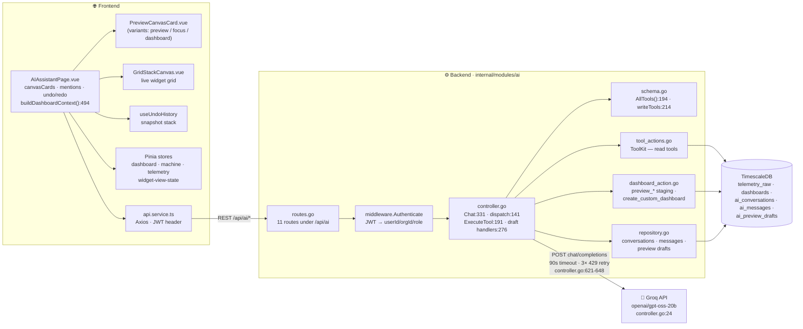
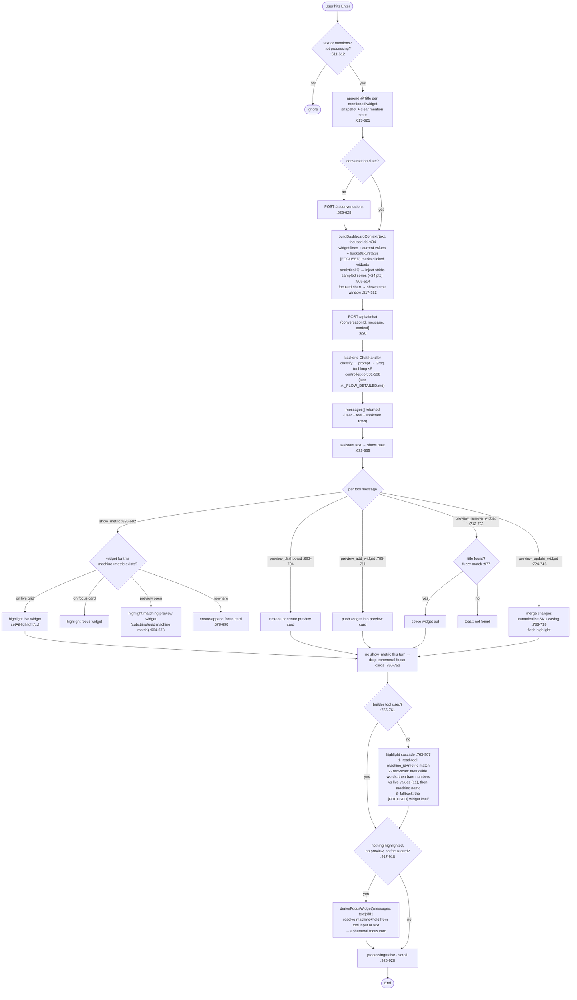
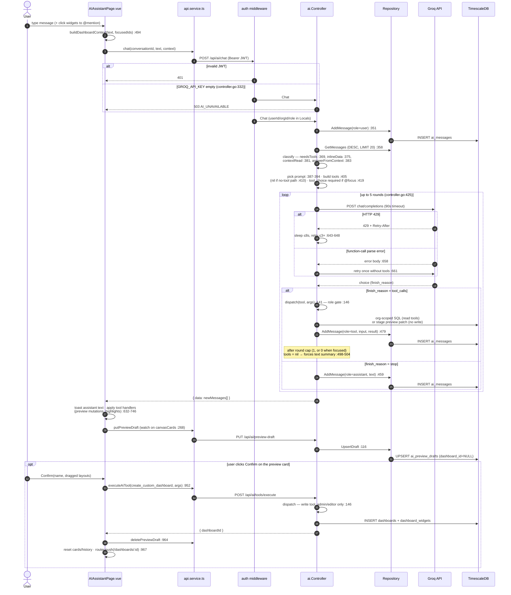
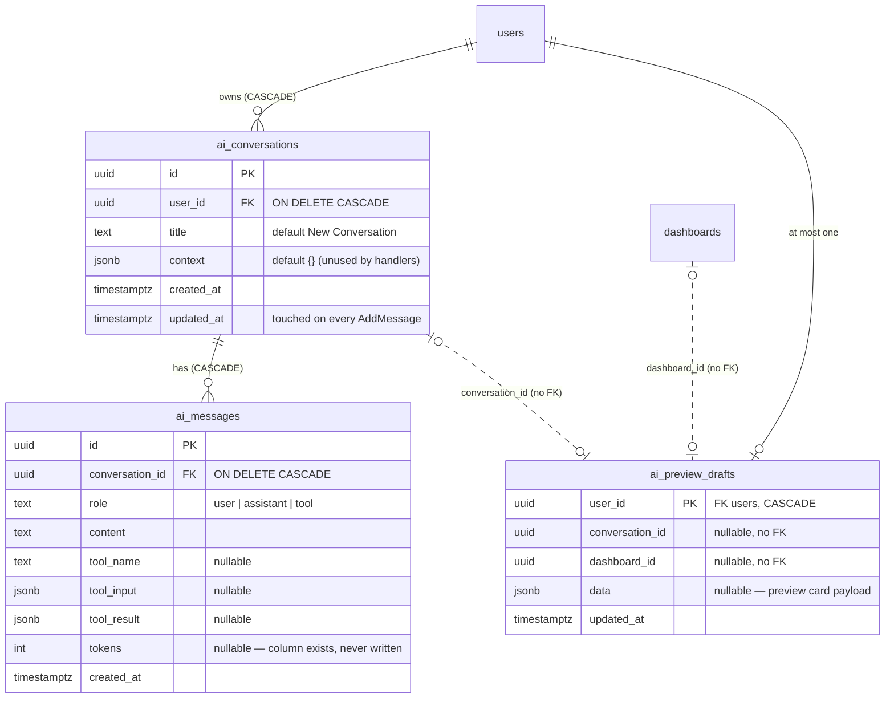
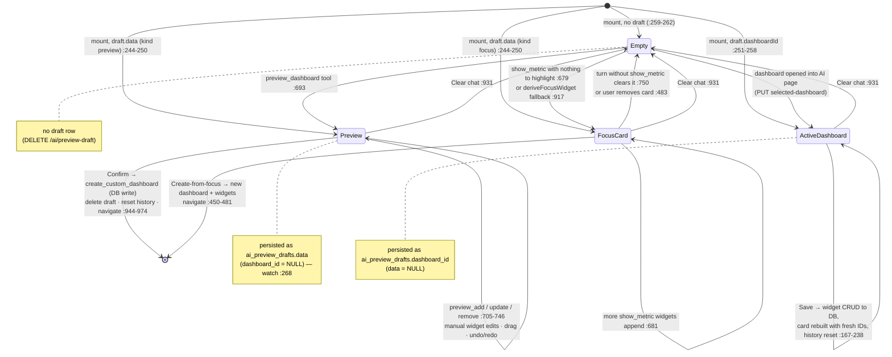

# IotVision — AI Page (very detailed)

Scope: the AI assistant page end-to-end — `frontend/src/pages/AIAssistantPage.vue` plus the
backend module it talks to (`backend/internal/modules/ai/`). Companion docs:
[`AI_ARCHITECTURE.md`](./AI_ARCHITECTURE.md) (design rationale, model bake-off) and
[`AI_FLOW_DETAILED.md`](./AI_FLOW_DETAILED.md) (backend `Chat` handler internals). This doc is
anchored on the **page**: what the browser holds, sends, and does with each tool result.

Sections: [Architecture](#1-system-architecture) · [Flowchart](#2-flowchart--sendmessage-pipeline-frontend) ·
[Sequence](#3-sequence-diagram--one-chat-turn--confirm) · [API](#4-api-reference--apiai) ·
[ERD](#5-data-model--erd) · [State](#6-state-diagram--canvas--persisted-draft)

---

## 1. System architecture

Components and who calls whom. The page never talks to Groq or the DB directly — everything
funnels through `/api/ai/*` (Fiber, JWT-authenticated at `routes.go:11`).

Key boundary rules:

- **Role gate** — `dispatch` (`controller.go:146`) rejects write tools for viewers; the only
  write tool is `create_custom_dashboard` (`schema.go:214`). It is deliberately **excluded from
  `AllTools()`** so the LLM can never call it — only the frontend does, via
  `POST /ai/tools/execute` after the user clicks Confirm (`controller.go:179-183`,
  `AIAssistantPage.vue:952`).
- **Token diet** — simple tools go to Groq slim (name + description only,
  `toGroqToolSlim` `controller.go:533`); only the three `preview_*` widget tools keep full
  schemas (`complexSchemaTools` `controller.go:556`), and they're hidden entirely when no
  dashboard context is on screen (`previewOnlyTools` `controller.go:564`).

---

## 2. Flowchart — `sendMessage` pipeline (frontend)

The backend half of this pipe (classify → prompt select → tool loop) is drawn in
[`AI_FLOW_DETAILED.md`](./AI_FLOW_DETAILED.md); here it's one box. This chart covers what the
**page** does before and after — `sendMessage` (`AIAssistantPage.vue:610-929`).

Around the pipe, three `watch`ers on `canvasCards` keep state durable
(`AIAssistantPage.vue:268-282`):

- **Draft persistence** — any preview/focus card change is `PUT` to `/ai/preview-draft`
  (per-user, survives refresh; restored in `onMounted` `:240-263`).
- **Undo history** — every mutation pushes a JSON snapshot onto `useUndoHistory`
  (`:113-141`); applied DB writes reset the stack (`resetHistory` `:137`).
- The `restoring` flag (`:111`) stops the mount-time restore from echoing itself back as a
  save or a history entry.

---

## 3. Sequence diagram — one chat turn + Confirm

Full round trip including the staged-preview confirm. Error paths shown as alts.

Note the asymmetry: while chatting, **nothing** the LLM does writes to `dashboards` — the
`preview_*` tools only return patches the page applies to its in-memory card. The single DB
write happens on the user's explicit Confirm (or Save for an Active-dashboard card, which the
page translates into widget CRUD calls itself — `saveDashboardCard` `:167-238`).

---

## 4. API reference — `/api/ai`

All routes registered in `routes.go:13-26`, JWT required (`routes.go:11`).

| Method | Path | Handler (controller.go) | Notes |
|--------|------|--------------------------|-------|
| GET | `/api/ai/tools` | `ListTools` :209 | Returns `AllTools()` (12 tools; excludes `create_custom_dashboard`). |
| POST | `/api/ai/tools/execute` | `ExecuteTool` :191 | `{toolName, params}` → direct `dispatch`. The frontend's Confirm path; write tools need admin/editor. |
| GET | `/api/ai/conversations` | `GetConversations` :215 | Current user's conversations, newest-updated first, with message counts. |
| POST | `/api/ai/conversations` | `CreateConversation` :227 | `{title?}` (default "New Conversation") → 201. |
| GET | `/api/ai/conversations/:id/messages` | `GetMessages` :243 | Last 20 messages, DESC. ⚠️ No ownership check on `:id`. |
| POST | `/api/ai/conversations/:id/messages` | `AddMessage` :255 | Manual message insert `{role, content, toolName?, toolInput?, toolResult?}`. |
| GET | `/api/ai/preview-draft` | `GetPreviewDraft` :276 | Per-user view state: `{conversationId, dashboardId, data}` or `null`. |
| PUT | `/api/ai/preview-draft` | `PutPreviewDraft` :306 | `{conversationId?, data}` — upsert preview, clears `dashboard_id`. |
| DELETE | `/api/ai/preview-draft` | `DeletePreviewDraft` :321 | Drop the row (Clear chat / after Confirm). |
| PUT | `/api/ai/selected-dashboard` | `PutSelectedDashboard` :292 | `{dashboardId}` — upsert selected dashboard, clears `data`. |
| POST | `/api/ai/chat` | `Chat` :331 | `{conversationId, message, context?}` → runs the Groq tool loop, returns all new message rows. 503 if no `GROQ_API_KEY`, 502 on Groq failure. |

Response envelope everywhere: `{ "success": true, "data": … }`; errors go through the
shared error middleware as `{code, message}` with 4xx/5xx status.

---

## 5. Data model — ERD

Tables created in `internal/migrate/migrate.go:211-245`.

Semantics worth knowing:

- `ai_preview_drafts` is a **one-row-per-user XOR**: `UpsertDraft` (`repository.go:116`) sets
  `data` and nulls `dashboard_id`; `UpsertDashboard` (`:134`) does the opposite. `GetDraft`
  (`:147`) returns whichever side is set; the page restores a preview/focus card or re-fetches
  the dashboard accordingly (`AIAssistantPage.vue:243-258`).
- `conversation_id` / `dashboard_id` on the draft are plain UUID columns (no FK) — a deleted
  dashboard leaves a dangling draft that simply fails to restore.
- `ai_messages.tokens` is schema-only; `AddMessage` (`repository.go:96`) never writes it.
- History sent to Groq is much smaller than what's stored: 20 rows fetched
  (`repository.go:77`), but only the last **3** user/assistant text rows are replayed —
  tool rows are deliberately dropped (`buildGroqMessages` `controller.go:732-750`).

---

## 6. State diagram — canvas + persisted draft

The page's central state is `canvasCards` (`AIAssistantPage.vue:18-22`) — at most one card of
kind `preview` | `focus` | `dashboard` (plus transient `created`). Each in-memory state maps
to a persisted `ai_preview_drafts` shape.

Undo/redo (`useUndoHistory`, `:113-141`) operates **within** a state — it snapshots
`canvasCards` on every deep change and restores previews/focus cards; anything already written
to the DB (Confirm, Save) is out of its reach, so those paths call `resetHistory()`.
