# IotVision AI — Slide Diagrams ("ทำงานยังไง")

Mermaid diagrams สำหรับ present เน้น **AI ทำงานยังไง**. หนึ่งหัวข้อ = หนึ่งสไลด์.
ทุก diagram ตรงกับโค้ดจริงใน `backend/internal/modules/ai/` (controller.go, dashboard_action.go, schema.go).

> เปิดใน VS Code (Markdown Preview Mermaid) หรือ paste เข้า https://mermaid.live เพื่อ export เป็นรูปใส่สไลด์

---

## Slide 1 — ภาพรวมสถาปัตยกรรม AI

**พูด:** ผู้ใช้พิมพ์ → backend เลือก prompt/tools ให้เอง → Groq เรียก "tool" มา query ข้อมูลจริงจาก DB → ตอบกลับเป็นภาษาคน. AI ไม่เดา ทุกตัวเลขมาจาก DB

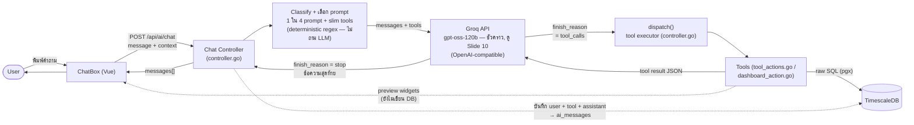

> **ตรงกับ `AI_ARCHITECTURE.md` §1:** `CLS` = ขั้น classify (เลือก 1 ใน 4 system prompt ด้วย regex ก่อนเรียก Groq — ไม่มีขั้น "ถาม LLM ว่าต้องใช้อะไร"). `dispatch()` คือ switch ใน `controller.go:142` ที่รัน tool แต่ละตัวใน `tool_actions.go` (read) / `dashboard_action.go` (preview). ทุกตัวเลขมาจาก DB จริง — AI ไม่เดา.
>
> _(แก้จากเวอร์ชันก่อน: `ROUTE` เดิมวาดเป็น decision {◇} แต่มีทางออกเดียว ซึ่งผิด — จริง ๆ เป็นขั้น classify ที่แตกเป็น 4 prompt, รายละเอียดการแตกอยู่ใน Slide 2)_

---

## Slide 2 — Router ตัดสินใจยังไง (จุดเด่นของระบบ)

**พูด:** ไม่ใช่ทุกข้อความจะยิง AI แบบเต็ม. Router ดูจากข้อความ (regex) ว่าต้องใช้ tool ไหม / มี widget บนจอไหม / ตอบจากบนจอได้เลยไหม แล้วเลือก **1 ใน 4 system prompt** ที่ "เบาที่สุดที่พอ" → ประหยัด token, เลี่ยง rate limit

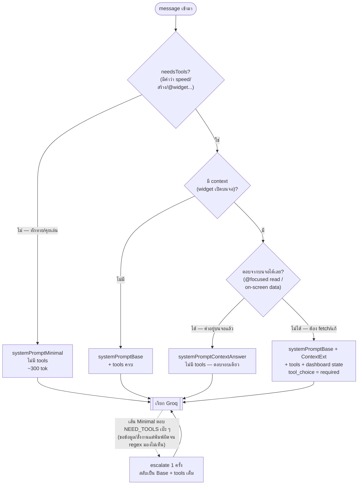

**มีทั้งหมด 4 prompt** (`controller.go:388-395`) — เลือกจาก 3 flag: `needsTools` (regex หา metric/action/@mention), `hasContext` (มี snapshot บนจอ), `answerFromContext` (ค่าอยู่บนจอแล้ว):

| # | Prompt | เลือกเมื่อ | มี tools? | บรรจุอะไร | ตัวอย่าง |
|---|--------|-----------|-----------|-----------|----------|
| 1 | `systemPromptMinimal` | `needsTools == false` — ทักทาย/คุยเล่น | ❌ | identity + กฎภาษา + "ตอบสั้นประโยคเดียว" + กฎ sentinel: ถ้าที่จริงขอข้อมูล/สั่งงาน ให้ตอบ `NEED_TOOLS` เป๊ะ ๆ (~300 tok) | "สวัสดีครับ", "ทำอะไรได้บ้าง" |
| 2 | `systemPromptContextAnswer` | `answerFromContext` — ค่าอยู่บนจอแล้ว (inlineData หรือ @-focused read) | ❌ | identity + ภาษา + "อย่าเรียก tool ตอบจาก context ที่ให้" | "@Speed Trend แนวโน้มเป็นยังไง" (series ถูก inline มาแล้ว) |
| 3 | `systemPromptBase` | `needsTools` + **ไม่มี** context (หรือมี context แต่ไม่เข้าเงื่อนไข ContextExt) | ✅ ครบ | TOOL SELECTION + SLOT FILLING + WIDGET TYPES | "speed ของ CW-01 เท่าไหร่", "มี dashboard อะไรบ้าง" |
| 4 | `systemPromptBase + systemPromptContextExt` | `needsTools && hasContext && !answerFromContext` — ต้อง fetch/แก้ ทั้งที่มี widget บนจอ | ✅ ครบ + preview | Base + กฎ preview-staging + routing `@Widget`/`[FOCUSED]` + dashboard state; ถ้า focused → `tool_choice=required` | "เพิ่ม gauge", "เปลี่ยน metric เป็น temperature" |

**แต่ละ prompt ใช้ทำอะไร:**
- **1. Minimal** — path ไม่ใช้ tool สำหรับทักทาย/คุยเล่น. สั่งแค่ "ตอบสั้นประโยคเดียว, match ภาษา, plain text". ตัดกฎ tool ทั้งหมดทิ้งเพื่อประหยัด token. มี **escape hatch**: ถ้าข้อความที่หลุดมาที่นี่จริง ๆ แล้วขอข้อมูล/สั่งงาน (พิมพ์ผิดจน regex จับไม่ได้ เช่น "ส้างแดชบอด cw-01") โมเดลจะตอบ `NEED_TOOLS` เป๊ะ ๆ → backend retry 1 ครั้งด้วย Base + tools เต็ม (`controller.go:487-494`, sentinel ไม่ถูกบันทึกลง DB)
- **2. ContextAnswer** — ตอบจากค่าที่อยู่บนจอแล้ว (ไม่ยิง tool ซ้ำ). สั่งอ่านค่า/ช่วงเวลา/bucket ของ widget ที่ `[FOCUSED]`, ถ้าเป็น trend ให้บรรยาย *รูปทรง* ทั้ง series + min/max + ทำนายถ้าขอ
- **3. Base** — สมองหลักของการเลือก tool (อ่านข้อมูล/สร้าง dashboard). มี **TOOL SELECTION** (read→`show_metric`, all→`get_machines`, สร้าง→`preview_dashboard`, SKU→`get_skus`, alert→`get_active_alerts`), **SLOT FILLING** (ขาดเครื่อง/เป้าหมาย→ถามกลับ 1 คำถาม), **WIDGET TYPES**
- **4. Base + ContextExt** — ทุกอย่างของ Base **บวก** กฎ preview-staging (`preview_*`, ไม่เขียน DB จนกด Save/Confirm) + routing ตามชนิดจริงของ widget ที่ mention (count→`get_production_count`, gauge/kpi→`show_metric`/`get_telemetry_series`, alarm→`get_active_alerts`)

**สรุปเป็นแกน 2 มิติ** (ใช้ tool ไหม × มี context ไหม):

| | ❌ ไม่ใช้ tool | ✅ ใช้ tool |
|---|---|---|
| **ไม่มี context** | 1. Minimal — ทักทาย | 3. Base — อ่าน/สร้าง |
| **มี context** | 2. ContextAnswer — ตอบจากบนจอ | 4. Base + ContextExt — fetch/แก้ widget |

> **หลักคิด:** จ่าย token เท่าที่ข้อความนั้นต้องใช้จริง — คำทักทายไม่ต้องแบกกฎ tool (~300 tok), ไม่มี dashboard เปิดก็ไม่ต้องแบกกฎ preview (~100 tok). `Base` ถูกทำให้ **byte-stable** เพื่อให้ Groq prompt cache reuse ข้าม turn ได้; prompt #4 จึงเป็น "ต่อท้าย Base" ไม่ใช่ก้อนใหม่ (ไม่งั้น cache miss). และ regex **พลาดคำผิดได้โดยไม่พัง** — Minimal มีกฎ `NEED_TOOLS` ให้ escalate ไป Base + tools อัตโนมัติ (คำทักทายจ่ายเพิ่มแค่ ~40 tok สำหรับกฎนี้).

---

## Slide 3 — AI Workflow ทั้งเส้นในรูปเดียว

**พูด:** ทุก request เดินเส้นเดียวกัน: classify ด้วย regex (ไม่เปลือง LLM) → ได้ prompt ที่เบาที่สุดที่พอ → ถ้าต้องใช้ข้อมูลก็เข้า tool loop → บันทึกแล้วตอบกลับ. จุดสำคัญ: การเขียน DB จริงอยู่**นอก**เส้นนี้เสมอ — ต้องรอผู้ใช้กด Confirm/Save

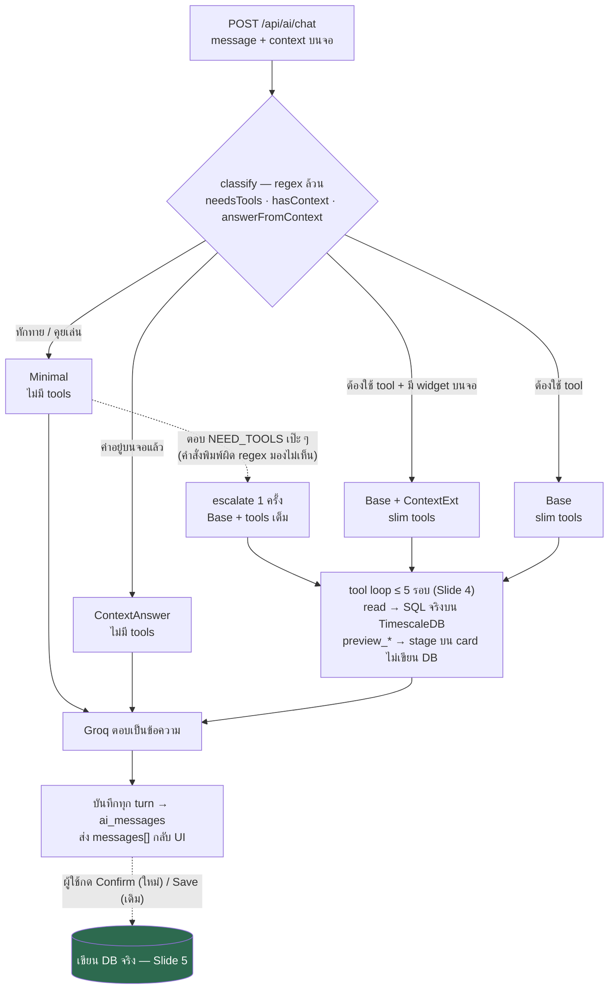

> ตรงกับ flowchart "Workflow at a glance" ใน `AI_ARCHITECTURE.md` §2 — เวอร์ชันนั้นละเอียดกว่า (แสดง finish_reason / roundCap / slot-filling). เคสตัวอย่างจริงของแต่ละเส้นอยู่ท้าย Slide 4 (เคส A–D)

---

## Slide 4 — Multi-round Tool Loop (หัวใจการทำงาน)

**พูด:** Groq ไม่ตอบตรง ๆ ถ้าต้องใช้ข้อมูล มันจะ "ขอเรียก tool" ก่อน. Backend รัน tool → ป้อนผลกลับ → Groq สรุปเป็นคำตอบ. วนได้สูงสุด 5 รอบ, แต่จริง ๆ ปิดจ็อบใน 1-2 รอบด้วย `roundCap` เพื่อคุม token

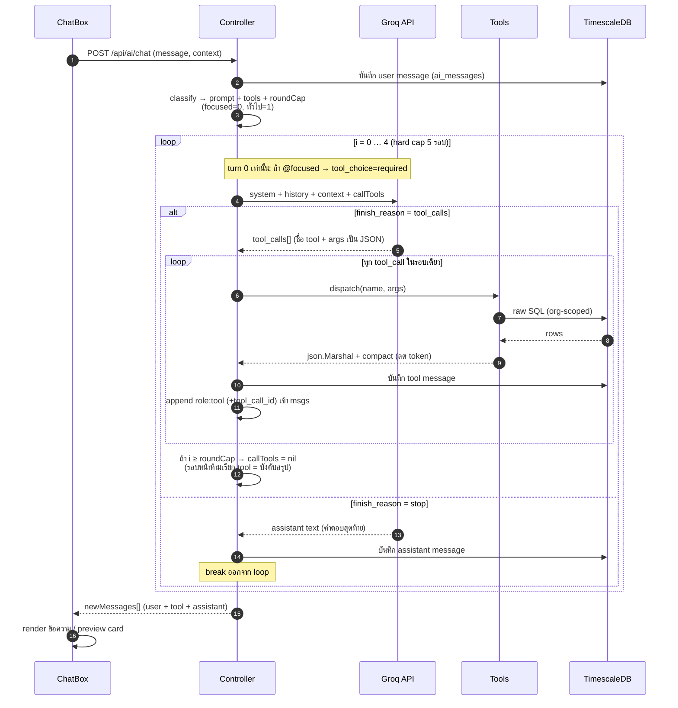

### loop ทำงานยังไง — ละเอียด (`controller.go:439` เป็นต้นไป)

**โครงหลัก:** `for i := 0; i < 5; i++` — วนได้สูงสุด **5 รอบ** (hard cap กันหลุด/วนไม่จบ) แต่ละรอบ = **1 ครั้งที่คุยกับ Groq**. แต่ละรอบจบด้วยหนึ่งใน 2 อย่าง: Groq ขอ tool (ทำต่อ) หรือ Groq ตอบข้อความ (จบ)

**1. ออกจาก loop เมื่อไหร่ (3 ทาง)**
- **`finish_reason = stop`** → Groq ตอบเป็นข้อความ = คำตอบสุดท้าย → บันทึก assistant message แล้ว **`break`** (ทางออกปกติ `:473-506`)
  - **ยกเว้น sentinel:** ก่อนบันทึก ถ้าเป็น no-tool path (`!needsToolsFlag`) แล้วข้อความคือ `NEED_TOOLS` เป๊ะ ๆ (`:487-494`) → ยังไม่จบ: สลับเป็น prompt เต็ม + tools เต็มแล้ว `continue` (ทำได้ **ครั้งเดียว** guard ด้วย `escalated`) — sentinel ไม่ถูกบันทึกลง DB. นี่คือทางหนีของข้อความสั่งงานที่พิมพ์ผิดจน regex จับไม่ได้
- **`callTools = nil` แล้ว** → รอบถัดไปไม่ส่ง tool ให้เลย Groq จึง *ต้อง* ตอบเป็นข้อความ → เข้าทาง stop ข้างบน (นี่คือกลไก roundCap บังคับให้จบ)
- **ครบ 5 รอบ** → hard stop กันเหนียว (ปกติไม่ถึง)

**2. `roundCap` — หัวใจการคุม token (`:538-542`)**
```
roundCap = 1            // ปกติ
if focused { roundCap = 0 }   // ถาม @widget เจาะจง
...หลังรัน tool: if i >= roundCap { callTools = nil }
```
- **focused (`@widget`) → roundCap 0** → หลังรอบ `i=0` ตัด tool ทิ้งเลย → `i=1` บังคับสรุป = ยิง tool **รอบเดียว**
- **ทั่วไป → roundCap 1** → `i=0` และ `i=1` ยังเรียก tool ได้, `i=2` บังคับสรุป = ยิง tool **2 รอบ** (เผื่อ pattern `get_machines` → `show_metric` หลายตัว)
- **ทำไมต้องจำกัด:** ทุกรอบต้อง re-send context ~3k tok ซ้ำ → ปล่อยวนเยอะจะทะลุ 8k tok/min ของ Groq

**3. `tool_choice=required` — เฉพาะ turn 0 (`:428-436`)**
- ส่งเฉพาะ `i==0` **และ** มี `@focused` mention (สัญญาณเดียวที่การันตีว่ามี widget จริงให้ลงมือ) → บังคับ Groq เรียก tool ทันที ไม่อ้อม
- รอบถัด ๆ (`i>0`) `tc=""` เสมอ → ปล่อย `auto`
- **safety net:** ถ้าบังคับ required แล้ว Groq ดันตอบ text (error "Tool choice is required") → retry ด้วย `auto` (`:451-455`) — required เป็น optimization ไม่ใช่กฎตายตัว

**4. หลาย tool ในรอบเดียว (`:509-536`)** — Groq ส่ง `tool_calls[]` ได้หลายตัวพร้อมกัน → loop ใน `dispatch` ทีละตัว, ผลแต่ละตัว `json.Marshal` + **compact** (series/count ใหญ่ย่อเป็น columns+tuples) แล้ว append เป็น message `role:"tool"` ผูกด้วย `tool_call_id` กลับเข้า `msgs` ก่อนวนรอบใหม่

**5. บันทึกทุก turn ระหว่างทาง** — user (ก่อน loop), tool (ทุกครั้งที่รัน), assistant (ตอนจบ) ลง `ai_messages` หมด และ append เข้า `newMessages[]` ส่งกลับ frontend

**6. error handling ในลูป (`:445-465`)**
- `"Tool choice is none"` (qwen พยายาม chain tool ตอนสรุป) → retry ด้วย toolset เต็ม
- rate limit (429) wait ยาว → คืน HTTP 429 `RATE_LIMIT` + `retryAfter` (ไม่ปล่อยค้าง)
- error อื่น → 502 `AI_ERROR`

> **สรุปสั้น:** loop = "ถาม Groq → ถ้าขอ tool ก็รันแล้วป้อนกลับ → วนจนได้ข้อความ". `roundCap` คือเบรกที่ตัด tool ทิ้งหลัง 1-2 รอบเพื่อบังคับสรุปไว ๆ ไม่ให้เปลือง token — 5 รอบเป็นแค่เพดานกันหลุด ปกติจบใน 2-3 ครั้งที่คุยกับ Groq

### 4 เคสจริง — sequence ต่อ prompt (ตรงกับ `AI_ARCHITECTURE.md` §2)

flow ต่างกันตาม prompt ที่ classify เลือก: 2 เคสแรกไม่มี tool (จบรอบเดียว ไม่แตะ DB), 2 เคสหลังเข้า tool-loop ข้างบน

#### เคส A — Minimal · ทักทาย — "สวัสดีครับ"

ไม่มี tool, ไม่แตะ DB — ตอบประโยคเดียวจบ

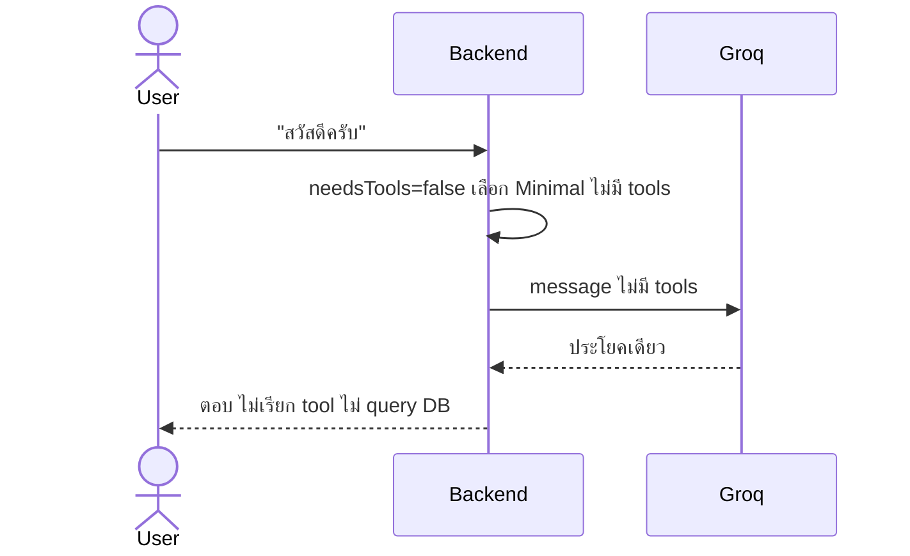

> ถ้าข้อความที่หลุดมาเคสนี้จริง ๆ แล้วเป็นคำสั่ง (พิมพ์ผิด เช่น "ส้างแดชบอด cw-01") Groq จะตอบ `NEED_TOOLS` แทนประโยคทักทาย → backend escalate ไปเคส C/D อัตโนมัติ (ดู "ยกเว้น sentinel" ข้างบน)

#### เคส B — ContextAnswer · ตอบจากบนจอ — "@Speed Trend แนวโน้มเป็นยังไง"

series ถูก inline มาใน context แล้ว จึงไม่ต้อง fetch ซ้ำ

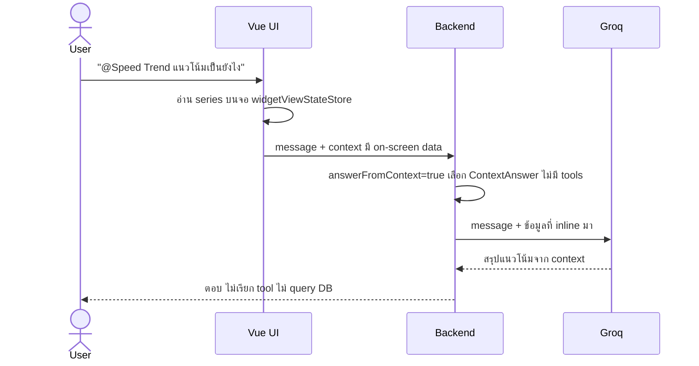

#### เคส C — Base · อ่านข้อมูล — "speed ของ CW-01 เท่าไหร่"

เข้า tool-loop ดึง DB จริง (ถ้าขาด slot จะถามกลับก่อน)

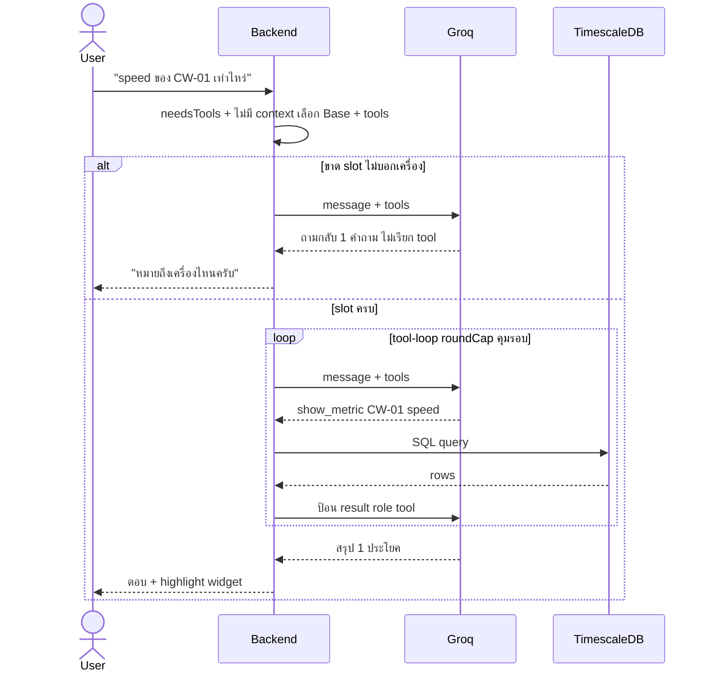

> **ถ้ามี dashboard เปิดบนจอด้วย (แต่ไม่ @ widget):** prompt จะเป็น `Base + ContextExt` (ช่อง #4 แบบเคส D) ไม่ใช่ `Base` เปล่า — เพราะ `hasContext=true`. แต่ ContextExt มีกฎ (`controller.go:84`) ว่า "live-value question ที่ไม่ได้ mention widget (เช่น 'speed ของ CW-01') → เรียก `show_metric`" → จึง fallback มาเดิน tool-loop แบบเคส C นี้เหมือนเดิม ผลลัพธ์ไม่เปลี่ยน. ต่างจากเคส D จริงตรง `tool_choice=auto` (ไม่ required เพราะไม่ focused) และ `roundCap=1` — เป็น read ล้วน ไม่ stage preview ไม่เขียน DB

#### เคส D — Base + ContextExt · แก้ widget — "เปลี่ยน metric เป็น temperature"

stage preview ก่อน เขียน DB ต่อเมื่อผู้ใช้กด Save/Confirm

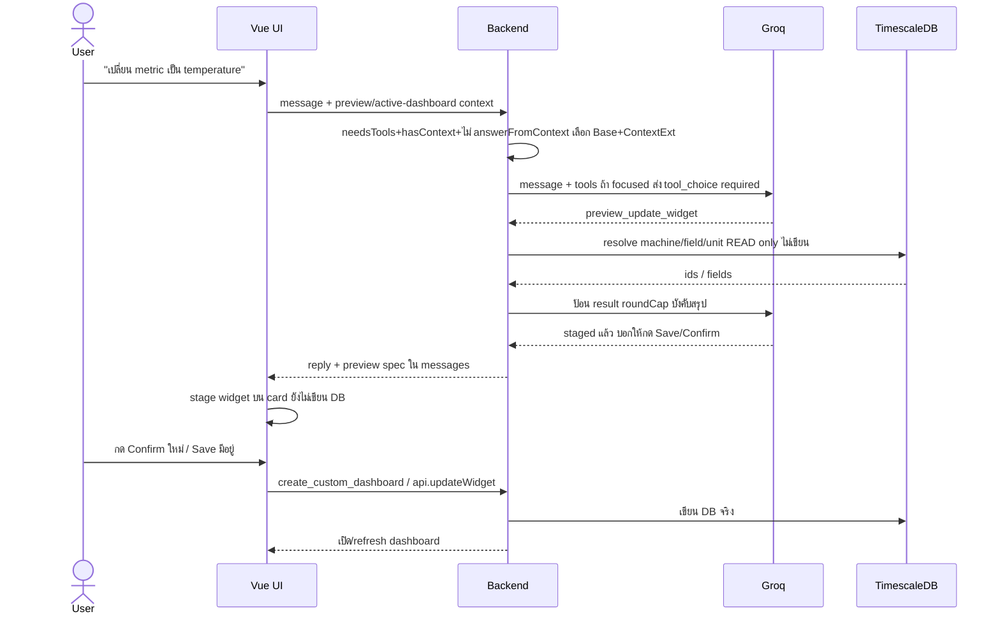

> **สังเกต:** เคส A-B จบในรอบเดียว ไม่แตะ DB → เร็ว+ถูกสุด. เคส C-D เข้า tool-loop ข้างบน แต่ D ยัง **ไม่เขียน DB** จนผู้ใช้กด Save/Confirm (ดู Slide 5)

---

## Slide 5 — Preview → Confirm → Apply (AI แก้ dashboard อย่างปลอดภัย)

**พูด:** ตอน AI "สร้าง/แก้ dashboard" มันไม่เขียน DB ทันที. มันสร้างแค่ **preview** ให้ดูก่อน — ผู้ใช้กดยืนยันเองถึงจะบันทึกจริง. LLM เรียก `create_custom_dashboard` เองไม่ได้ (ตัดออกจาก tool list) มีแต่ frontend เรียกหลังกดปุ่ม

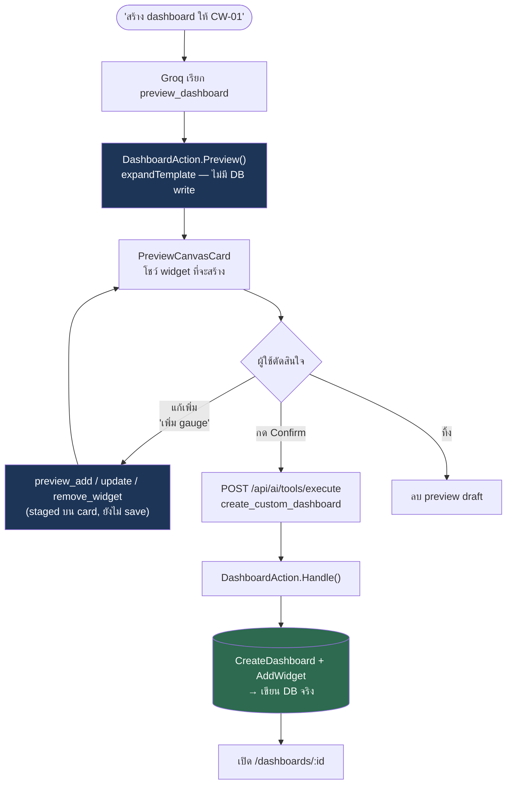

> **จุดขาย:** human-in-the-loop — AI เสนอ, คนอนุมัติ. ไม่มีทางที่ AI จะแก้ข้อมูลจริงโดยไม่ผ่านการกดยืนยัน

---

## Slide 6 — Tool Catalog (AI ทำอะไรได้บ้าง)

**พูด:** AI มี 12 tools แบ่งเป็น "อ่าน" (ใครก็เรียกได้) กับ "แก้ preview" (เฉพาะ admin/editor). tool แต่ละตัว = 1 SQL query จริงบน DB

**📖 Read tools (8) — ทุก role เรียกได้ · แต่ละตัว = 1 SQL query จริง → ผลป้อนกลับให้ Groq สรุป**

| Tool | ทำอะไร |
|------|--------|
| `get_machines` | ลิสต์เครื่อง: ชื่อ / ชนิด / สถานะ / field ที่มี |
| `show_metric` | ค่าปัจจุบันของ metric → คืนเป็น widget ให้ UI render |
| `get_telemetry_trend` | avg / min / max ของ metric ในช่วงเวลา |
| `get_telemetry_series` | ข้อมูลราย bucket (แบบที่ line chart แสดง) |
| `get_production_count` | ยอดผลิตราย bucket (แบบ daily-count widget) |
| `get_active_alerts` | alert ที่เปิดอยู่ (+ event_id ไว้ ack/resolve) |
| `get_skus` | ลิสต์ SKU ที่เครื่องมี |
| `list_dashboards` | dashboard ที่มี + จำนวน widget |

**✏️ Preview tools (4) — เฉพาะ admin / editor · staged บน card เท่านั้น ไม่เขียน DB**

| Tool | ทำอะไร |
|------|--------|
| `preview_dashboard` | สร้าง preview จาก template (machine_overview/production/maintenance) |
| `preview_add_widget` | เพิ่ม widget ลง preview หรือ active dashboard ที่เปิดอยู่ |
| `preview_update_widget` | แก้ widget: metric / bucket / ชื่อ / unit / min-max / sku / ... |
| `preview_remove_widget` | ลบ widget ออก |

**🔒 Gated (1) — LLM เรียกไม่ได้ (ตัดออกจาก tool list) · frontend เรียกเองหลังกดปุ่ม**

| Tool | ทำอะไร |
|------|--------|
| `create_custom_dashboard` | บันทึก preview เป็น dashboard จริง (เขียน DB) — เรียกหลังกด Confirm |

> **flow สั้น:** Read → query TimescaleDB ตรง ๆ · Preview → staged บน Preview Canvas (ไม่เขียน DB) → กด Confirm → `create_custom_dashboard` → เขียน DB. สิทธิ์บังคับที่ backend (`dispatch` เช็ค role) ไม่ใช่แค่ซ่อนปุ่ม

---

## Slide 7 — ทำไมถึงลื่นและถูก (token / rate-limit optimization)

**พูด (optional):** ระบบออกแบบให้ทุก request จ่าย token น้อยสุด — prompt เล็กสุดที่พอ, ส่ง tool schema แบบย่อ, จำ history แค่ 3 ข้อความล่าสุด, ตอบจากบนจอถ้าทำได้. ผลคือเลี่ยง rate limit 8k/นาที ของ Groq

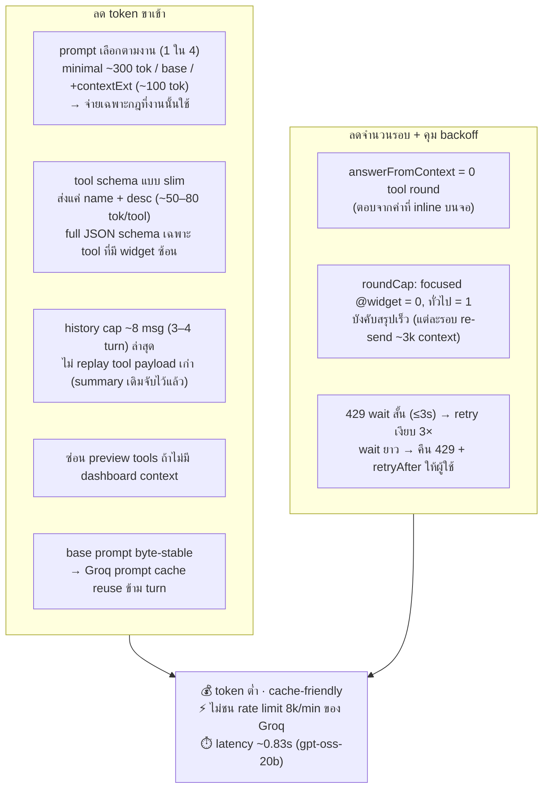

**สรุปกลไก (`controller.go`):**
- **Layered prompt** — ประกอบ prompt เป็นชั้น ต่อเฉพาะชั้นที่จำเป็น: greeting ตัดกฎ tool ทิ้ง (~300 tok), ไม่มี dashboard ก็ไม่ต่อกฎ preview (~100 tok).
- **Slim tool schema** (`toGroqToolSlim`) — tool ทั่วไปส่งแค่ชื่อ+คำอธิบาย (arg hint ฝังในคำอธิบาย), ส่ง JSON schema เต็มเฉพาะ tool ที่มี widget ซ้อน (เช่น `preview_add_widget`).
- **Context ต่อท้ายสุด** — dashboard state ที่ authoritative ต่อหลัง history เพื่อให้ recency ชนะ turn เก่าที่ค้าง.
- **Round cap** — ทุกรอบ tool ต้อง re-send context ~3k tok, จึงจำกัดรอบ (focused=0, ทั่วไป=1) แลกกับให้สรุปไวขึ้น.
- **Rate-limit handling** — 429 wait สั้น retry เงียบ (ไม่ทำผู้ใช้ค้าง), wait ยาวคืน HTTP 429 พร้อม `retryAfter` ให้ผู้ใช้กดใหม่แทนที่จะรอค้าง.

---

## Slide 8 — Target Users (ใครใช้ AI)

**พูด:** AI ให้ทุก role ใช้ได้ แต่ทำได้ไม่เท่ากัน — คนดูข้อมูล vs คนแก้ dashboard. ระบบบังคับสิทธิ์ที่ backend (write tool ต้อง admin/editor) ไม่ใช่แค่ซ่อนปุ่ม

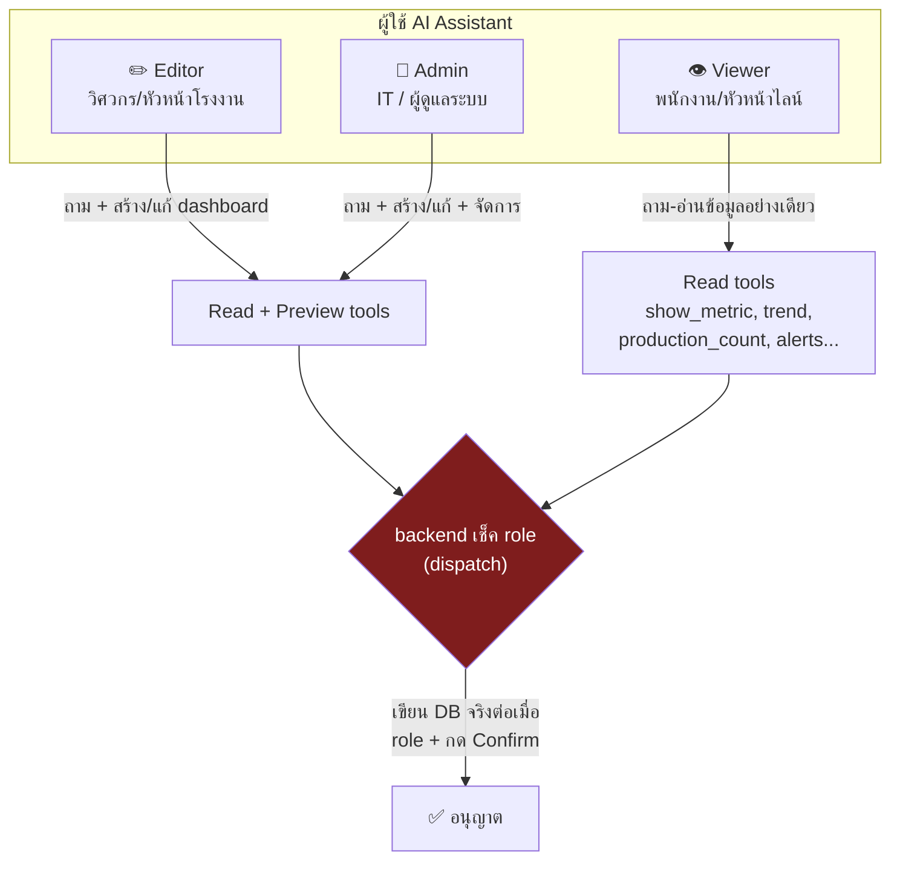

**หนึ่งประโยคขึ้น slide:** "ทีมโรงงานที่อยากได้ข้อมูลเครื่องจักรโดยไม่ต้องรู้ SQL หรือเปิดหลายหน้า — แค่ถามเป็นภาษาคน"

---

## Slide 9 — Expected Outcomes (ผู้ใช้ได้อะไรจาก AI)

**พูด:** คุณค่าหลักคือ "ลดระยะทางจากคำถาม → คำตอบ/การกระทำ" — จากเดิมต้องขุดข้อมูลเอง/เขียน config เอง เหลือแค่พิมพ์ประโยคเดียว

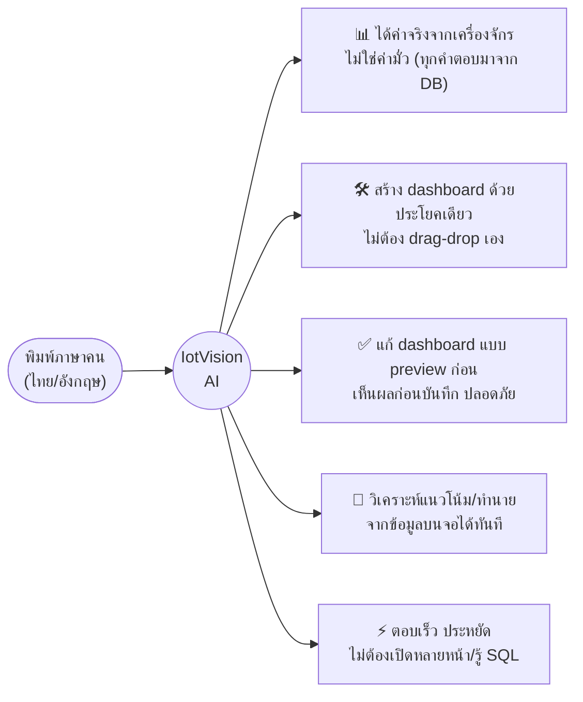

**หนึ่งประโยคขึ้น slide:** "จากคำถาม → คำตอบจริง หรือ dashboard พร้อมใช้ ในไม่กี่วินาที โดยไม่ต้องเขียนโค้ด"

---

## Slide 10 — AI Model Comparison (เลือกโมเดลจากข้อมูลจริง)

**พูด:** ไม่ได้เดาว่าโมเดลไหนดี — มี bake-off harness (`eval_test.go`) ยิง **24 เคสภาษาไทย** (เคสที่ 24 `typo-create` เพิ่ม 2026-07-08 พร้อมงาน NEED_TOOLS sentinel — คะแนนด้านล่างมาจาก run 23 เคสของ 2026-07-06) วัดว่าโมเดลเลือก tool ถูกตั้งแต่ครั้งแรกไหม (first-decision accuracy). ความแม่นตันกันแล้ว เลยตัดสินที่ **ความเร็ว + token + การรอด rate limit**

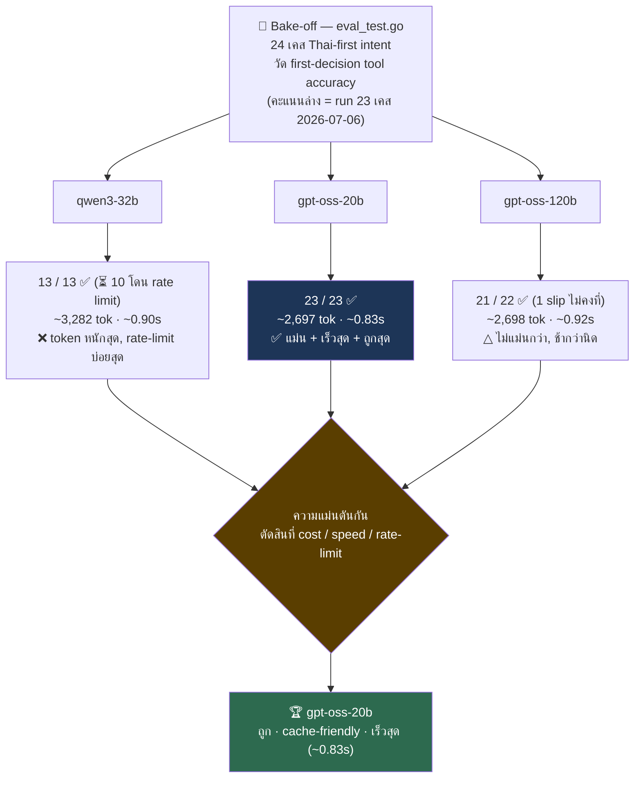

| Model | Score | Avg tok | Latency | ผล |
|-------|-------|---------|---------|-----|
| `qwen3-32b` | 13/13 (⏳10) | ~3,282 | ~0.90s | ตัดออก — หนัก, โดน rate limit |
| `gpt-oss-20b` | **23/23** | **~2,697** | **~0.83s** | 🏆 เลือก — ถูก+เร็ว+cache-friendly |
| `gpt-oss-120b` | 21/22 | ~2,698 | ~0.92s | ไม่คุ้ม — ไม่แม่นกว่า |

> **จุดขาย:** เลือกโมเดลแบบ data-driven ทำซ้ำได้ (`go test -run TestBakeOff`) ไม่ใช่ "รู้สึกว่าตัวนี้ดี" · วัด 3 แกน: Quality (เลือก tool ถูก) / Cost (token) / Latency

---

### ลำดับสไลด์ที่แนะนำ

1. ภาพรวมสถาปัตยกรรม (Slide 1) — เห็นทั้งระบบก่อน
2. Router (Slide 2) — จุดต่างที่ทำให้ประหยัด
3. Workflow ทั้งเส้น (Slide 3) — request หนึ่งเดินยังไงจนจบ
4. Tool loop (Slide 4) — หัวใจว่า AI ดึงข้อมูลจริงยังไง
5. Preview → Confirm (Slide 5) — เรื่องความปลอดภัย คนชอบถาม
6. Tool catalog (Slide 6) — สรุปความสามารถ
7. Optimization (Slide 7) — ปิดท้ายถ้าคนฟังสายเทคนิค (ตัดได้ถ้าเวลาน้อย)

**ถ้าต้องเปิดด้วย "ทำเพื่อใคร/ได้อะไร":** เอา Slide 8 (Target Users) + Slide 9 (Outcomes) ขึ้นก่อน Slide 1
