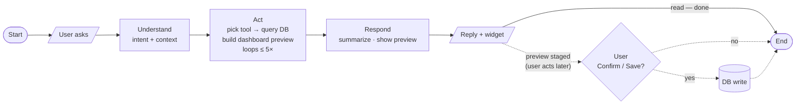
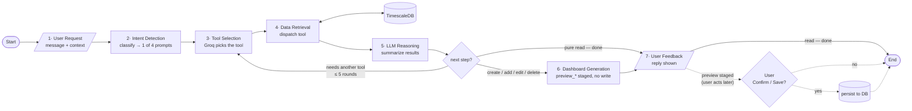
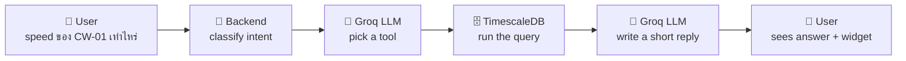
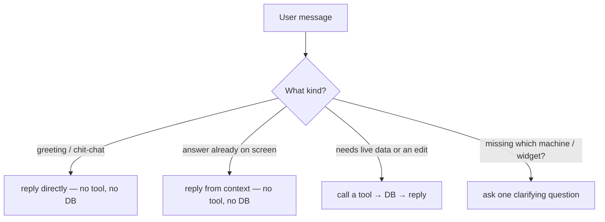

# IotVision AI — Workflow (simple)

The one-line version: **user talks → AI picks a tool → backend queries the DB → AI replies.**
For the full detail (four flow shapes, prompt layering, model bake-off) see
[`AI_ARCHITECTURE.md`](./AI_ARCHITECTURE.md).

## One-slide version

Collapse the 7 stages into 4 phases — fits a 16:9 slide, one line per box:

If you need the named stages on the slide, use the 7-box chart below but keep **only the bold
titles** (drop the sub-text) so it stays one line tall.

## The 7 stages

The canonical agent pipeline, mapped to what each step actually is in the code:

Shapes (ANSI): **oval/terminator** = Start / End · **parallelogram** = input / output (user
request, reply) · **rectangle** = process step · **diamond** = decision · **cylinder** = database.
The loop back to stage 3 is the tool-calling loop; stage 6 covers **any** staged change
(create / add / edit / delete via `preview_*`) and nothing hits the DB until the user clicks
**Confirm** or **Save** (dashed).

**Three shortcuts** the backend takes so it doesn't always run the full loop:

That's it. Reads show a widget; create/edit stage a preview and only write to the DB when the
user clicks **Confirm** or **Save**.
