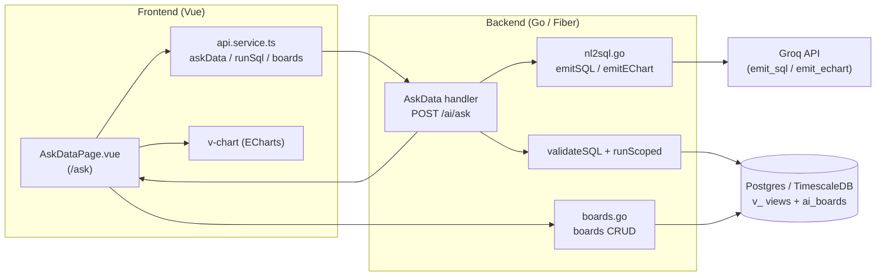
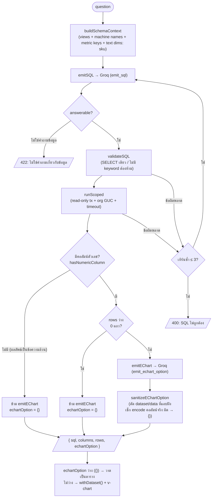
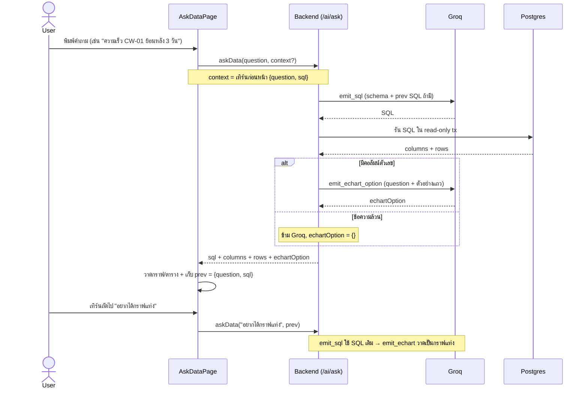
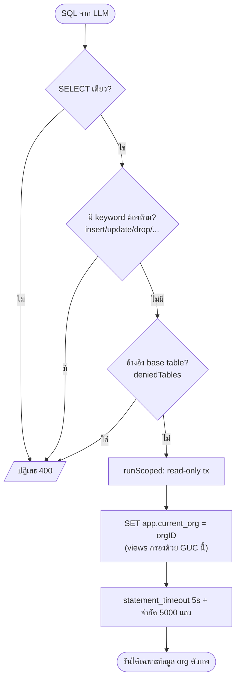
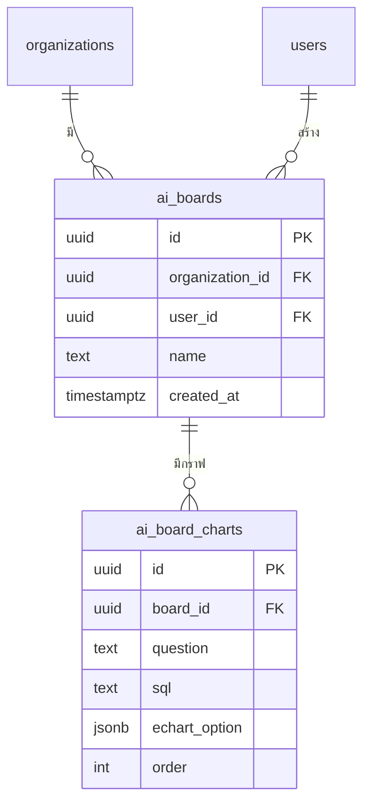

# Ask Data — ภาพรวมการทำงาน

ฟีเจอร์ **Ask Data** (`/ask`) ให้ผู้ใช้ถามคำถามเกี่ยวกับข้อมูลโรงงานเป็นภาษาพูด แล้วระบบแปลงเป็น SQL แบบอ่านอย่างเดียว รันบนฐานข้อมูล แล้ววาดเป็นกราฟ ECharts ให้อัตโนมัติ — แยกขาดจาก AI Assistant chat (`/ai`) ที่ใช้ structured tools

> ไดอะแกรมทั้งหมดเป็น Mermaid แสดงผลได้บน GitHub / VS Code Markdown Preview / mermaid.live

---

## 1. สถาปัตยกรรมรวม

- **Page** ส่งคำถามผ่าน `api.askData()`
- **Backend** เรียก Groq สองครั้ง (สร้าง SQL แล้วสร้าง option ของกราฟ) และรัน SQL ผ่าน guard
- **DB** เข้าถึงได้เฉพาะ `v_` views ที่กรอง org ไว้แล้ว

---

## 2. Request pipeline (`POST /ai/ask`)

**การจัดการข้อผิดพลาด กรณีผลลัพธ์ว่าง และ sanitization:**

1. **SQL ที่ validate หรือรันพัง** — backend ส่งข้อความข้อผิดพลาดกลับให้ LLM แก้เอง (ไม่แสดงให้ผู้ใช้เห็น) สูงสุด 3 ครั้ง ภายใน timeout รวม 45 วินาที หลังจากนั้นถ้ายังผิดก็ส่ง 400 กลับไปยัง frontend
2. **ผลลัพธ์ 0 แถว** — ข้ามการเรียก Groq รอบสร้างกราฟ ส่ง `echartOption = {}` กลับมา ฝั่ง frontend เช็ก `rows.length === 0` เอง (`resultIsEmpty`) แล้วแสดงข้อความ "No data matched — try a wider time range or check the machine name." แทนตาราง/กราฟ
3. **Sanitization** — ฝั่ง Go ตัด `dataset` / `data` ที่ LLM อาจแอบฝังไว้ในกราฟ, เช็ก encode ของคอลัมน์ที่อ้างอิงจริง ถ้าผิดก็คืน `echartOption = {}` ให้วาดเป็นตาราง

ข้อมูลถูกวาดโดยเอา `echartOption` (ไม่มีข้อมูลในตัว) มารวมกับ `rows` เป็น `dataset` ตอน render — รันซ้ำก็แค่เปลี่ยนข้อมูล ส่วนการเข้ารหัสกราฟคงเดิม

**Chart หรือ Table** — backend เช็ก `hasNumericColumn(cols, rows)` หลังรัน SQL: ถ้าผลลัพธ์ไม่มีคอลัมน์ตัวเลขเลย (เช่น "list machines", "มี sku อะไรบ้าง" ที่ได้ข้อความล้วน) จะ **ข้ามการเรียก Groq รอบสร้างกราฟ** แล้วส่ง `echartOption` เป็น `{}` กลับมา ฝั่ง frontend ใช้ `{}` เป็นสัญญาณว่า "วาดเป็นตาราง" (`isTabular()`) แทนที่จะฝืนวาดกราฟที่ว่างเปล่า — ใช้กับทั้งผลลัพธ์สดและกราฟที่บันทึกไว้ใน board

**กฎที่ฝังใน prompt ของ `emitSQL`** (ควบคุมว่า LLM สร้าง SQL แบบไหน):
- **ช่วงเวลาแบบ relative** ("ย้อนหลัง N ชม./วัน") → `WHERE ts > now() - interval 'N ...'` เสมอ ห้าม hardcode วันที่
- **คำถามแนวโน้ม** → `time_bucket('<interval>', ts)` + `ORDER BY bucket` (เลือก interval ให้ได้จำนวนจุดพอเหมาะ)
- **จับชื่อเครื่องด้วย `machine_name ILIKE '%<code>%'`** ไม่ใช่ `=` เพราะชื่อจริงมี prefix (ผู้ใช้พิมพ์ "CW-01" แต่ในฐานข้อมูลคือ "Checkweigher CW-01") — ถ้าใช้ `=` จะได้ 0 แถว = กราฟว่าง
- **มิติแบบข้อความ (text dimension)** — นอกจาก metric ตัวเลขแล้ว `data` JSONB ยังเก็บมิติข้อความ โดยเฉพาะ `sku` (อ่านด้วย `data->>'sku'`) `buildSchemaContext` บอก LLM ว่ามีมิตินี้ ไม่งั้น LLM จะไม่รู้จักและตอบว่า "ไม่ใช่คำถามข้อมูล"
- **คำถามแบบ listing** ("มี sku อะไรบ้าง", "which SKUs", "list machines") = `SELECT DISTINCT ...` ไม่ใช่ time series และถือเป็น **answerable=true** — `answerable=false` เฉพาะทักทาย/คุยเล่นเท่านั้น

---

## 3. Sequence diagram (รวม follow-up memory)

follow-up memory เก็บแค่ **1 เทิร์นล่าสุด** ทำให้คำสั่งต่อเนื่องอย่าง "เอาเป็นกราฟแท่ง" / "จัดกลุ่มรายวัน" ปรับผลลัพธ์เดิมได้ ไม่ถูกปฏิเสธ

---

## 4. Security model

ชั้นป้องกันซ้อนกัน:
- **validateSQL** — SELECT เดียว, บล็อก keyword เขียน/DDL, บล็อกการอ้างอิง base table (อนุญาตเฉพาะ `v_` views)
- **runScoped** — transaction แบบอ่านอย่างเดียว + `statement_timeout` + จำกัดจำนวนแถว
- **org GUC** — `v_` views กรองด้วย `current_setting('app.current_org')` ถ้าไม่ตั้งค่า = ไม่เห็นแถวใด (deny by default)
- **now()-cap** — `v_telemetry` ใส่ `WHERE timestamp <= now()` ซ่อนข้อมูลอนาคตของ seed data ทำให้ช่วงเวลาแบบ "ย้อนหลัง N วัน" มีขอบบนที่ถูกต้อง

---

## 5. API reference

ทุก endpoint อยู่ภายใต้ `/api/ai` และต้องผ่าน auth (JWT) — org ดึงมาจาก token

| Method | Path | หน้าที่ | Body หลัก |
|--------|------|---------|-----------|
| POST | `/ai/ask` | คำถาม → SQL → กราฟ | `{ question, context? }` |
| POST | `/ai/run-sql` | รัน SQL ที่เก็บไว้ซ้ำ (ตอนเปิด board) | `{ sql }` |
| GET | `/ai/boards` | รายการ board | — |
| POST | `/ai/boards` | สร้าง board | `{ name }` |
| GET | `/ai/boards/:id` | ดึง board + charts | — |
| DELETE | `/ai/boards/:id` | ลบ board | — |
| POST | `/ai/boards/:id/charts` | เพิ่มกราฟลง board | `{ question, sql, echartOption }` |
| DELETE | `/ai/boards/:id/charts/:chartId` | ลบกราฟ | — |

`/ai/run-sql` และ `/ai/boards/.../charts` re-validate SQL ผ่าน `validateSQL` ทุกครั้ง แม้ SQL จะมาจาก DB ของเราเอง (defense-in-depth)

---

## 6. Data model / ERD

**Views (อ่านอย่างเดียว, กรอง org ในตัว)** — เป็นสิ่งเดียวที่ SQL จาก LLM แตะได้:

| View | มาจาก | หมายเหตุ |
|------|-------|----------|
| `v_telemetry(machine_id, machine_name, ts, data)` | `telemetry_raw` + `v_machines` | ค่าเมตริกอยู่ใน `data` JSONB อ่านด้วย `(data->>'key')::float` — cap ที่ `now()` |
| `v_machines(id, name, type, status)` | `machines` + `production_lines` + `factories` | กรองด้วย `app.current_org` |
| `v_machine_fields(machine_id, machine_name, key, label, unit)` | `machine_fields` + `v_machines` | บอก LLM ว่ามี metric key อะไรบ้าง |

`ai_board_charts` เก็บ `sql` ไว้ ทำให้เปิด board แล้วรัน SQL ซ้ำเพื่อดึงข้อมูลล่าสุดได้ (ไม่ได้เก็บ snapshot ข้อมูล)
