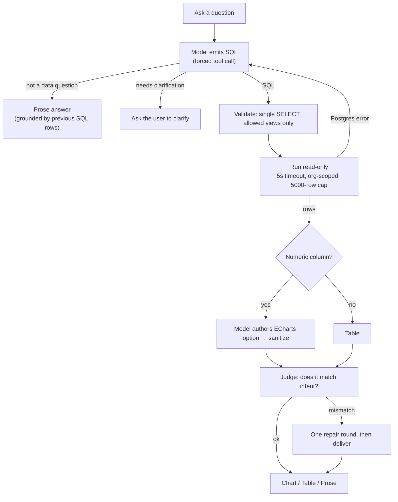

# IotVision AI Pages — Simple Guide

A short tour of IotVision's two AI features. For the full deep-dive (line-level references,
security tables, API contracts), see [`ai-pages.md`](./ai-pages.md).

IotVision has **two independent AI surfaces**. They share the same AI provider account and the
same org-scoped database, but nothing else — no shared code, conversation state, or UI.
Production runs on **KKU GenAI**: `claude-sonnet-5` does the heavy generation, and a cheaper
`gpt-5.4-mini` does intent routing and answer-checking. Both are OpenAI-compatible chat APIs.

| Surface | Page | What it does |
|---|---|---|
| **Ask-Data** ("Ask" page) | `AskDataPage.vue` | Turns a question into safe read-only SQL, runs it, and (for numeric results) has the model draw an ECharts chart. |
| **Chat Assistant** | `AIAssistantPage.vue` + `ChatBox.vue` | A conversational agent that reads live telemetry and stages dashboard edits, gated behind preview-then-confirm. |

---

## 1. Ask-Data

You type a question. The pipeline:

1. **Build schema context** — describe the three allowlisted views (`v_telemetry`,
   `v_machines`, `v_machine_fields`), the org's real machine names/metrics, and the SQL rules.
2. **Emit SQL** — the model is forced to return `{answerable, sql, clarification}`. It either
   gives SQL, asks a clarifying question, or signals "this isn't a data question" (→ prose).
3. **Validate + run** — Go checks it's a single `SELECT` against allowed views, then runs it
   read-only (5s timeout, org isolation, 5000-row cap). Any error is fed back and the model
   retries — up to 3 attempts.
4. **Chart it** — if the result has a numeric column, the model authors an ECharts option
   (`encode`-only, one series). Go sanitizes it. No numeric column → render as a table.
5. **Verify** — a cheap judge checks the answer matches the question. On a mismatch it does
   **one** repair round, then delivers whatever it has (degrading to a table if needed) —
   it never returns a hard error for a verification miss.

**Three turn types.** Every response is exactly one of:
- **Data turn** (`sql` present) — replaces the chart/table.
- **Clarification turn** — the next message you send is treated as the answer.
- **Prose turn** (`answer` present) — a markdown note that annotates the current chart without
  clearing it, grounded in the previous SQL's rows.

**Retries are bounded:** SQL self-correction ×3, chart authoring ×1, plus one repair round.

**Boards** let you save a chart (`{question, sql, echart_option}`). Reopening re-runs the stored
SQL through the same validation path, so saved charts always show live data — never a stale
snapshot.

**Security in one line:** generated SQL can only ever be a single read-only `SELECT` against
three allowlisted views, org-isolated at the database layer, time- and row-bounded. Stored SQL
from boards is re-validated too — nothing is trusted implicitly.

---

## 2. Chat Assistant

The core idea: **the model classifies, Go decides.**

1. **Classify intent** — the cheap router model makes one forced `classify_intent` call and
   returns strict JSON (intent, machine, metric, date range, target widget, confidence, …).
   Recognized intents: `chat`, `read_metric`, `read_agg`, `edit_widget`, `compare`,
   `create_dashboard`, `alerts`, `production`. The `confidence` is the model's own
   self-rating (0..1, guided by a 3-band rubric — not a calibrated probability); below 0.5
   it falls back to "let the model choose."
2. **Dispatch** — a pure Go function maps that intent to which tool (if any) the generation
   model is *forced* to call. No LLM call in this decision.

   | Intent | Forced tool |
   |---|---|
   | `read_metric` | `show_metric` |
   | `read_agg` | `get_telemetry_series` |
   | `production` | `get_production_count` |
   | `alerts` | `get_active_alerts` |
   | `edit_widget` | `preview_update_widget` |
   | `compare` | `preview_update_widget` / `preview_add_widget` |
   | `create_dashboard` | `preview_dashboard` |
   | focused read from on-screen data | none — answered from context |
   | classification failed | auto — model chooses |

3. **Tool loop** — up to 5 iterations. Each round the model may call tools; results are
   appended and persisted. After the round budget is used, tools are dropped so the model has
   to write a final text answer.
4. **Verify-then-repair** — if any tool ran, deterministic Go checks run first (a staged
   `preview_add_widget`/`preview_update_widget` can't reference a metric that doesn't exist on
   the target machine; a `preview_dashboard` plan can't leave a widget metric-less), then an LLM
   judge. Outcome is deliver, ask back, or one repair round.

**Preview-then-confirm.** The model can *stage* a dashboard via `preview_*` tools but can never
create one directly — `create_custom_dashboard` is deliberately excluded from the tool schema
and only fires from the frontend after the user clicks Confirm.

**Widget element-click** (`/ai` only): clicking a part of a widget (an axis, a data point, the
value) attaches a one-line context hint to your next message via a mention chip — so you can
ask "why did this dip?" about a specific point without retyping it.

---

## 3. Output checking

Both surfaces cap their self-correction so latency and token cost stay predictable — neither
loops forever chasing a perfect answer. Every *structural* check (SQL safety, schema validity,
column validation) is deterministic Go; the LLM is reserved for genuine *semantic* judgment
(intent, chart appropriateness, answer-vs-question consistency). On failure both degrade
gracefully rather than erroring — Ask-Data falls back to a plain table, Chat delivers its best
text. The one hard error is a provider daily-quota exhaustion, surfaced as `429 QUOTA_EXCEEDED`
so the UI can say "come back later."

---

## 4. What it can't do (yet)

- **Ask-Data only sees telemetry** — the three `v_` views. Questions about dashboards, alert
  rules, or users have no data to answer from. It also can't return more than 5000 rows, run
  longer than 5s, or draw stacked/dual-axis charts (line, bar, pie, scatter, heatmap — plus
  area, smoothed and horizontal as style variants — one series each).
- **Ask-Data remembers one turn** — a follow-up refines the previous question; it can't reach
  back to a chart from three questions ago.
- **Chat can't create alert rules** — there is no tool for it, only reading active alerts. It
  also can't create a dashboard on its own: preview then Confirm, always.
- **Chat remembers the last 3 messages** and chains at most two tool rounds per turn (one when a
  widget is focused) — both caps exist to keep the prompt (and the bill) small. Several widgets
  can be edited in a single message; what it can't do is chain tools where each result picks the
  next one.
- **Element-click works on `/ai` only**, one element per widget.
- **Capacity:** ~4,700 tokens per Ask question, ~11,400 per chat turn. Against a 200k/day quota
  shared by the whole org that is roughly **42 questions or 17 chat turns a day**.
- **No browser E2E tests** — coverage stops at the HTTP handler + live database.
