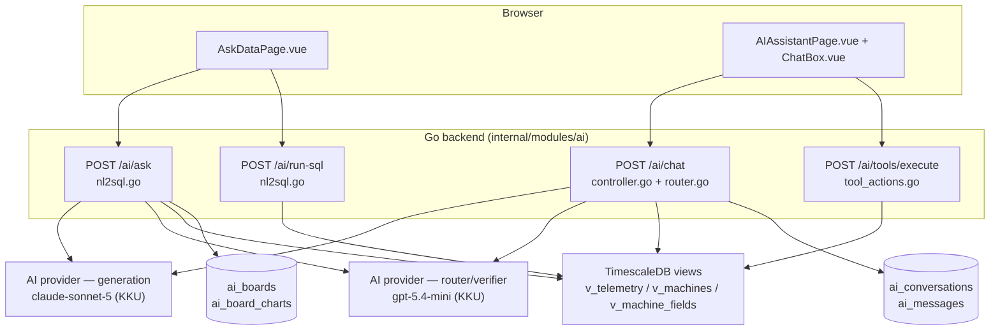
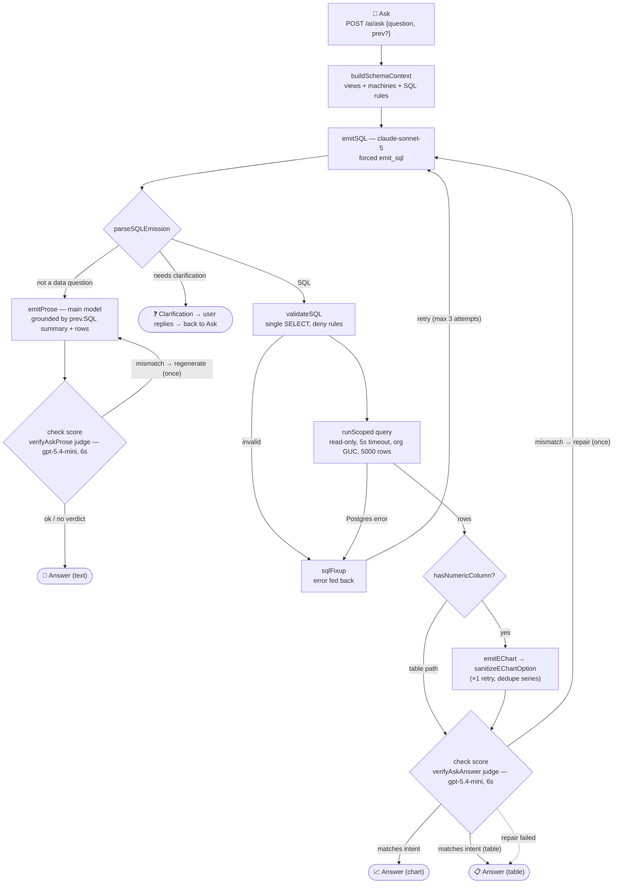
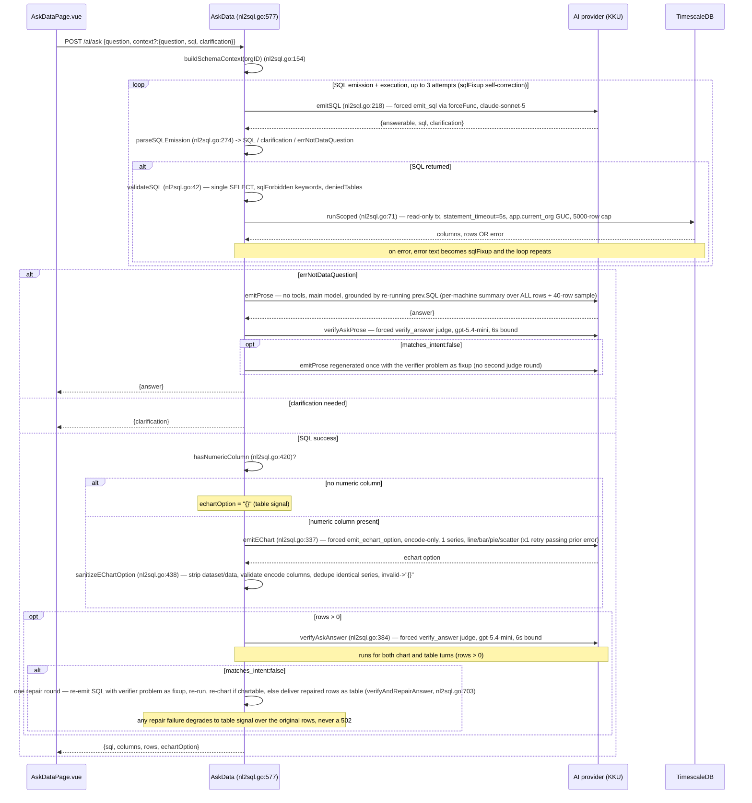
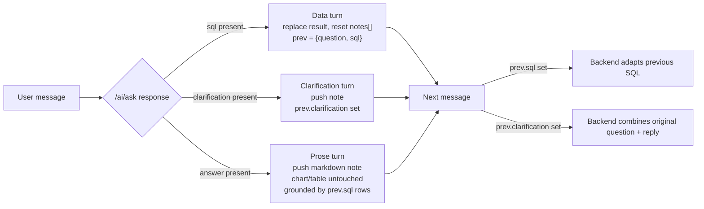
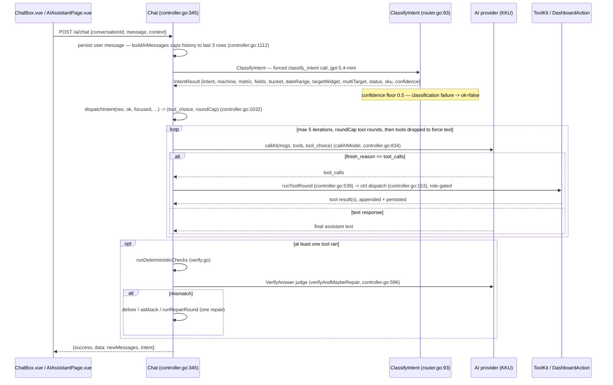

# IotVision — AI Pages: How Ask-Data & Chat Assistant Work

IotVision ships two independent AI surfaces, both backed by an OpenAI-compatible chat completions API. **Production runs on KKU GenAI** (`AI_BASE_URL=https://gen.ai.kku.ac.th/api/v1`): generation uses `claude-sonnet-5` (`AI_MODEL`); intent routing and answer verification use `gpt-5.4-mini` (`AI_ROUTER_MODEL` — deliberately a different model family so router/judge quota is isolated from the generation pool). Provider, models, and key are set via `AI_BASE_URL`, `AI_MODEL`, `AI_ROUTER_MODEL`, and `AI_API_KEY`; unset values fall back to Groq (`api.groq.com`, `openai/gpt-oss-120b` / `openai/gpt-oss-20b`, legacy `GROQ_API_KEY`). `aiBaseURL()` accepts either a provider base (`…/v1`) or a full completions URL — it auto-appends `/chat/completions` when missing. The **Ask-Data** page turns a natural-language question into hardened, read-only SQL and an LLM-authored ECharts option. The **Chat Assistant** is a conversational agent that reads live telemetry and stages dashboard edits through structured tool calls, gated behind a preview-then-confirm workflow. This document explains both pipelines end to end for developers extending or debugging them.

## Table of contents

1. [Overview — two surfaces](#1-overview--two-surfaces)
2. [Ask-Data pipeline](#2-ask-data-pipeline-the-ask-page)
   - [2.1 Frontend flow](#21-frontend-flow)
   - [2.2 Backend pipeline](#22-backend-pipeline)
   - [2.3 Turn types & follow-up thread](#23-turn-types--follow-up-thread)
   - [2.4 Security hardening](#24-security-hardening)
   - [2.5 Boards](#25-boards)
   - [2.6 Example Q&A](#26-example-qa)
   - [2.7 Layer map & call budget](#27-layer-map--call-budget)
3. [Output checking](#3-output-checking)
4. [Chat Assistant pipeline](#4-chat-assistant-pipeline)
   - [4.1 Frontend](#41-frontend)
   - [4.2 Backend](#42-backend)
   - [4.3 Tools](#43-tools)
   - [4.4 Widget element-click](#44-widget-element-click)
5. [API reference](#5-api-reference)
6. [Current limits & scope](#6-current-limits--scope)

---

## 1. Overview — two surfaces

**In short:** IotVision's AI capability is split into two surfaces that share the same AI provider account and org-scoped database access but do not share code paths, conversation state, or UI.

| Surface | Page | Backend | Purpose |
|---|---|---|---|
| Ask-Data ("Ask" page) | `frontend/src/pages/AskDataPage.vue` | `backend/internal/modules/ai/nl2sql.go`, `boards.go` | Natural language → hardened SQL → rows → LLM-authored ECharts option; boards to save charts; follow-up thread. |
| AI Assistant (chat) | `frontend/src/pages/AIAssistantPage.vue` + `ChatBox.vue`, `PreviewCanvasCard.vue`, `CreatedCanvasCard.vue`, `TextCanvasCard.vue` | `controller.go`, `router.go`, `schema.go`, `tool_actions.go`, `dashboard_action.go`, `verify.go` | Conversational assistant reading live metrics and staging dashboard edits via structured tool calls. |



---

## 2. Ask-Data pipeline (the "Ask" page)

**In short:** the Ask page takes a question, has the model emit validated SQL, executes it read-only against three allowlisted views, and (for numeric results) has the model author a chart option that the frontend renders — with self-correction and verification loops at every risky step.

### 2.1 Frontend flow

`AskDataPage.vue` is a self-contained page: a global `<v-chart>` from `vue-echarts` is used for rendering, laid out as a left "Boards" rail alongside a main "Ask your data" column.

**State:**

| Field | Meaning |
|---|---|
| `question` | The current input text. |
| `asking` | In-flight guard while a request is pending. |
| `result` (`AskDataResult`) | The current chart/table payload. |
| `notes[]` | The follow-up Q&A thread rendered under the current result. |
| `askedQuestion` | The question that produced the current `result`. |
| `prev` | Previous-turn context passed back to the backend for follow-ups. |

**`ask()`** (`AskDataPage.vue:~89`) trims the input, calls `api.askData(q, prev)`, and branches on the response shape:

- `res.sql` present → a **data turn**: replace `result`, reset `notes`, set `prev = {question, sql}`.
- `res.clarification` present → push a clarification note and set `prev.clarification`; the user's next message is treated as the answer to that question.
- otherwise `res.answer` → push a prose note.

Prose and clarification turns annotate the current chart rather than clearing it.

**`withDataset(option, columns, rows)`** (`AskDataPage.vue:~35`) merges the data-less ECharts option returned by the backend with `{dataset: {source: [cols, ...rows]}}`. It then performs the per-machine split: if the option has exactly one `line`/`bar`/`scatter` series with string `encode.x`/`encode.y` and a category column is present (e.g. `machine_name`), it rewrites the option into N filter-transform datasets and N series — one line per machine, with a 2–20 category ceiling — and adds a vertical legend.

**`isTabular(option)`** (`AskDataPage.vue:~79`) — an empty `{}` option is the backend's signal to render the result as a table instead of a chart.

Prose answers are rendered as markdown via `marked` + `DOMPurify`.

**API client:** `frontend/src/services/api.service.ts:314-353` — `askData(question, context?)` issues `POST /ai/ask` with a 60s timeout; the same module exposes `runSql`, `listBoards`, `createBoard`, `getBoard`, `addBoardChart`, and `deleteBoardChart`.

### 2.2 Backend pipeline

**In short:** the backend forces the model to emit SQL through a tool call, validates and runs it read-only with retries, then (if the result is numeric) has a second forced tool call author a chart option that gets sanitized and verified before it ever reaches the browser.

The full loop at a glance — retries and repair drawn as return arrows:



Entry point `AskData` (`nl2sql.go:577`), routed at `POST /ai/ask` in `routes.go`.



Numbered walkthrough (same substance as the sequence diagram, for reference):

1. **`buildSchemaContext(ctx, orgID)`** (`nl2sql.go:154`) — describes the three allowed views (`v_telemetry`, `v_machines`, `v_machine_fields`) plus the org's real machine names and metric keys, and the SQL rules the model must follow: use `time_bucket`, use `now()`-relative windows, use `ILIKE '%code%'` for machine-code matching, and access metrics via JSONB `data->>'key'`.
2. **`emitSQL(ctx, question, schema, prev, fixup)`** (`nl2sql.go:218`) — one forced tool call to `emit_sql` via `forceFunc("emit_sql")` on the generation model (`claude-sonnet-5`); the tool schema is `{answerable, sql, clarification}`. Follow-ups are handled by prompt injection: if `prev.SQL` is set, the prompt asks the model to adapt the previous SQL; if `prev.Clarification` is set, it combines the original question with the user's reply. Two prompt rules keep the model from over-clarifying (added 2026-07-17 for claude-sonnet-5): an explain/definition question ("what does X mean", "อธิบาย", "ต่างกันยังไง") must set `answerable=false` (prose path) and never a clarification; and when a reasonable default exists (no time range → last 24h, fuzzy "drops/low" → below the window average) the model answers with the default instead of asking back — clarification is reserved for questions where no metric/machine/dimension is identifiable at all. `parseSQLEmission` (`nl2sql.go:274`) returns SQL XOR a clarification, or the sentinel error `errNotDataQuestion`.
3. **Branch on the emission:** `errNotDataQuestion` routes to the prose path `emitProse` (`nl2sql.go`, main model) — a no-tools completion grounded by re-running `prev.SQL` via `runScoped`, then fed a per-machine summary (min/max/avg computed over ALL rows, so no extreme is thinned away) plus a 40-row sample for trend shape. The answer then passes a prose judge, `verifyAskProse` — same contract as the chart judge (6s bound, `gpt-5.4-mini`, forced `verify_answer`): a MISMATCH verdict (off-topic answer, or a number contradicting the grounding rows) triggers exactly one regenerate with the verifier's problem as fixup, no second judge round; no verdict or a failed regenerate delivers the original answer — never a 502. Returns `{answer}`. A clarification response returns `{clarification}` directly. Otherwise the SQL path continues.
4. **`validateSQL`** (`nl2sql.go:42`) — enforces a single `SELECT` statement, rejects forbidden write keywords (`sqlForbidden`), and rejects any access to base tables (`deniedTables`), scrubbing the allowed `v_` views first.
5. **`runScoped(ctx, orgID, sql)`** (`nl2sql.go:71`) — opens a read-only transaction, sets `SET LOCAL statement_timeout='5s'`, sets `set_config('app.current_org', orgID, true)` as a Postgres GUC for org isolation, and caps results at 5000 rows. A retry loop runs up to 3 times: any validation failure or Postgres error is turned into a `sqlFixup` message fed back into `emitSQL` so the model can self-correct.
6. **`hasNumericColumn(cols, rows)`** (`nl2sql.go:420`) — if there is no numeric column, or the result is empty, the response sets `option = "{}"` (the table signal) and skips the chart-authoring model call entirely.
7. **`emitEChart(question, cols, sample20, prevErr)`** (`nl2sql.go:337`) — a forced `emit_echart_option` call. The system prompt (`echartSystemPrompt`, `nl2sql.go:326`) requires `encode`-based column references (no embedded data arrays), exactly one series even when a category column is present, and a chart type of line, bar, pie, or scatter. One retry is attempted, passing the prior error back to the model.
8. **`sanitizeEChartOption(option, cols)`** (`nl2sql.go:438`) — strips any `dataset`/`data` the model tried to embed, validates that `encode` references real columns, and dedupes series: series that share the same type and `encode` without per-series filters would render identical rows, so only the first is kept — the frontend's `withDataset` performs the actual per-machine split. An invalid option collapses to `"{}"`.
9. **`verifyAndRepairAnswer`** (`nl2sql.go:703`) runs on chart AND table turns whenever at least one row was returned (empty results are skipped — nothing to judge beyond the SQL text) — `verifyAskAnswer` (`nl2sql.go:384`) runs a bounded 6-second forced `verify_answer` judge call on the router model (`gpt-5.4-mini`). A chart type the user explicitly requested (pie/bar/line/scatter, any language) is correct by definition — the judge only evaluates the data (metric, machine, time window), never a user-chosen style. On `matches_intent:false`, exactly one repair round runs: SQL is re-emitted with the verifier's `problem` text as the fixup and re-run. If the repaired result is chartable it is re-charted; otherwise the repaired rows are delivered as a table. Only a failed emission/validation/run, or an empty repaired result, falls back to the original rows (chart degraded to the table signal) — the endpoint never returns a 502 for a verification miss.
10. **Response shape:** one of `{sql, columns, rows, echartOption}`, `{answer}`, or `{clarification}`.

### 2.3 Turn types & follow-up thread

**In short:** every response is exactly one of three turn types, and the shape of `prev` sent back on the next request determines how that next message is interpreted.



### 2.4 Security hardening

> **Security hardening**
>
> | Rule | Enforcement |
> |---|---|
> | View allowlist | Only the three allowlisted `v_` views are queryable — no base table is ever exposed to generated SQL. |
> | SQL deny rules | `validateSQL` requires a single `SELECT`, rejects forbidden write keywords, and denies base-table names even if referenced indirectly. |
> | Read-only execution | All generated SQL executes inside a read-only transaction. |
> | Org isolation | Enforced at the database layer via the `app.current_org` Postgres GUC, not just in application code. |
> | Timeout | A 5-second `statement_timeout` bounds worst-case query cost. |
> | Row cap | Result sets are capped at 5000 rows. |
> | Stored SQL re-validated | Boards' `AddBoardChart` re-validates the stored SQL through the same `validateSQL`/`runScoped` path even though it originated from our own database — stored SQL is never trusted implicitly. |

### 2.5 Boards

Implemented in `boards.go` against the `ai_boards` / `ai_board_charts` tables. A saved chart stores `{question, sql, echart_option}`. Reopening a board re-runs the stored SQL via `POST /ai/run-sql` (which re-validates it through the same hardening path) so the chart always reflects live data rather than a frozen snapshot.

### 2.6 Example Q&A

Illustrative only — actual SQL and chart shape depend on the org's live schema and data.

- *"average weight per hour today for CW-01"* → SQL → line chart.
- *"compare output of all packing machines this week"* → backend returns a single-series option; the frontend's `withDataset` splits it into one line per machine.
- *"how are things?"* → clarification turn asking which machine, metric, and timeframe.
- Follow-up *"why did it dip at 14:00?"* after a chart → prose turn grounded in the previous SQL's rows.
- *"list machine names"* → no numeric column → table render.

### 2.7 Layer map & call budget

Conceptual layer ↔ code map for the Ask-Data pipeline (every structural check is deterministic Go; the model is called only where semantic judgment is required):

| Layer | Function / file | Model / mechanism |
|---|---|---|
| 1.1 Intent (`answerable`) | `emitSQL` → `parseSQLEmission` (nl2sql.go) | claude-sonnet-5, `forceFunc("emit_sql")` |
| 1.2 Slot grounding | `buildSchemaContext` (nl2sql.go) | Go (deterministic) — live query via `runScoped` |
| 1.3 Clarification | `clarification` field in the same `emit_sql` call | claude-sonnet-5 |
| 2.1 SQL generation | `emitSQL` (nl2sql.go) | claude-sonnet-5 |
| 2.2 SQL validation + runtime guard | `validateSQL`, `runScoped` (nl2sql.go) | Go (deterministic) |
| 3.1 Chart-type pick | `echartSystemPrompt` + `hasNumericColumn` gate | model picks type / Go decides whether to call at all |
| 3.2 Chart spec generation | `emitEChart` (nl2sql.go) | claude-sonnet-5, `forceFunc("emit_echart_option")` |
| 4.1 Spec sanitize | `sanitizeEChartOption` (nl2sql.go) | Go (deterministic) |
| 4.2 Self-consistency judge | `verifyAskAnswer` → `verifyAndRepairAnswer` (nl2sql.go) | gpt-5.4-mini, `forceFunc("verify_answer")` |
| 4.3 Error handling | retry loop in `AskData` (SQL ×3, chart ×1) | Go (deterministic) — no LLM classifier |
| 5 Orchestration | `AskData` handler (nl2sql.go) | Go |

Model-call budget per turn (all inside the handler's 200s context; per-call cap 90s):

| Turn type | Calls |
|---|---|
| prose (not a data question) | `emitSQL` 1 + `emitProse` 1 + judge 1 (+ `emitProse` 1 on mismatch) = **3–4**. `emitSQL`, `emitProse` and its repair run on the **main model** (analysis quality matters); only the judge runs on the router model. |
| table (no numeric column) | `emitSQL` **1–3** (retry loop); no chart/judge — `hasNumericColumn` gates before `emitEChart` |
| chart | SQL 1(–3) + chart 1(–2) + judge 1 (~1s) |
| chart + judge-ordered repair (worst case) | above + SQL 1 + chart 1(–2) |

---

## 3. Output checking

**In short:** both surfaces bound their self-correction and verification work to a fixed, small number of retries so latency and provider token cost stay predictable — neither pipeline will loop indefinitely trying to get a "perfect" answer, and both degrade gracefully instead of failing outright.

| Stage | Ask-Data | Chat Assistant |
|---|---|---|
| Retry-on-error loop | SQL self-correction loop, up to 3 attempts total (`validateSQL`/Postgres error → `sqlFixup` → re-emit via `emitSQL`) | Tool loop, max 5 iterations bounded by `roundCap` |
| Secondary generation retry | Chart authoring (`emitEChart`) retries once, passing the prior error back to the model | — |
| Deterministic checks | — | `runDeterministicChecks` (`verify.go`) — for `preview_add_widget` and `preview_update_widget`, the new metric/fields must exist on the target machine (`checkFieldsExist` against `machine_fields`); for `preview_dashboard`, every planned widget must carry a metric. Any check it can't resolve (no machine on hand, empty lookup) is skipped, never failed. Plus `checkMultiTargetCoverage` — when the router flagged `multiTarget`, fewer than two `preview_update_widget` calls means the turn edited only part of what was asked (first pass only; the post-repair re-check deliberately skips it so a text-only repair isn't trapped in ask-back). |
| LLM judge | `verify_answer` via `verifyAskAnswer` (chart + table turns; empty results skipped; user-specified chart types never judged) and `verifyAskProse` (prose turns — topicality + rows-contradiction), both `gpt-5.4-mini`, 6s bound | `VerifyAnswer` judge |
| Repair | Exactly one repair round (chart/table: re-emit SQL with verifier's `problem` as fixup, re-run, re-chart; prose: regenerate the answer once) | One `runRepairRound` |
| Failure outcome | Degrades to table signal (`{}` echart option) — never a 502; a provider daily-quota error is the exception → 429 `QUOTA_EXCEEDED` | Outcome is deliver / ask back / repair; provider daily-quota error → 429 `QUOTA_EXCEEDED` (else 502 `AI_ERROR`) |

Design rationale: bounded checks keep worst-case latency and provider token cost predictable regardless of how ambiguous or malformed a given question or tool round turns out to be. The same principle decides *what* gets an LLM call at all: every structural check (schema validity, SQL safety, encode-column validation) is deterministic Go code; the LLM is reserved for genuine semantic judgment (intent, chart appropriateness, answer-vs-question consistency) — cutting cost, latency, and nondeterminism at every step that doesn't need a model.

---

## 4. Chat Assistant pipeline

**In short:** the chat backend classifies user intent with a small cheap model, uses that classification in plain Go to decide which tool (if any) the generation model is forced to call, runs a bounded tool-calling loop, and verifies the final answer before returning it.

### 4.1 Frontend

`AIAssistantPage.vue` hosts the conversation; `ChatBox.vue` renders the message list and input.

`buildDashboardContext(focusedIds)` (`AIAssistantPage.vue:~464`) serializes the on-screen dashboard/widget state into context lines such as:

```
- [FOCUSED] line-chart "Trend" — machine CW-01, metric weight, bucket 1h
```

and injects a focused widget's on-screen data so a read is answerable with no tool call: `seriesLine` appends a line-chart/daily-count's full series, and `alarmLine` appends a focused alarm-panel's active-alert list (same severity/machine filter as `AlarmPanelWidget.displayAlerts`, `"none (All Clear)"` when empty). Both emit the literal `on-screen data` marker the backend keys `inlineData` off. `@Widget` mention tokens let the user route an edit request to a specific widget explicitly.

`api.chat(conversationId, text, context)` calls `POST /ai/chat`, which returns `{messages, intent}`. Three card components render the results:

- `PreviewCanvasCard` — a staged dashboard preview produced by the `preview_*` tools.
- `CreatedCanvasCard` — a confirmed/created dashboard.
- `TextCanvasCard` — plain text answers.

### 4.2 Backend

Entry point `Chat` (`controller.go:345`).



Numbered walkthrough:

1. Persist the user message; history is capped to the last 3 user/assistant rows (`buildAIMessages`, `controller.go:1112`).
2. The outgoing message list is `systemPromptUnified` (a large provider-cached prompt) + capped history + an authoritative context block containing dashboard state and today's date.
3. **Intent router** (`router.go`): `ClassifyIntent` (`router.go:93`) makes one forced `classify_intent` call on the router model (`gpt-5.4-mini` — bake-off 29/32 on the 32-case intent suite, 2026-07-17), returning strict JSON `IntentResult{intent, machine, metric, fields, bucket, dateRange, targetWidget, status, sku, confidence}`. Recognized intents: `chat`, `read_metric`, `read_agg`, `edit_widget`, `compare`, `create_dashboard`, `alerts`, `production`. `confidence` is **self-reported by the model** (0..1, per a 3-band rubric in `routerSystemPrompt` — 0.85+ unambiguous, 0.5–0.85 loose wording, below 0.5 genuinely ambiguous); it is not a logprob or a calibrated probability. A confidence floor of 0.5 applies (`parseIntentResult`, `router.go`); below it — or on any classification failure — `ok=false` and the caller falls back to auto tool selection. Design law: **the model classifies, Go decides.**
4. `dispatchIntent(res, ok, focused, inlineData, role, machineValid, chartExists)` (`controller.go:1032`) is a pure Go function that maps the classified intent to a `(tool_choice, roundCap)` pair — no LLM call is involved in this decision.

| Intent | Forced tool_choice |
|---|---|
| `read_metric` | `show_metric` |
| `read_agg` | `get_telemetry_series` |
| `production` | `get_production_count` |
| `alerts` | `get_active_alerts` |
| `edit_widget` | `preview_update_widget` |
| `compare` | `preview_update_widget` or `preview_add_widget`, chosen by `chartExists` |
| `create_dashboard` | `preview_dashboard` |
| focused read/chat with inline data | `tool_choice: "none"` — answered from injected context, no tool call. Fires for any read/chat intent (`readOnlyIntents`: `chat`/`read_metric`/`read_agg`/`production`/`alerts`) when a focused widget shipped its on-screen data. This also rescues a router miss: a focused `daily-count`/`alarm-panel` that the router mislabels `chat` still answers correctly from context, so the classification error is cosmetic. |
| classification failed | `""` (auto — model chooses) |

5. **Tool loop:** up to 5 iterations total, chained across `roundCap` rounds. `callAI(msgs, tools, tc)` is called each iteration; when `finish_reason == "tool_calls"`, `runToolRound` (`controller.go:539`) dispatches through `ctrl.dispatch` (`controller.go:153`) (role-gated), and the tool results are appended to the message list and persisted. Once `roundCap` tool rounds are used, tools are dropped from the next call to force a final text summary.
6. **Verify-then-repair:** `verifyAndMaybeRepair` (`controller.go:596`) runs only when at least one tool executed. Deterministic checks (`runDeterministicChecks` in `verify.go`) run first — they validate that any metric/fields introduced by `preview_add_widget`/`preview_update_widget` exist on the target machine, that a `preview_dashboard` plan has no metric-less widgets, and that a `multiTarget` turn actually edited more than one widget — followed by an LLM `VerifyAnswer` judge. A failed deterministic check skips the judge entirely and goes straight to repair, so the common failures cost no extra tokens. The outcome is deliver, ask back, or one repair round (`runRepairRound`).
7. **Response:** `{success, data: newMessages, intent}`.

### 4.3 Tools

`schema.go`'s `AllTools()` (`schema.go:258`) exposes: `get_machines`, `show_metric`, `get_telemetry_trend`, `get_active_alerts`, `get_telemetry_series`, `get_production_count`, `get_skus`, `list_dashboards`, `preview_dashboard`, `preview_add_widget`, `preview_remove_widget`, `preview_update_widget`.

`create_custom_dashboard` is deliberately **excluded** from `AllTools()` — only the frontend calls it, via `POST /ai/tools/execute`, and only after the user clicks Confirm on a staged preview. This enforces the preview-then-confirm workflow: the model can never create a dashboard directly, it can only stage one.

Tool implementations live in `tool_actions.go` (ToolKit methods) and `dashboard_action.go` (`DashboardAction`'s `Preview`/`PreviewAddWidget`/`PreviewUpdateWidget`/`Handle` methods).

`buildAIToolsWith(role, slimAll)` (`controller.go`; `buildAITools(role)` is the full-schema wrapper) filters the tool list by role — viewers lose write/preview tools. Simple tools always go over slim (name + description only). The three `preview_*` widget tools keep their full schemas **only on edit-intent turns and router fallback**; when the router classifies the turn as a read (`chat`/`read_metric`/`read_agg`/`production`/`alerts`, see `readOnlyIntents`) they are sent slim too (~850 tokens saved per call) while remaining callable in case of a misclassification. When `dispatchIntent` pins `tool_choice` to a single function (a `forceFunc` choice), the Chat loop sends **only that one tool's schema** on turn 0 (`forcedFuncName` + `oneAITool`, `controller.go`) instead of the whole ~2k slim set, and drops tools entirely for the summary call — the forced function resolves the turn in one round, so the other schemas are dead weight the model can't call. Per-call token logging (`[ai call] model=… prompt=… completion=… total=…`) at the `callAIModel` choke point confirmed this: a `production` turn's two sonnet calls are prompt-dominated (~4.8k prompt, ~90 completion each), i.e. the cost is the re-sent system prompt + tool schemas, not hidden reasoning. Each per-intent variant stays byte-stable, so provider-cacheable prefixes are preserved.

Token budget (2026-07-20): every call carries `max_completion_tokens` (`AI_MAX_TOKENS`, default 2048 — hidden reasoning counts against it, so don't set below ~1024). Tool results for `get_telemetry_series` / `get_production_count` are capped at 100 stride-sampled rows plus a `summary` (min/max/avg/total computed over the full data before sampling), since those results are re-sent on every remaining loop iteration.

**Capacity, derived from the measured suites:** /ask averages ~4,700 tokens per question (183,542 ÷ 39, 2026-07-22) and /ai ~11,400 tokens per turn (57,141 ÷ 5, 2026-07-21). Against KKU's 200k tokens/day — shared across the whole org, and shared with test runs — that is roughly **42 /ask questions or 17 /ai turns per day**. The 11% reduction above bought ~2 extra chat turns per day. One full /ask live suite run consumes nearly the entire daily budget, which is why it runs once a day at most.

`tool_choice` serialization in `callAIModel` (`controller.go:834`): an empty string means auto, `"required"`/`"none"` are sent as plain strings, and a value starting with `{` is sent as a forced-function object. Provider `tool_choice` errors are retried with auto; a function-parser failure is retried with no tools at all. The response parser (`aiError.UnmarshalJSON`, `controller.go`) tolerates both OpenAI-style `{"error":{"message":...}}` objects and bare-string errors (`{"error":"This model reached daily limit."}` — the KKU proxy's format).

**Provider error mapping** (`callAIModel`): a per-minute rate-limit blip (provider HTTP 429) is retried internally for short waits, else surfaced as `rateLimitError` → **429 `RATE_LIMIT`** with a `retryAfter` seconds hint. A per-day quota exhaustion — the KKU `"...daily limit"` message — is detected and returned as a typed `quotaError` → **429 `QUOTA_EXCEEDED`** with message "AI daily quota reached. Please try again later." Both surfaces map it: `/ai` Chat via an `errors.As` branch in its loop, `/ask` AskData via the shared `askAIError` helper (used at its `emitSQL`/`emitProse` sites). The distinct code lets the frontend tell "come back later" (quota) apart from "retry shortly" (rate limit) and from a generic **502 `AI_ERROR`** (real provider failure). This is the mapping only — the daily quota is pooled per model family (see `llm2viz/test-results.md` §3).

### 4.4 Widget element-click

**In short:** shipped 2026-07-18/19, **`/ai` only** — clicking an element inside a widget (an axis, a data point, the value, etc.) attaches it as a one-line context hint to the *next* chat message via a mention chip. This is separate from the `@Widget` mention token described in §4.1 (which mentions a whole widget by typing `@`): element-click mentions a specific *part* of a widget, and there is no auto-ask — the user still types and sends the question.

- A click adds a mention chip next to the input, e.g. `Weight Trend · y-axis`, or for a data point `Weight Trend · 14:00 · 42`.
- The same click injects a one-line hint into the `dashboardContext` sent with the chat request, e.g. `user clicked the y-axis (kg)` or `user clicked point: x=14:00, value=42 (series Weight)`.
- **One element per widget** — clicking a new element on the same widget overwrites the previous selection; only the latest click per widget is kept.
- Chips clear on: send, clicking a chip's ✕, deselecting the widget, or New chat.

**Elements per widget:**

| Widget | Clickable elements |
|---|---|
| LineChart | title, point (click anywhere in the plot snaps to the nearest point), y-axis (left strip), x-axis (bottom strip) |
| CustomChart | title, point (snaps to nearest point on the nearest series), y-axis left, y-axis right (dual-axis mode only), x-axis, legend (top strip, lists all series) |
| DailyCount | title, point (bar click), y-axis (left + top strips), x-axis |
| Gauge | title, value (the dial), unit (text under the number), threshold (lower/target/upper labels) |
| KPI | title, value, unit |
| StatusCard | title, value (status pill + per-field tiles), unit |
| Table | title, per-row value, unit |
| AlarmPanel | title only |

**Architecture:** everything is gated by an `elementPickMode` flag in `widget-view-state.store.ts`, set `true` only while `AIAssistantPage.vue` is mounted (`onMounted`/`onUnmounted`) — the editor, dashboard list, and LED pages are untouched. Two mechanisms feed the same store:

1. **HTML elements** are tagged with `data-ai-el` (+ optional `data-ai-detail`) attributes; a single click-delegation handler in `WidgetWrapper.vue` catches any click inside `[data-ai-el]` and calls `setElementClick` on the store, and shared CSS gives a violet hover cue on any tagged element. Canvas regions (axis strips, the legend strip, the gauge dial) are transparent, absolutely-positioned overlay `<div>`s carrying the same attributes, so they get the same delegation and hover cue for free.
2. **In-plot data-point clicks** use a zrender `click` listener bound directly on each chart instance (`chart.getZr().on('click', ...)`), using the chart's static grid config to work out pure-geometry grid bounds and snap to the nearest category index / series — no ECharts event, so it works even over empty plot area.

`AIAssistantPage.vue` watches the store's `lastElementClick`, adds the mention through the existing highlight/mention path, and `buildDashboardContext` appends the corresponding element line for each focused widget. `CustomChartWidget`'s legend toggle (`selectedMode`) is disabled while pick mode is on, so clicking the legend always registers as an element click rather than toggling a series.

---

## 5. API reference

**In short:** all routes below live under `/ai` and require JWT authentication via `middleware.Authenticate`.

| Route | Request | Response |
|---|---|---|
| `POST /ai/ask` | `{question, context?: {question, sql, clarification}}` | one of `{sql, columns, rows, echartOption}` / `{answer}` / `{clarification}` |
| `POST /ai/run-sql` | `{sql}` | `{columns, rows}` (SQL is re-validated before execution) |
| `GET /ai/boards` | — | list of saved boards |
| `POST /ai/boards` | board create payload | created board |
| `GET /ai/boards/:id` | — | board with its saved charts |
| `DELETE /ai/boards/:id` | — | — |
| `POST /ai/boards/:id/charts` | `{question, sql, echart_option}` | saved chart (SQL re-validated before storage) |
| `DELETE /ai/boards/:id/charts/:chartId` | — | — |
| `POST /ai/chat` | `{conversationId, message, context}` | `{success, data: messages[], intent}` |
| `GET /ai/tools` | — | role-filtered tool schema list |
| `POST /ai/tools/execute` | tool name + args (frontend-only path, used for `create_custom_dashboard` after Confirm) | tool execution result |
| conversation + preview-draft CRUD | standard list/get/create/delete for `ai_conversations`/`ai_messages` and staged preview drafts | — |

---

## 6. Current limits & scope

**In short:** what the two surfaces cannot do today, split into limits that are deliberate (safety or cost decisions, don't "fix" them without a design discussion) and limits that are simply not built yet.

**Ask-Data**

| Can't do | Enforced by |
|---|---|
| `WITH`/CTE, or any statement not starting with `SELECT` | `validateSQL` (`nl2sql.go`) requires the trimmed statement to start with `select` |
| A query containing the word `into` | `sqlForbidden` word-scan — a deliberate false-positive in the safe direction (it is a regex scan, not a parser) |
| Anything outside telemetry: dashboards, alert rules, users | `allowedViews` is the three `v_` views; every base table is in `deniedTables` |
| Results beyond 5000 rows, or queries slower than 5s | `maxRows` + `SET LOCAL statement_timeout='5s'` in `runScoped` |
| Stacked/heatmap/dual-axis charts, multi-series options | `echartSystemPrompt` restricts the model to line/bar/pie/scatter, `encode`-only, one series; the per-machine split is a frontend transform in `withDataset` capped at 2–20 categories |
| Referring back further than one turn | `prevTurn` carries only `{question, sql, clarification}` of the immediately previous turn |
| Streaming/partial answers | No streaming path — the handler returns once, inside its 45s context |

**Chat Assistant — deliberate**

- The model cannot create a dashboard: `create_custom_dashboard` is excluded from `AllTools()` and only reachable via `POST /ai/tools/execute` after the user confirms a staged preview.
- Viewers lose every write/preview tool in `buildAIToolsWith(role, …)`; role gating is server-side, not a UI affordance.

**Chat Assistant — not built yet**

| Can't do | Why |
|---|---|
| Create or edit alert rules ("ตั้ง alert ให้หน่อย") | No such tool exists — `AllTools()` exposes `get_active_alerts` (read) only; the router still classifies these as `alerts` |
| Remember more than the last few messages | `buildAIMessages` caps history to the last 3 rows to keep the prompt small |
| Chain tools across **several dependent rounds** (A's result picks B, B's picks C) | `dispatchIntent` returns `roundCap` 1 — two tool rounds, dropping to 0 when a widget is focused; the loop's hard stop is 5 iterations. Editing several widgets at once is a different case and *is* supported: the router's `multiTarget` flag routes to `tool_choice: "required"` so the model emits one `preview_update_widget` per widget in one round |
| Element-click outside `/ai` | `elementPickMode` is set true only while `AIAssistantPage.vue` is mounted; one element per widget, and `AlarmPanel` exposes only its title |
| Treat router `confidence` as calibrated | It is self-reported by the model against a 3-band rubric, not a logprob; the only mechanical use is the 0.5 floor in `parseIntentResult` |

**Both:** no browser-level E2E coverage — testing reaches the Fiber handler + live TimescaleDB and stops there (`llm2viz/test-results.md` §5).

---

The generation model lives at `controller.go`'s `aiModel()` (`AI_MODEL`, production `claude-sonnet-5`); the router/judge model at `router.go`'s `routerModel()` (`AI_ROUTER_MODEL`, production `gpt-5.4-mini`). The endpoint comes from `aiBaseURL()` (`AI_BASE_URL`, production KKU) — it accepts a provider base or a full URL and auto-appends `/chat/completions` when missing; unset values fall back to Groq defaults.

**Model split on Ask-Data.** The main model (`aiModel()`) handles all generation — `emitSQL` (right metric/machine, valid SELECT), `emitEChart` (valid chart spec), and `emitProse` (the analyze/explain prose, plus its repair), because analysis quality is the point of an "analyze this" answer. The router model (`routerModel()`) handles only the judging — every verifier. Numeric correctness of a prose answer comes from the grounded per-machine summary fed to `emitProse` (min/max/avg over ALL rows), not from the model. Note: `emitProse` was briefly moved to the router model while the main model was `kimi-k3` (a reasoning model that burned ~77s + ~5k tokens per prose call, blowing the timeout); under a fast main model that offload is unnecessary.

**Testing:** the Ask-Data pipeline has three live suites in `backend/internal/modules/ai/` — `nl2sql_live_test.go` (`TestAskDataLiveQuestions`, ~39 questions through the LLM half against a schema fixture), `TestVerifyAskChartLive` (the judge in isolation), and `ask_fullloop_live_test.go` (`TestAskDataFullLoopLive`, the same cases POSTed through the real Fiber handler + live TimescaleDB — the full production path). All read the real `.env` AI settings via `liveKeyOrSkip`, so they exercise the exact provider/models production uses. Latest run results and quota guidance: [`llm2viz/test-results.md`](../llm2viz/test-results.md).
