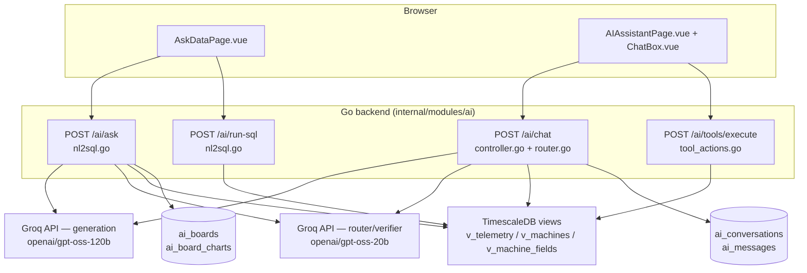
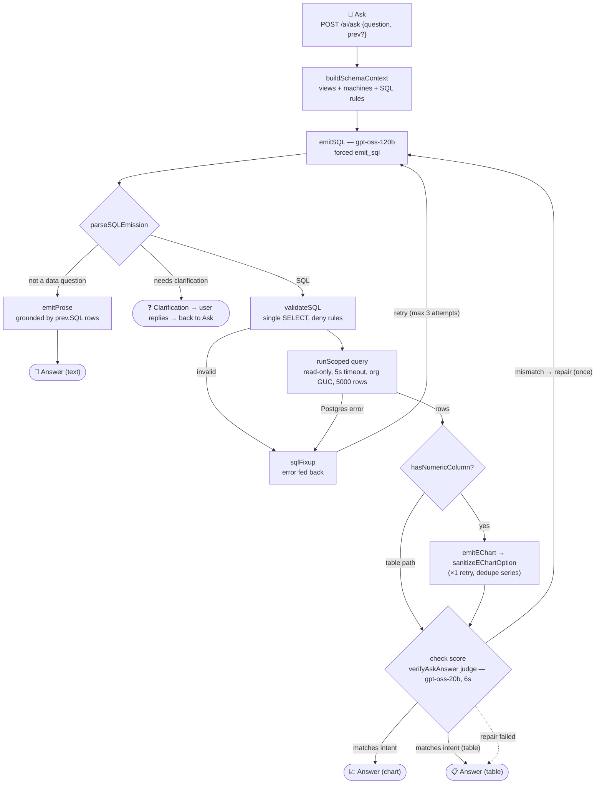
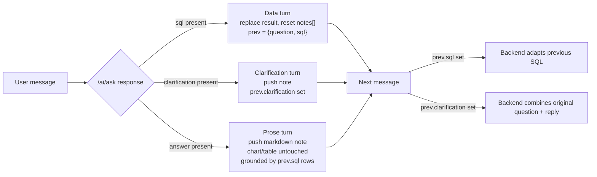

# IotVision — AI Pages: How Ask-Data & Chat Assistant Work

IotVision ships two independent AI surfaces, both backed by an OpenAI-compatible chat completions API. Defaults target Groq (`https://api.groq.com/openai/v1/chat/completions`): generation uses `openai/gpt-oss-120b`; intent routing and answer verification use the smaller/faster `openai/gpt-oss-20b`. Provider, models, and key are overridable via `AI_BASE_URL`, `AI_MODEL`, `AI_ROUTER_MODEL`, and `AI_API_KEY` (legacy `GROQ_API_KEY` still works as a fallback). The **Ask-Data** page turns a natural-language question into hardened, read-only SQL and an LLM-authored ECharts option. The **Chat Assistant** is a conversational agent that reads live telemetry and stages dashboard edits through structured tool calls, gated behind a preview-then-confirm workflow. This document explains both pipelines end to end for developers extending or debugging them.

## Table of contents

1. [Overview — two surfaces](#1-overview--two-surfaces)
2. [Ask-Data pipeline](#2-ask-data-pipeline-the-ask-page)
   - [2.1 Frontend flow](#21-frontend-flow)
   - [2.2 Backend pipeline](#22-backend-pipeline)
   - [2.3 Turn types & follow-up thread](#23-turn-types--follow-up-thread)
   - [2.4 Security hardening](#24-security-hardening)
   - [2.5 Boards](#25-boards)
   - [2.6 Example Q&A](#26-example-qa)
3. [Output checking](#3-output-checking)
4. [Chat Assistant pipeline](#4-chat-assistant-pipeline)
   - [4.1 Frontend](#41-frontend)
   - [4.2 Backend](#42-backend)
   - [4.3 Tools](#43-tools)
5. [API reference](#5-api-reference)

---

## 1. Overview — two surfaces

**In short:** IotVision's AI capability is split into two surfaces that share the same Groq account and org-scoped database access but do not share code paths, conversation state, or UI.

| Surface | Page | Backend | Purpose |
|---|---|---|---|
| Ask-Data ("Ask" page) | `frontend/src/pages/AskDataPage.vue` | `backend/internal/modules/ai/nl2sql.go`, `boards.go` | Natural language → hardened SQL → rows → LLM-authored ECharts option; boards to save charts; follow-up thread. |
| AI Assistant (chat) | `frontend/src/pages/AIAssistantPage.vue` + `ChatBox.vue`, `PreviewCanvasCard.vue`, `CreatedCanvasCard.vue`, `TextCanvasCard.vue` | `controller.go`, `router.go`, `schema.go`, `tool_actions.go`, `dashboard_action.go`, `verify.go` | Conversational assistant reading live metrics and staging dashboard edits via structured tool calls. |



---

## 2. Ask-Data pipeline (the "Ask" page)

**In short:** the Ask page takes a question, has Groq emit validated SQL, executes it read-only against three allowlisted views, and (for numeric results) has Groq author a chart option that the frontend renders — with self-correction and verification loops at every risky step.

### 2.1 Frontend flow

`AskDataPage.vue` is a self-contained page: a global `<v-chart>` from `vue-echarts` is used for rendering, laid out as a left "Boards" rail alongside a main "Ask your data" column.

**State:**

| Field | Meaning |
|---|---|
| `question` | The current input text. |
| `asking` | In-flight guard while a request is pending. |
| `result` (`AskDataResult`) | The current chart/table payload. |
| `notes[]` | The follow-up Q&A thread rendered under the current result. |
| `askedQuestion` | The question that produced the current `result`. |
| `prev` | Previous-turn context passed back to the backend for follow-ups. |

**`ask()`** (`AskDataPage.vue:~89`) trims the input, calls `api.askData(q, prev)`, and branches on the response shape:

- `res.sql` present → a **data turn**: replace `result`, reset `notes`, set `prev = {question, sql}`.
- `res.clarification` present → push a clarification note and set `prev.clarification`; the user's next message is treated as the answer to that question.
- otherwise `res.answer` → push a prose note.

Prose and clarification turns annotate the current chart rather than clearing it.

**`withDataset(option, columns, rows)`** (`AskDataPage.vue:~35`) merges the data-less ECharts option returned by the backend with `{dataset: {source: [cols, ...rows]}}`. It then performs the per-machine split: if the option has exactly one `line`/`bar`/`scatter` series with string `encode.x`/`encode.y` and a category column is present (e.g. `machine_name`), it rewrites the option into N filter-transform datasets and N series — one line per machine, with a 2–20 category ceiling — and adds a vertical legend.

**`isTabular(option)`** (`AskDataPage.vue:~79`) — an empty `{}` option is the backend's signal to render the result as a table instead of a chart.

Prose answers are rendered as markdown via `marked` + `DOMPurify`.

**API client:** `frontend/src/services/api.service.ts:314-353` — `askData(question, context?)` issues `POST /ai/ask` with a 60s timeout; the same module exposes `runSql`, `listBoards`, `createBoard`, `getBoard`, `addBoardChart`, and `deleteBoardChart`.

### 2.2 Backend pipeline

**In short:** the backend forces the model to emit SQL through a tool call, validates and runs it read-only with retries, then (if the result is numeric) has a second forced tool call author a chart option that gets sanitized and verified before it ever reaches the browser.

The full loop at a glance — retries and repair drawn as return arrows:



Entry point `AskData` (`nl2sql.go:577`), routed at `POST /ai/ask` in `routes.go`.

```mermaid
sequenceDiagram
  participant FE as AskDataPage.vue
  participant API as AskData (nl2sql.go:577)
  participant Groq as Groq API
  participant DB as TimescaleDB

  FE->>API: POST /ai/ask {question, context?:{question, sql, clarification}}
  API->>API: buildSchemaContext(orgID) (nl2sql.go:154)

  loop SQL emission + execution, up to 3 attempts (sqlFixup self-correction)
    API->>Groq: emitSQL (nl2sql.go:218) — forced emit_sql via forceFunc, gpt-oss-120b
    Groq-->>API: {answerable, sql, clarification}
    API->>API: parseSQLEmission (nl2sql.go:274) -> SQL / clarification / errNotDataQuestion
    alt SQL returned
      API->>API: validateSQL (nl2sql.go:42) — single SELECT, sqlForbidden keywords, deniedTables
      API->>DB: runScoped (nl2sql.go:71) — read-only tx, statement_timeout=5s, app.current_org GUC, 5000-row cap
      DB-->>API: columns, rows OR error
      Note over API,DB: on error, error text becomes sqlFixup and the loop repeats
    end
  end

  alt errNotDataQuestion
    API->>Groq: emitProse (nl2sql.go:297) — no tools, grounded by re-running prev.SQL downsampled to 200 rows
    Groq-->>API: {answer}
    API-->>FE: {answer}
  else clarification needed
    API-->>FE: {clarification}
  else SQL success
    API->>API: hasNumericColumn (nl2sql.go:420)?
    alt no numeric column
      Note over API: echartOption = "{}" (table signal)
    else numeric column present
      API->>Groq: emitEChart (nl2sql.go:337) — forced emit_echart_option, encode-only, 1 series, line/bar/pie/scatter (x1 retry passing prior error)
      Groq-->>API: echart option
      API->>API: sanitizeEChartOption (nl2sql.go:438) — strip dataset/data, validate encode columns, dedupe identical series, invalid->"{}"
    end
    opt rows > 0
      API->>Groq: verifyAskAnswer (nl2sql.go:384) — forced verify_answer judge, gpt-oss-20b, 6s bound
      Note over API,Groq: runs for both chart and table turns (rows > 0)
      alt matches_intent:false
        API->>API: one repair round — re-emit SQL with verifier problem as fixup, re-run; re-chart if the repaired result is chartable, else deliver repaired rows as table (verifyAndRepairAnswer, nl2sql.go:703)
        Note over API: any repair failure degrades to table signal over the original rows, never a 502
      end
    end
    API-->>FE: {sql, columns, rows, echartOption}
  end
```

Numbered walkthrough (same substance as the sequence diagram, for reference):

1. **`buildSchemaContext(ctx, orgID)`** (`nl2sql.go:154`) — describes the three allowed views (`v_telemetry`, `v_machines`, `v_machine_fields`) plus the org's real machine names and metric keys, and the SQL rules the model must follow: use `time_bucket`, use `now()`-relative windows, use `ILIKE '%code%'` for machine-code matching, and access metrics via JSONB `data->>'key'`.
2. **`emitSQL(ctx, question, schema, prev, fixup)`** (`nl2sql.go:218`) — one forced Groq tool call to `emit_sql` via `forceFunc("emit_sql")` on `openai/gpt-oss-120b`; the tool schema is `{answerable, sql, clarification}`. Follow-ups are handled by prompt injection: if `prev.SQL` is set, the prompt asks the model to adapt the previous SQL; if `prev.Clarification` is set, it combines the original question with the user's reply. `parseSQLEmission` (`nl2sql.go:274`) returns SQL XOR a clarification, or the sentinel error `errNotDataQuestion`.
3. **Branch on the emission:** `errNotDataQuestion` routes to the prose path `emitProse` (`nl2sql.go:297`) — a no-tools completion grounded by re-running `prev.SQL` via `runScoped` downsampled to 200 rows, returning `{answer}`. A clarification response returns `{clarification}` directly. Otherwise the SQL path continues.
4. **`validateSQL`** (`nl2sql.go:42`) — enforces a single `SELECT` statement, rejects forbidden write keywords (`sqlForbidden`), and rejects any access to base tables (`deniedTables`), scrubbing the allowed `v_` views first.
5. **`runScoped(ctx, orgID, sql)`** (`nl2sql.go:71`) — opens a read-only transaction, sets `SET LOCAL statement_timeout='5s'`, sets `set_config('app.current_org', orgID, true)` as a Postgres GUC for org isolation, and caps results at 5000 rows. A retry loop runs up to 3 times: any validation failure or Postgres error is turned into a `sqlFixup` message fed back into `emitSQL` so the model can self-correct.
6. **`hasNumericColumn(cols, rows)`** (`nl2sql.go:420`) — if there is no numeric column, or the result is empty, the response sets `option = "{}"` (the table signal) and skips the chart-authoring Groq call entirely.
7. **`emitEChart(question, cols, sample20, prevErr)`** (`nl2sql.go:337`) — a forced `emit_echart_option` call. The system prompt (`echartSystemPrompt`, `nl2sql.go:326`) requires `encode`-based column references (no embedded data arrays), exactly one series even when a category column is present, and a chart type of line, bar, pie, or scatter. One retry is attempted, passing the prior error back to the model.
8. **`sanitizeEChartOption(option, cols)`** (`nl2sql.go:438`) — strips any `dataset`/`data` the model tried to embed, validates that `encode` references real columns, and dedupes series: series that share the same type and `encode` without per-series filters would render identical rows, so only the first is kept — the frontend's `withDataset` performs the actual per-machine split. An invalid option collapses to `"{}"`.
9. **`verifyAndRepairAnswer`** (`nl2sql.go:703`) runs on chart AND table turns whenever at least one row was returned (empty results are skipped — nothing to judge beyond the SQL text) — `verifyAskAnswer` (`nl2sql.go:384`) runs a bounded 6-second forced `verify_answer` judge call on `openai/gpt-oss-20b`. On `matches_intent:false`, exactly one repair round runs: SQL is re-emitted with the verifier's `problem` text as the fixup and re-run. If the repaired result is chartable it is re-charted; otherwise the repaired rows are delivered as a table. Only a failed emission/validation/run, or an empty repaired result, falls back to the original rows (chart degraded to the table signal) — the endpoint never returns a 502 for a verification miss.
10. **Response shape:** one of `{sql, columns, rows, echartOption}`, `{answer}`, or `{clarification}`.

### 2.3 Turn types & follow-up thread

**In short:** every response is exactly one of three turn types, and the shape of `prev` sent back on the next request determines how that next message is interpreted.



### 2.4 Security hardening

> **Security hardening**
>
> | Rule | Enforcement |
> |---|---|
> | View allowlist | Only the three allowlisted `v_` views are queryable — no base table is ever exposed to generated SQL. |
> | SQL deny rules | `validateSQL` requires a single `SELECT`, rejects forbidden write keywords, and denies base-table names even if referenced indirectly. |
> | Read-only execution | All generated SQL executes inside a read-only transaction. |
> | Org isolation | Enforced at the database layer via the `app.current_org` Postgres GUC, not just in application code. |
> | Timeout | A 5-second `statement_timeout` bounds worst-case query cost. |
> | Row cap | Result sets are capped at 5000 rows. |
> | Stored SQL re-validated | Boards' `AddBoardChart` re-validates the stored SQL through the same `validateSQL`/`runScoped` path even though it originated from our own database — stored SQL is never trusted implicitly. |

### 2.5 Boards

Implemented in `boards.go` against the `ai_boards` / `ai_board_charts` tables. A saved chart stores `{question, sql, echart_option}`. Reopening a board re-runs the stored SQL via `POST /ai/run-sql` (which re-validates it through the same hardening path) so the chart always reflects live data rather than a frozen snapshot.

### 2.6 Example Q&A

Illustrative only — actual SQL and chart shape depend on the org's live schema and data.

- *"average weight per hour today for CW-01"* → SQL → line chart.
- *"compare output of all packing machines this week"* → backend returns a single-series option; the frontend's `withDataset` splits it into one line per machine.
- *"how are things?"* → clarification turn asking which machine, metric, and timeframe.
- Follow-up *"why did it dip at 14:00?"* after a chart → prose turn grounded in the previous SQL's rows.
- *"list machine names"* → no numeric column → table render.

---

## 3. Output checking

**In short:** both surfaces bound their self-correction and verification work to a fixed, small number of retries so latency and Groq cost stay predictable — neither pipeline will loop indefinitely trying to get a "perfect" answer, and both degrade gracefully instead of failing outright.

| Stage | Ask-Data | Chat Assistant |
|---|---|---|
| Retry-on-error loop | SQL self-correction loop, up to 3 attempts total (`validateSQL`/Postgres error → `sqlFixup` → re-emit via `emitSQL`) | Tool loop, max 5 iterations bounded by `roundCap` |
| Secondary generation retry | Chart authoring (`emitEChart`) retries once, passing the prior error back to the model | — |
| Deterministic checks | — | `runDeterministicChecks` (`verify.go`) |
| LLM judge | `verify_answer` via `verifyAskAnswer`, `openai/gpt-oss-20b`, 6s bound — covers chart + table turns (empty results skipped) | `VerifyAnswer` judge |
| Repair | Exactly one repair round (re-emit SQL with verifier's `problem` as fixup, re-run, re-chart) | One `runRepairRound` |
| Failure outcome | Degrades to table signal (`{}` echart option) — never a 502 | Outcome is deliver / ask back / repair |

Design rationale: bounded checks keep worst-case latency and Groq token cost predictable regardless of how ambiguous or malformed a given question or tool round turns out to be.

---

## 4. Chat Assistant pipeline

**In short:** the chat backend classifies user intent with a small cheap model, uses that classification in plain Go to decide which tool (if any) the generation model is forced to call, runs a bounded tool-calling loop, and verifies the final answer before returning it.

### 4.1 Frontend

`AIAssistantPage.vue` hosts the conversation; `ChatBox.vue` renders the message list and input.

`buildDashboardContext(focusedIds)` (`AIAssistantPage.vue:~464`) serializes the on-screen dashboard/widget state into context lines such as:

```
- [FOCUSED] line-chart "Trend" — machine CW-01, metric weight, bucket 1h
```

and injects the focused widget's full series data for analytical questions. `@Widget` mention tokens let the user route an edit request to a specific widget explicitly.

`api.chat(conversationId, text, context)` calls `POST /ai/chat`, which returns `{messages, intent}`. Three card components render the results:

- `PreviewCanvasCard` — a staged dashboard preview produced by the `preview_*` tools.
- `CreatedCanvasCard` — a confirmed/created dashboard.
- `TextCanvasCard` — plain text answers.

### 4.2 Backend

Entry point `Chat` (`controller.go:345`).

```mermaid
sequenceDiagram
  participant FE as ChatBox.vue / AIAssistantPage.vue
  participant API as Chat (controller.go:345)
  participant Router as ClassifyIntent (router.go:93)
  participant Groq as Groq API
  participant Tools as ToolKit / DashboardAction

  FE->>API: POST /ai/chat {conversationId, message, context}
  API->>API: persist user message; buildAIMessages caps history to last 3 rows (controller.go:1112)
  API->>Router: ClassifyIntent — forced classify_intent call, gpt-oss-20b
  Router-->>API: IntentResult {intent, machine, metric, fields, bucket, dateRange, targetWidget, status, sku, confidence}
  Note over Router: confidence floor 0.5; classification failure -> ok=false
  API->>API: dispatchIntent(res, ok, focused, ...) -> (tool_choice, roundCap) (controller.go:1032)

  loop max 5 iterations, roundCap tool rounds, then tools dropped to force text
    API->>Groq: callAI(msgs, tools, tool_choice) (callAIModel, controller.go:834)
    alt finish_reason == tool_calls
      Groq-->>API: tool_calls
      API->>Tools: runToolRound (controller.go:539) -> ctrl.dispatch (controller.go:153), role-gated
      Tools-->>API: tool result(s), appended + persisted
    else text response
      Groq-->>API: final assistant text
    end
  end

  opt at least one tool ran
    API->>API: runDeterministicChecks (verify.go)
    API->>Groq: VerifyAnswer judge (verifyAndMaybeRepair, controller.go:596)
    alt mismatch
      API->>API: deliver / askback / runRepairRound (one repair)
    end
  end

  API-->>FE: {success, data: newMessages, intent}
```

Numbered walkthrough:

1. Persist the user message; history is capped to the last 3 user/assistant rows (`buildAIMessages`, `controller.go:1112`).
2. The outgoing message list is `systemPromptUnified` (a large Groq-cached prompt) + capped history + an authoritative context block containing dashboard state and today's date.
3. **Intent router** (`router.go`): `ClassifyIntent` (`router.go:93`) makes one forced `classify_intent` call on `openai/gpt-oss-20b`, returning strict JSON `IntentResult{intent, machine, metric, fields, bucket, dateRange, targetWidget, status, sku, confidence}`. Recognized intents: `chat`, `read_metric`, `read_agg`, `edit_widget`, `compare`, `create_dashboard`, `alerts`, `production`. A confidence floor of 0.5 applies; any classification failure falls back to `ok=false`. Design law: **the model classifies, Go decides.**
4. `dispatchIntent(res, ok, focused, inlineData, role, machineValid, chartExists)` (`controller.go:1032`) is a pure Go function that maps the classified intent to a `(tool_choice, roundCap)` pair — no LLM call is involved in this decision.

| Intent | Forced tool_choice |
|---|---|
| `read_metric` | `show_metric` |
| `read_agg` | `get_telemetry_series` |
| `production` | `get_production_count` |
| `alerts` | `get_active_alerts` |
| `edit_widget` | `preview_update_widget` |
| `compare` | `preview_update_widget` or `preview_add_widget`, chosen by `chartExists` |
| `create_dashboard` | `preview_dashboard` |
| focused inline-data read | `tool_choice: "none"` — answered from injected context, no tool call |
| classification failed | `""` (auto — model chooses) |

5. **Tool loop:** up to 5 iterations total, chained across `roundCap` rounds. `callAI(msgs, tools, tc)` is called each iteration; when `finish_reason == "tool_calls"`, `runToolRound` (`controller.go:539`) dispatches through `ctrl.dispatch` (`controller.go:153`) (role-gated), and the tool results are appended to the message list and persisted. Once `roundCap` tool rounds are used, tools are dropped from the next call to force a final text summary.
6. **Verify-then-repair:** `verifyAndMaybeRepair` (`controller.go:596`) runs only when at least one tool executed. Deterministic checks (`runDeterministicChecks` in `verify.go`) run first, followed by an LLM `VerifyAnswer` judge. The outcome is deliver, ask back, or one repair round (`runRepairRound`).
7. **Response:** `{success, data: newMessages, intent}`.

### 4.3 Tools

`schema.go`'s `AllTools()` (`schema.go:258`) exposes: `get_machines`, `show_metric`, `get_telemetry_trend`, `get_active_alerts`, `get_telemetry_series`, `get_production_count`, `get_skus`, `list_dashboards`, `preview_dashboard`, `preview_add_widget`, `preview_remove_widget`, `preview_update_widget`.

`create_custom_dashboard` is deliberately **excluded** from `AllTools()` — only the frontend calls it, via `POST /ai/tools/execute`, and only after the user clicks Confirm on a staged preview. This enforces the preview-then-confirm workflow: the model can never create a dashboard directly, it can only stage one.

Tool implementations live in `tool_actions.go` (ToolKit methods) and `dashboard_action.go` (`DashboardAction`'s `Preview`/`PreviewAddWidget`/`PreviewUpdateWidget`/`Handle` methods).

`buildAITools(role)` (`controller.go:806`) filters the tool list by role — viewers lose write/preview tools — and sends simple tools slim (name + description only) while the `preview_*` widget tools go over with their full schema, exploiting Groq prompt caching to keep token cost down.

`tool_choice` serialization in `callAIModel` (`controller.go:834`): an empty string means auto, `"required"`/`"none"` are sent as plain strings, and a value starting with `{` is sent as a forced-function object. Groq `tool_choice` errors are retried with auto; a function-parser failure is retried with no tools at all.

---

## 5. API reference

**In short:** all routes below live under `/ai` and require JWT authentication via `middleware.Authenticate`.

| Route | Request | Response |
|---|---|---|
| `POST /ai/ask` | `{question, context?: {question, sql, clarification}}` | one of `{sql, columns, rows, echartOption}` / `{answer}` / `{clarification}` |
| `POST /ai/run-sql` | `{sql}` | `{columns, rows}` (SQL is re-validated before execution) |
| `GET /ai/boards` | — | list of saved boards |
| `POST /ai/boards` | board create payload | created board |
| `GET /ai/boards/:id` | — | board with its saved charts |
| `DELETE /ai/boards/:id` | — | — |
| `POST /ai/boards/:id/charts` | `{question, sql, echart_option}` | saved chart (SQL re-validated before storage) |
| `DELETE /ai/boards/:id/charts/:chartId` | — | — |
| `POST /ai/chat` | `{conversationId, message, context}` | `{success, data: messages[], intent}` |
| `GET /ai/tools` | — | role-filtered tool schema list |
| `POST /ai/tools/execute` | tool name + args (frontend-only path, used for `create_custom_dashboard` after Confirm) | tool execution result |
| conversation + preview-draft CRUD | standard list/get/create/delete for `ai_conversations`/`ai_messages` and staged preview drafts | — |

---

The generation model default lives at `controller.go`'s `aiModel()` (override via `AI_MODEL`); the router model at `router.go`'s `routerModel()` (override via `AI_ROUTER_MODEL`). The endpoint defaults to Groq via `aiBaseURL()` (override via `AI_BASE_URL`).
