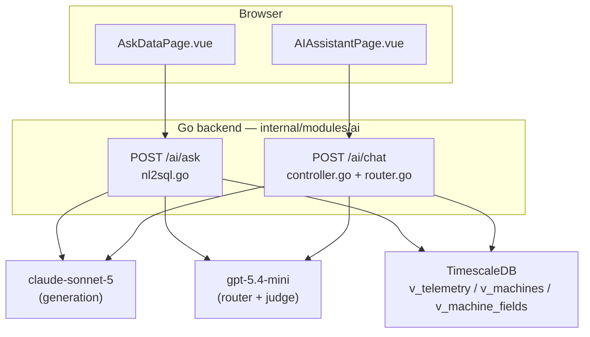
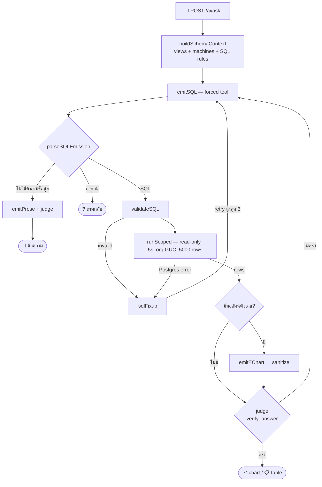
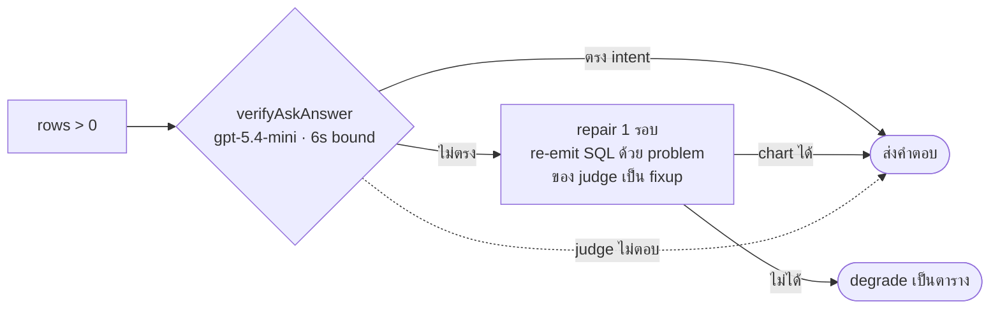
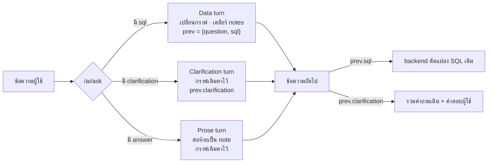
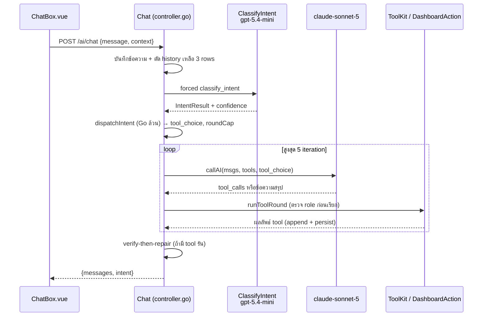
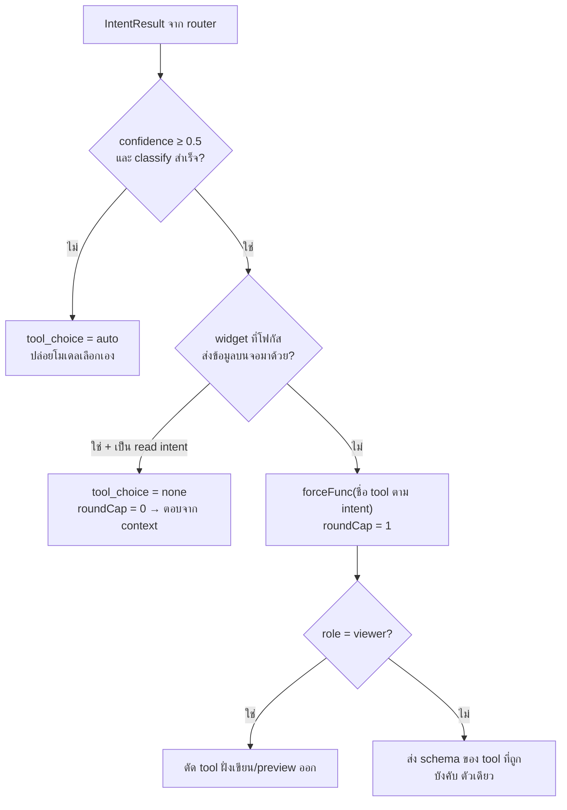
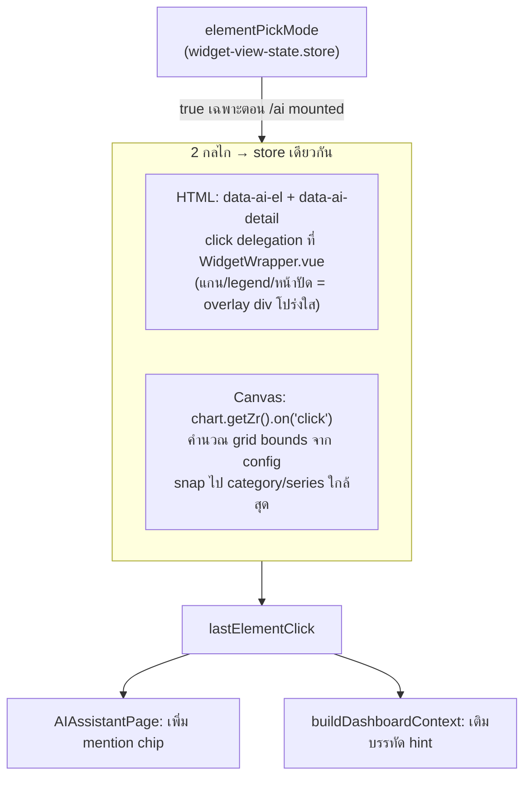
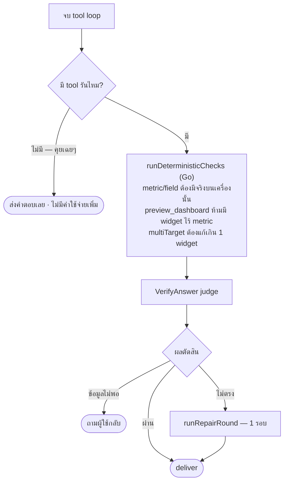
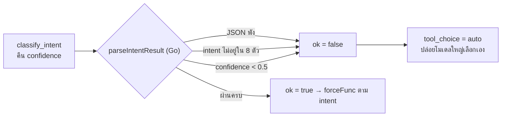

# IotVision — AI Pages

## หน้า Ask-Data ใหม่ และการอัปเกรดหน้า AI Assistant

**ช่วงงาน:** 8 – 22 กรกฎาคม 2026 · 39 commits นับจาก `3464651`

**Stack:** KKU GenAI — generate `claude-sonnet-5` · router/judge `gpt-5.4-mini`

**สิ่งที่จะเล่า:** /ask ทั้งหน้า · intent router · verify-then-repair · **split element** · token optimization · ผลเทสจริง

> เอกสารอ้างอิงเชิงลึก: `docs/ai-pages.md` · ผลเทส: `llm2viz/*.md`

---

# 1. ปัญหา & เป้าหมาย

**ก่อนหน้านี้** ผู้ใช้ต้องรู้ล่วงหน้าว่าอยากดูอะไร แล้วไปสร้าง widget เองบน dashboard
คำถามแบบ "สัปดาห์นี้เครื่องไหน reject เยอะสุด" ไม่มีที่ให้ถาม

| ปัญหา | สิ่งที่ทำ |
|---|---|
| อยากได้กราฟเฉพาะกิจ ไม่อยากสร้าง widget ถาวร | **หน้า /ask** — ถามเป็นภาษาคน ได้ SQL + กราฟ |
| หน้า /ai ตีความคำสั่งพลาดบ่อย (regex dispatch) | **intent router** — โมเดลเล็กจัดประเภท, Go ตัดสินใจ |
| ถามถึง "แกน Y" หรือ "จุดนี้" ในกราฟไม่ได้ | **split element** — คลิกส่วนย่อยของ widget แล้วถาม |
| ตอบผิดแล้วไม่มีใครจับ | **verify-then-repair** — judge + ซ่อม 1 รอบ |
| โควตา provider หมดแล้ว error งง | **429 QUOTA_EXCEEDED** + ลด token 11% |

---

# 2. ภาพรวม — 2 AI surfaces

แชร์ provider account และ DB เดียวกัน แต่ **ไม่แชร์โค้ด, state, หรือ UI**

| | **Ask-Data** (`/ask`) | **AI Assistant** (`/ai`) |
|---|---|---|
| Frontend | `AskDataPage.vue` | `AIAssistantPage.vue` + `ChatBox.vue` |
| Backend | `nl2sql.go`, `boards.go` | `controller.go`, `router.go`, `verify.go` |
| ทำอะไร | คำถาม → SQL ปลอดภัย → rows → ECharts | คุยกับ agent อ่าน telemetry สด + แก้ dashboard |
| จำอะไร | thread ต่อคำถาม + boards | `ai_conversations` / `ai_messages` |
| เขียนข้อมูลได้ไหม | **ไม่ได้เลย** (read-only SQL) | ได้ แต่ต้อง preview → confirm |

---

# 3. ภาพรวมระบบ

> แยกค่ายโมเดลตั้งใจ: generate = Claude, router/judge = OpenAI → โควตาไม่ลากกันตาย

---

# 4. /ask — ถามอะไรได้บ้าง

| คำถาม | ได้อะไรกลับ |
|---|---|
| "average weight per hour today for CW-01" | 📈 line chart |
| "compare output of all packing machines this week" | 📈 หลายเส้น (แยกต่อเครื่อง) |
| "list machine names" | 📋 ตาราง (ไม่มีคอลัมน์ตัวเลข) |
| "throughput กับ speed ต่างกันยังไง" | 💬 คำอธิบายเป็นข้อความ |
| "how are things?" | ❓ ถามกลับว่าเครื่องไหน metric ไหน ช่วงไหน |
| ตามด้วย "ทำไมมันตกตอน 14:00" | 💬 ตอบโดยอ้างข้อมูลจากกราฟเดิม |

**ทุกคำตอบเป็นหนึ่งใน 3 แบบเท่านั้น:** chart/table · prose · clarification

---

# 5. /ask — flow ทั้งวง

---

# 6. Deep dive 1 — สร้าง SQL

**`buildSchemaContext(orgID)`** — ประกอบ prompt จากของจริงใน DB
- 3 views ที่อนุญาต: `v_telemetry`, `v_machines`, `v_machine_fields`
- ชื่อเครื่องจริงและ metric keys จริงของ org นั้น
- กติกา SQL: ใช้ `time_bucket`, ใช้ `now()`-relative, `ILIKE '%code%'`, metric อ่านผ่าน `data->>'key'`

**`emitSQL`** — บังคับเรียก tool `emit_sql` เดียว คืน `{answerable, sql, clarification}`
- ได้ SQL **หรือ** คำถามกลับ **หรือ** สัญญาณ "ไม่ใช่คำถามข้อมูล" — เลือกได้อย่างเดียว
- 2 กติกาที่เติมเมื่อ 07-17 กันโมเดลถามกลับพร่ำเพรื่อ:
  คำถามเชิงนิยาม/อธิบาย → `answerable=false` (ไปทาง prose) · มี default ที่สมเหตุผล (ไม่ระบุเวลา → 24 ชม.) → ตอบเลย

> Follow-up ทำด้วย prompt injection: ถ้ามี `prev.sql` ให้โมเดล "ดัดแปลง SQL เดิม"

---

# 7. Deep dive 2 — ตรวจแล้วรัน (self-correcting)

**`validateSQL`** — Go ล้วน ไม่ใช้โมเดล
- ต้องเป็น `SELECT` เดียว · ปฏิเสธ keyword เขียนข้อมูล · ปฏิเสธชื่อ base table ทุกกรณี

**`runScoped`** — ด่านที่ 2 ที่ระดับฐานข้อมูล
- read-only transaction · `statement_timeout = 5s` · `app.current_org` GUC · cap 5000 rows

**Retry loop สูงสุด 3 ครั้ง**
- error จาก validate หรือจาก Postgres ถูกส่งกลับเป็น `sqlFixup` ให้โมเดลแก้เอง
- ผู้ใช้ไม่เคยเห็น SQL error — เห็นแต่คำตอบ หรือคำถามกลับ

---

# 8. Deep dive 3 — วาดกราฟ

**Gate ก่อน:** `hasNumericColumn` — ไม่มีคอลัมน์ตัวเลข หรือไม่มี row → ส่ง `"{}"` = สัญญาณ "เรนเดอร์เป็นตาราง" และ**ข้ามการเรียกโมเดลไปเลย**

**`emitEChart`** — forced tool `emit_echart_option` (retry 1 ครั้ง ส่ง error เดิมกลับไป)
- บังคับอ้างคอลัมน์ผ่าน `encode` เท่านั้น ห้ามฝัง data array
- 1 series · เลือกได้แค่ line / bar / pie / scatter

**`sanitizeEChartOption`** — Go ตรวจซ้ำ: ถอด `dataset`/`data` ที่โมเดลแอบใส่ · เช็คว่า `encode` อ้างคอลัมน์จริง · dedupe series ซ้ำ · ถ้าพังก็ยุบเป็น `"{}"`

**`withDataset` (frontend)** — ประกบ option กับข้อมูล แล้วแตกเป็นเส้นต่อเครื่อง (2–20 category) พร้อม legend

---

# 9. Deep dive 4 — judge + repair

- ทำงานทั้ง **chart และ table** ขอให้มีอย่างน้อย 1 row
- **chart type ที่ user สั่งเอง (pie/bar/line/scatter) ถือว่าถูกเสมอ** — judge ตัดสินแค่ข้อมูล
- ล้มเหลวยังไงก็ไม่ 502 — เลวร้ายสุดคือได้ตารางของข้อมูลเดิม
- prose ก็มี judge ของตัวเอง (`verifyAskProse`) — ตรวจว่าตอบตรงเรื่อง และตัวเลขไม่ขัดกับ rows

---

# 10. /ask — 3 turn types & thread ต่อเนื่อง

> จุดสำคัญ: prose/clarification **ไม่ล้างกราฟ** — ผู้ใช้ถามต่อจากกราฟที่มองอยู่ได้เรื่อยๆ

---

# 11. Boards — เก็บกราฟไว้ดูซ้ำ

- บันทึกกราฟลง board เก็บ `{question, sql, echart_option}` ในตาราง `ai_boards` / `ai_board_charts`
- เปิด board ใหม่ → **รัน SQL เดิมสดผ่าน `POST /ai/run-sql`** ไม่ใช่ snapshot แช่แข็ง → ข้อมูลอัปเดตเสมอ
- SQL ที่เก็บไว้ถูก **validate ซ้ำ** ทุกครั้งด้วยด่านเดิม ทั้งตอนบันทึกและตอนรัน
  → ถึงจะเป็น SQL ที่ออกจากระบบเราเอง ก็ไม่เชื่อโดยปริยาย
- งาน UX ที่ตามมา (`64b71b6`): เปลี่ยนชื่อ board, layout แบบ chips, กด "คำถามใหม่" แล้ว reset thread

---

# 12. /ai — อัปเกรดอะไรไปบ้าง

| # | อัปเกรด | commit หลัก |
|---|---|---|
| 1 | **Intent router** — เลิกใช้ regex เดา แล้วให้โมเดลเล็กจัดประเภท | `38ed571`, `5b59ddd`, `dffe1f8` |
| 2 | **Verify-then-repair** — deterministic check + LLM judge + ซ่อม 1 รอบ | `99b2b2e`, `6e7c557` |
| 3 | **Split element** — คลิกส่วนย่อยของ widget แล้วถาม | `39365cc`, `72cf970` |
| 4 | **Token optimization** — cap tokens, slim tool schemas, cap rows | `cac8638`, `3207925`, `29d9c28`, `d6bacef` |
| 5 | **Quota/error mapping** — 429 `QUOTA_EXCEEDED` แยกจาก rate limit | `b38a4ed`, `7d47019` |

---

# 13. Intent router — "โมเดลจัดประเภท, Go ตัดสินใจ"

`ClassifyIntent` เรียก `gpt-5.4-mini` 1 ครั้ง ได้ JSON เข้ม
`{intent, machine, metric, fields, bucket, dateRange, targetWidget, multiTarget, status, sku, confidence}`
จากนั้น **`dispatchIntent` ซึ่งเป็นฟังก์ชัน Go ล้วน** แปลงเป็น `(tool_choice, roundCap)`

| intent | บังคับเรียก tool |
|---|---|
| `read_metric` / `read_agg` | `show_metric` / `get_telemetry_series` |
| `production` / `alerts` | `get_production_count` / `get_active_alerts` |
| `edit_widget` / `compare` | `preview_update_widget` (หรือ `preview_add_widget`) |
| `create_dashboard` | `preview_dashboard` |
| classify ไม่สำเร็จ (confidence < 0.5) | ปล่อย auto ให้โมเดลเลือกเอง |

> `confidence` เป็นค่าที่โมเดลรายงานเอง ไม่ใช่ logprob — จึงใช้แค่เป็น floor ไม่ใช่ค่าชี้ขาด

---

# 14. /ai — flow ทั้งวง

---

# 15. dispatchIntent — จุดตัดสินใจที่ไม่ใช้โมเดล

> ฟังก์ชันนี้ไม่มี I/O ไม่มี randomness → **เขียน unit test ครอบได้ทั้งหมด**
> โมเดลผิดพลาดได้ แต่ "ใครมีสิทธิ์ทำอะไร" ตัดสินด้วย Go เสมอ

---

# 16. ⭐ Split element — จาก "ทั้ง widget" เป็น "ส่วนย่อย"

| | ก่อน | หลัง |
|---|---|---|
| เลือกได้แค่ไหน | ทั้ง widget (`@Widget` mention) | คลิกแกน / จุดข้อมูล / ค่า / legend |
| บริบทที่ส่งไป | "line-chart Trend, machine CW-01, metric weight" | + `user clicked the y-axis (kg)` |
| ถามได้ | "อันนี้เป็นยังไง" | "แกนนี้หน่วยอะไร" · "จุดนี้ทำไมสูง" |

**การใช้งาน:** คลิกส่วนใดก็ได้ในกราฟ → ขึ้น chip ข้างช่องพิมพ์ เช่น `Weight Trend · y-axis`
หรือ `Weight Trend · 14:00 · 42` → พิมพ์คำถามแล้วส่ง (ไม่มี auto-ask, ผู้ใช้คุมเอง)

**1 element ต่อ 1 widget** — คลิกใหม่ทับของเดิม · chip หายเมื่อส่ง / กด ✕ / เลิกโฟกัส / เริ่มแชทใหม่

---

# 17. Split element — คลิกอะไรได้บ้าง

| Widget | ส่วนที่คลิกได้ |
|---|---|
| LineChart | title, point (คลิกที่ไหนก็ snap ไปจุดใกล้สุด), y-axis, x-axis |
| CustomChart | title, point, y-axis ซ้าย, y-axis ขวา (โหมด dual), x-axis, legend |
| DailyCount | title, point (แท่ง), y-axis, x-axis |
| Gauge | title, value (หน้าปัด), unit, threshold (lower/target/upper) |
| KPI | title, value, unit |
| StatusCard | title, value (pill + tile ต่อ field), unit |
| Table | title, ค่าราย row, unit |
| AlarmPanel | title |

> hover ขึ้นสีม่วงอ่อนบอกว่าคลิกได้ (`.ai-region`) — เปลี่ยนจาก dashed outline เดิมที่ตีกับเส้นกราฟ

---

# 18. Split element — สถาปัตยกรรม

- gate ด้วย flag เดียว → **editor / dashboard list / LED ไม่ถูกแตะเลย**
- zrender แทน ECharts event เพื่อให้คลิกพื้นที่ว่างในกราฟก็ยังจับจุดใกล้สุดได้
- legend toggle ของ CustomChart ถูกปิดชั่วคราวตอน pick mode เปิด ไม่ให้คลิกแล้วซ่อนเส้น

---

# 19. Answer-from-context — ตอบโดยไม่เรียก tool

เมื่อ widget ที่โฟกัสส่ง **ข้อมูลบนจอ** มาด้วย (`seriesLine` ของ line-chart/daily-count,
`alarmLine` ของ alarm-panel) `dispatchIntent` จะสั่ง `tool_choice: "none"` — โมเดลตอบจาก context ตรงๆ

- ประหยัด 1 tool round เต็มๆ ต่อคำถาม (เร็วขึ้น + ถูกลง)
- **กันความผิดพลาดของ router ไปในตัว**: ถ้า router เดา `chat` ผิดสำหรับ daily-count ที่โฟกัสอยู่
  คำตอบก็ยังถูก เพราะข้อมูลอยู่ใน context แล้ว — การจัดประเภทผิดกลายเป็นเรื่องความสวยงามเฉยๆ
- ใช้กับทุก read intent: `chat` / `read_metric` / `read_agg` / `production` / `alerts`

---

# 20. /ai — verify-then-repair

| | /ask (หน้า 9) | /ai (หน้านี้) |
|---|---|---|
| ตรวจก่อนด้วย Go | validate + sanitize | metric/field มีจริงไหม |
| judge | `verify_answer` (6s) | `VerifyAnswer` |
| ทางออกเมื่อไม่ผ่าน | repair 1 รอบ → ตาราง | repair 1 รอบ / ถามกลับ |

> เช็คอะไรที่ resolve ไม่ได้ (ไม่รู้เครื่อง, lookup ว่าง) จะ **ข้าม ไม่ใช่ fail** — กัน false alarm

---

# 21. Security hardening (/ask)

| กติกา | บังคับใช้ที่ไหน |
|---|---|
| View allowlist | คิวรีได้แค่ 3 `v_` views — base table ไม่เคยถูกเปิดให้ SQL ที่ generate |
| SQL deny rules | `validateSQL`: SELECT เดียว, ปฏิเสธ keyword เขียน, ปฏิเสธชื่อ base table |
| Read-only execution | ทุก SQL รันใน read-only transaction |
| Org isolation | `app.current_org` GUC **ที่ชั้นฐานข้อมูล** ไม่ใช่แค่โค้ดแอป |
| Timeout | `statement_timeout = 5s` |
| Row cap | 5000 rows |
| SQL ที่เก็บไว้ | board chart ถูก validate ซ้ำทุกครั้ง ไม่เชื่อ SQL ของตัวเอง |

**ผลทดสอบ adversarial: 5/5 ผ่าน** — delete/drop, ขอ password, `SELECT` จาก raw table, ถามเรื่องนอกระบบ, ข้อความมั่ว

---

# 22. Output checking — เทียบ 2 pipeline

| ขั้นตอน | Ask-Data | Chat Assistant |
|---|---|---|
| Retry เมื่อ error | SQL self-correct สูงสุด 3 ครั้ง | tool loop สูงสุด 5 iteration (`roundCap`) |
| Retry generation รอง | `emitEChart` retry 1 | — |
| ตรวจแบบ deterministic | validate/sanitize (Go) | `runDeterministicChecks` — metric/field ต้องมีจริงบนเครื่องนั้น + `multiTarget` ต้องแก้เกิน 1 widget |
| LLM judge | `verifyAskAnswer` + `verifyAskProse` (6s) | `VerifyAnswer` |
| Repair | 1 รอบ | 1 รอบ (`runRepairRound`) |
| ถ้ายังไม่ผ่าน | degrade เป็นตาราง ไม่ 502 | deliver / ถามกลับ |

> หลักการเดียวกันทั้งสองฝั่ง: **โครงสร้างตรวจด้วย Go, ความหมายเท่านั้นที่ใช้โมเดล** และทุก loop มีเพดานตายตัว
> → latency และค่า token คาดเดาได้เสมอ ไม่ว่าคำถามจะกำกวมแค่ไหน

---

# 23. ผลเทสจริง

| Suite | ผล | tokens | เวลา | วันที่รัน |
|---|---|---|---|---|
| `/ai/ask` full-loop (HTTP → SQL → DB จริง → chart → judge) | **39/39 PASS** | 183,542 | 500.0s | 2026-07-22 |
| `/ai` chat full-loop (5 เคส read/alerts/production/preview/greeting) | **5/5 PASS** | 44,213 | 70.8s | 2026-07-23 |
| Router eval (`classify_intent`, 32 เคส) | **27/32** | 31,265 | 130.5s | 2026-07-22 |
| Judge เดี่ยว (`verifyAskChart`) | 4/4 | — | — | 2026-07-17 |

- ask full-loop เฉลี่ย **~11s/เคส** · router เฉลี่ย **~1.8s/เคส**
- router: 2 ใน 5 เคสที่ตกเป็น `(declined)` 0 token = provider ไม่ตอบ ไม่ใช่จัดประเภทผิด (bake-off 07-17 ได้ 29/32)
- **จุดบอดที่เหลือ:** ยังไม่มี E2E ฝั่ง browser — ทดสอบถึงระดับ HTTP handler + DB จริงเท่านั้น

---

# 24. Token & cost

**สิ่งที่ทำ (2026-07-20 → 22)**
- `AI_MAX_TOKENS` — เพดาน completion ต่อ call (default 2048; hidden reasoning นับรวม อย่าต่ำกว่า ~1024)
- Tool schema แบบ slim บน turn ที่ router บอกว่าเป็น read (~850 tokens/call)
- Turn ที่บังคับ tool เดียว → **ส่ง schema ของ tool นั้นตัวเดียว** แล้วตัด tool ทิ้งตอนสรุป
- Tool result ของ series/production cap ที่ 100 rows (stride-sample) + แนบ summary min/max/avg/total จากข้อมูลเต็ม
- ตัด prose ใน system prompt: ~9.6k → ~8.1k ตัวอักษร โดยไม่ทิ้งกติกาข้อไหน

**ผลวัดจริง:** chat full-loop **64,188 → 57,141 tokens (−11%)** โดย router ยังได้ 29/32 เท่าเดิม
รอบ 07-23 แก้ harness ให้ 1 เคส = 1 conversation (เดิมเคสหลังลาก history ของเคสก่อน) วัดได้ **44,213**
— ส่วนต่างนี้เป็นสิ่งประดิษฐ์ของเทส ไม่ใช่การ optimize เพิ่ม

**ข้อควรรู้เรื่องโควตา KKU:** 200k tokens/วัน เป็น **pool ร่วมต่อค่ายโมเดล** ไม่ใช่ต่อโมเดล
→ เทสหนักด้วย sonnet ลาก judge ตายไปด้วย จึงย้าย router/judge ไป `gpt-5.4-mini` แยก pool
โควตาหมด → HTTP 429 `QUOTA_EXCEEDED` (คนละอันกับ `RATE_LIMIT` ที่ retry สั้นๆ ได้)

---

# 25. เพดานการใช้งานจริงต่อวัน

คำนวณจากผลเทสจริง (หน้า 23) หารด้วยจำนวนเคส:

| | ต่อ 1 ครั้ง | โควตา 200k/วัน รองรับได้ |
|---|---|---|
| /ask 1 คำถาม | ~4,700 tokens (183,542 ÷ 39) | **~42 คำถาม/วัน** |
| /ai 1 เทิร์น (แชทใหม่) | ~8,800 tokens (44,213 ÷ 5) | **~22 เทิร์น/วัน** |
| /ai 1 เทิร์น (แชทต่อเนื่อง มี history) | ~11,400 tokens | **~17 เทิร์น/วัน** |

- ตัวเลขนี้คือของ **ทั้ง org รวมกัน** ไม่ใช่ต่อคน — และ pool แชร์กับการรันเทสด้วย
- /ai แพงกว่า /ask ~1.9–2.4 เท่า เพราะแบก system prompt + tool schema + ผลลัพธ์ tool ทุกรอบ
- ก่อน optimize /ai อยู่ที่ ~12,800/เทิร์น → รองรับได้แค่ ~15 เทิร์น การลด 11% = **+2 เทิร์น/วัน**
- ⚠️ **นี่คือข้อจำกัดใหญ่ที่สุดของการเอาไปใช้จริง** — ถ้าจะเปิดให้ผู้ใช้หลายสิบคน ต้องซื้อโควตาเพิ่มหรือย้าย provider

> รันเทสวงเต็มหนึ่งรอบ ≈ 183k tokens = โควตาเกือบทั้งวัน — จึงรันได้วันละครั้ง

---

# 26. ข้อจำกัดปัจจุบัน — /ask

| ทำไม่ได้ | เพราะอะไร |
|---|---|
| `WITH` / CTE, subquery ที่ขึ้นต้นด้วยอย่างอื่น | `validateSQL` บังคับให้ SQL **ขึ้นต้นด้วย `SELECT`** เท่านั้น |
| คำถามที่ SQL ต้องมีคำว่า `into` | อยู่ใน blacklist keyword → ตกทั้งที่ไม่ได้เขียนข้อมูล (ยอมพลาดฝั่งปลอดภัย) |
| "มี dashboard อะไรบ้าง" · "alert rule ตั้งไว้ยังไง" · เรื่องผู้ใช้ | ตารางพวกนี้ถูก deny หมด — /ask เห็นแค่ 3 telemetry views |
| ผลลัพธ์เกิน 5000 rows หรือคิวรีนานเกิน 5 วินาที | row cap + `statement_timeout` — ตัดทิ้ง ไม่รอ |
| กราฟ stacked / heatmap / 2 แกน Y | โมเดลถูกจำกัดที่ line, bar, pie, scatter · 1 series (แตกเส้นต่อเครื่องทำที่ frontend, 2–20 เส้น) |
| อ้างถึงกราฟเมื่อ 3 คำถามก่อน | `prev` เก็บแค่ **เทิร์นก่อนหน้า 1 เทิร์น** (question + sql) |
| เห็นคำตอบทยอยขึ้น | ไม่มี streaming — รอ 5–20 วินาทีแล้วได้ทีเดียว |

---

# 27. ข้อจำกัดปัจจุบัน — /ai

**จงใจ (เป็น safety ไม่ใช่บั๊ก)**
- โมเดล**สร้าง dashboard เองไม่ได้** — `create_custom_dashboard` ไม่อยู่ใน tool list ต้องผ่าน preview → Confirm
- role `viewer` ถูกตัด tool ฝั่งเขียน/preview ออกทั้งหมดที่ backend

**ยังไม่ได้ทำ**

| ทำไม่ได้ | เพราะอะไร |
|---|---|
| "ตั้ง alert ให้หน่อยถ้า speed เกิน 100" | ไม่มี tool สร้าง/แก้ alert rule — มีแต่ `get_active_alerts` (อ่านอย่างเดียว) |
| จำเรื่องที่คุยไว้ 10 ข้อความก่อน | history ถูก cap ที่ **3 ข้อความล่าสุด** (กันค่า token บาน) |
| คำสั่งที่ต้องต่อ tool **หลายชั้น** (ผลของ A ใช้เลือก B ใช้เลือก C) | `roundCap` = 1 → เรียก tool ได้ 2 รอบ · เหลือ 0 เมื่อโฟกัส widget · hard stop 5 iteration |
| element-click บนหน้า editor / LED | เปิดเฉพาะตอนอยู่หน้า /ai · 1 element ต่อ widget · AlarmPanel คลิกได้แค่ title |
| เชื่อ `confidence` ของ router ได้ 100% | เป็นค่าที่โมเดลรายงานเอง ไม่ใช่ calibrated — รันล่าสุด 27/32 |

---

# 28. Demo script

**หน้า /ask**
1. "speed เฉลี่ยรายชั่วโมงวันนี้ของ CW-01" → 📈 line chart *(ดู: ไม่ต้องเลือก metric/ช่วงเวลาเอง)*
2. "ขอเป็น bar chart" → กราฟเปลี่ยนชนิด SQL เดิมถูกดัดแปลง *(ดู: judge ไม่ค้านชนิดกราฟที่ผู้ใช้สั่ง)*
3. "ทำไมมันตกช่วงบ่าย" → 💬 ตอบเป็นข้อความ **กราฟยังอยู่** *(ดู: ตอบโดยอ้าง rows ของกราฟจริง)*
4. บันทึกลง board แล้วเปิดใหม่ → ข้อมูลสดกว่าเดิม *(ดู: re-run SQL ไม่ใช่ snapshot)*

**หน้า /ai**
5. คลิก **แกน Y** ของ Weight Trend → chip ขึ้น → ถาม "แกนนี้หน่วยอะไร ค่าปกติเท่าไหร่" *(ดู: chip + คำตอบเจาะจงส่วนที่คลิก)*
6. "เพิ่ม widget อุณหภูมิ CW-01" → ได้ **preview** ก่อน → กด Confirm ถึงจะสร้างจริง *(ดู: โมเดลสร้าง dashboard เองไม่ได้)*

---

# 29. แนวทางพัฒนา — /ask

| ระยะ | สิ่งที่ทำ | แก้ข้อจำกัดข้อไหน |
|---|---|---|
| **สั้น** | E2E test ฝั่ง browser | จุดบอด coverage ข้อเดียวที่เหลือ |
| | ปุ่ม "ส่งกราฟนี้ไป dashboard" | ตอนนี้ต้องไปสร้าง widget เองใหม่ |
| | export CSV / PNG ของผลลัพธ์ | เอาไปทำรายงานต่อไม่ได้ |
| **กลาง** | thread memory ยาวกว่า 1 เทิร์น | `prev` จำได้แค่เทิร์นก่อนหน้า (หน้า 26) |
| | รองรับหลาย series / 2 แกน Y | ตอนนี้ 1 series 4 ชนิด |
| | streaming ทยอยส่งคำตอบ | ผู้ใช้รอ 5–20s แบบไม่มี feedback |
| **ยาว** | เปิด view read-only เพิ่ม (dashboards / alert rules) | /ask ตอบเรื่องนอก telemetry ไม่ได้เลย |
| | cache SQL ของคำถามที่ซ้ำ | ลด token + latency ของคำถามยอดฮิต |

---

# 30. แนวทางพัฒนา — /ai

| ระยะ | สิ่งที่ทำ | แก้ข้อจำกัดข้อไหน |
|---|---|---|
| **สั้น** | ✅ **แก้หลาย widget ในคำสั่งเดียว** — slot `multiTarget` → `tool_choice: required` | ทำแล้ว: ทุกชั้นรองรับอยู่แล้ว ติดแค่ router force tool ตัวเดียว |
| | E2E test ฝั่ง browser | เหมือน /ask |
| | เปิด element-click บนหน้า dashboard editor | ตอนนี้ใช้ได้เฉพาะหน้า /ai (หน้า 27) |
| | token metering ต่อ intent เก็บยาว | เห็น trend ต้นทุนจริง ไม่ต้องเดา |
| **กลาง** | tool จัดการ alert rule แบบ preview → confirm | "ตั้ง alert ให้หน่อย" ยังทำไม่ได้ |
| | history แบบ summarize แทน cap 3 ข้อความ | ลืมบริบทเก่าเร็วเกินไป |
| | ปรับ `roundCap` ตาม intent แทนค่าคงที่ | คำสั่งที่ต้องต่อ tool หลายชั้นทำไม่ได้ |
| **ยาว** | router few-shot / fine-tune จาก log จริง | `confidence` ยังไม่ calibrated, 27/32 |
| | streaming ทยอยส่งคำตอบ | UX ยังเป็นรอบต่อรอบ |

---

# 31. สรุป

**1. เพิ่มช่องทางถามข้อมูลที่ไม่ต้องสร้าง widget** — /ask เปลี่ยนคำถามภาษาคนเป็น SQL ที่ปลอดภัย
รันจริงบน TimescaleDB แล้ววาดกราฟให้ ผ่านครบ **39/39 เคส** รวมเคสโจมตี 5 เคส

**2. /ai ฉลาดขึ้นโดยไม่ยกอำนาจให้โมเดล** — โมเดลเล็กจัดประเภท, **Go เป็นคนตัดสินใจ**,
judge ตรวจก่อนส่ง, และ split element ทำให้ถามถึง "ส่วนย่อย" ของกราฟได้

**3. ทุกอย่างมีเพดานตายตัว** — retry, tool round, timeout, row cap, token
→ latency และต้นทุนคาดเดาได้ · พังยังไงก็ degrade ไม่ใช่ error

**สิ่งที่ต้องตัดสินใจต่อ:** โควตา 200k/วัน = ~42 คำถาม/วันทั้งองค์กร (หน้า 25)
ถ้าจะใช้งานจริงหลายคน ต้องคุยเรื่องโควตาก่อนเรื่องฟีเจอร์

**อ้างอิง:** `docs/ai-pages.md` (deep-dive) · `docs/ai-pages-simple.md` (ฉบับย่อ) · `llm2viz/*.md` (ผลเทส)

---

# ภาคผนวก A1 — router / judge ใช้ตอนไหนบ้าง

**router ใช้เฉพาะ /ai — /ask ไม่เคยเรียกเลย · judge ใช้ทั้งสองหน้า** (ทั้งคู่วิ่งบน `gpt-5.4-mini`)

| | /ai (chat) | /ask (ask-data) |
|---|---|---|
| **router** `classify_intent` | ✅ ทุกข้อความ **ก่อน**เรียกโมเดลใหญ่ — เพื่อเลือกว่าจะบังคับ tool ไหน | ❌ ไม่มี — หน้าที่ "นี่คือคำถามข้อมูลไหม" อยู่ในฟิลด์ `answerable` ของ `emit_sql` เอง ไม่ต้องเสีย call เพิ่ม |
| **judge** `verify_answer` | ✅ **หลัง** tool ทำงานอย่างน้อย 1 ตัว (คุยเฉยๆ = ข้าม) | ✅ ทุกเทิร์นที่มี ≥1 row — ทั้ง chart, table (`verifyAskAnswer`) และ prose (`verifyAskProse`) |
| **ทำอะไรเมื่อไม่ผ่าน** | deliver / ถามกลับ / repair 1 รอบ | repair 1 รอบ → ไม่ไหวก็ degrade เป็นตาราง |

- **router = ก่อนทำงาน** (ตัดสินใจว่าจะทำอะไร) · **judge = หลังทำงาน** (ตรวจว่าที่ทำไปตรงคำถามไหม)
- /ask ไม่ต้องมี router เพราะมันมีทางออกแค่ 3 ทาง (SQL / ถามกลับ / prose) ซึ่ง `emit_sql` ตอบมาในคำตอบเดียวอยู่แล้ว
- /ai ต้องมี เพราะมี tool 12 ตัวให้เลือก และการเลือกผิดแปลว่าไปแก้ widget ผิดตัว

---

# ภาคผนวก A2 — แล้ว /ask รู้ intent ได้ยังไง

**ไม่มีขั้นจำแนก intent แยก** — มันอยู่ในการเรียกโมเดล **ครั้งเดียวกับที่สร้าง SQL**
`emit_sql` คืน `{answerable, sql, clarification}` แล้ว `parseSQLEmission` (Go ล้วน) แยกทาง:

| เงื่อนไข | ไปทางไหน |
|---|---|
| `clarification` ไม่ว่าง | ❓ ถามกลับ |
| `answerable=true` + มี `sql` | 📈 SQL path |
| `answerable=false` ไม่มี clarification | 💬 prose path |
| **โมเดลไม่ยอมเรียก tool เลย** | 💬 prose path — อ่าน "การปฏิเสธ" เป็นสัญญาณ intent ไม่ใช่ error |

**กติกา intent เขียนไว้ใน prompt:** "มี SKU อะไรบ้าง" = answerable (listing) · ทักทาย = false ·
อธิบาย/นิยาม = false **และห้ามถามกลับ** · ไม่บอกช่วงเวลา → default 24 ชม. ห้ามถามกลับ ·
ถามเกี่ยวกับ**กราฟเดิม** (bucket กี่นาที, จุดนั้นแปลว่าอะไร) = false → prose ไม่ใช่ SQL ใหม่

> ราคาที่จ่ายกับการไม่มี router: ไม่มี `confidence` ไม่มี fallback แบบ auto
> ตัวที่กันแทนคือ **retry 3 ครั้ง** (SQL พังก็แก้เอง) + **judge ท้ายทาง** ทั้ง prose และ chart/table

---

# ภาคผนวก A3 — judge ทำงานยังไง

1 call ไป `gpt-5.4-mini` **บังคับเรียก tool `verify_answer`** → คืน `{matches_intent, problem, clarifying_question}`

| | /ask chart-table | /ask prose | /ai |
|---|---|---|---|
| ส่งอะไรไปตัดสิน | `question, sql, columns, sampleRows(5), option` | `question, answer, columns, sampleRows(5)` | `userMessage, intentSummary, finalText, toolLog` |
| เกณฑ์ MISMATCH | ผิด metric / เครื่อง / ช่วงเวลา หรือชนิดกราฟขัดคำสั่ง | ตอบคนละเรื่อง หรือตัวเลขขัดกับ rows | ทำคนละ action หรือแต่งค่าที่ tool ไม่ได้คืนมา |

- **judge เห็น rows จริง** ที่คำตอบอ้างอิง ไม่ได้ตัดสินจากข้อความลอยๆ
- นิยาม MISMATCH แคบโดยตั้งใจ — คำตอบไม่สมบูรณ์แต่ตรงเรื่องถือว่าผ่าน ไม่งั้น judge จะจู้จี้จนเผา token
- ชนิดกราฟที่ **ผู้ใช้สั่งเอง ถูกเสมอ** — judge ตัดสินเฉพาะข้อมูล
- **timeout 6s · judge ล่ม/ช้า = "ไม่มีคำตัดสิน" → ส่งของเดิมทันที** ไม่เคยทำให้ผู้ใช้เห็น error (พิสูจน์แล้วตอนโควตาหมด 07-16)

---

# ภาคผนวก A4 — `confidence` ละเอียด

**มันคืออะไร:** เลข 0..1 ที่ **โมเดล router กรอกเองเป็นฟิลด์หนึ่งใน `classify_intent`** ตาม rubric ที่เขียนไว้ใน prompt
— **ไม่ใช่ logprob ไม่ใช่ probability ที่ calibrate แล้ว** เป็นการที่โมเดลบอกว่า "ฉันมั่นใจแค่ไหน"

| ช่วง | นิยามใน prompt | ผลที่เกิด |
|---|---|---|
| **0.85+** | intent เดียวเข้าเค้าชัด มีคำสำคัญตรงๆ ไม่มี intent อื่นเป็นไปได้ | บังคับ tool ตาม intent |
| **0.5 – 0.85** | intent หนึ่งน่าจะใช่ แต่ถ้อยคำหลวมหรือคำสำคัญเป็นนัย | บังคับ tool ตาม intent (เหมือนกัน) |
| **< 0.5** | มี ≥2 intent เข้าเค้า หรือใจความหลัก ขาด/เพี้ยน | **ทิ้งผลทั้งก้อน** → `ok=false` → auto |

- **มันวัดความมั่นใจของ `intent` เท่านั้น ไม่ใช่ของ slot** (machine/metric/bucket) — slot มีกติกาแยก: กรอกเฉพาะที่ผู้ใช้พูดจริง ห้ามเดา
- prompt เขียนกำกับตรงๆ ว่า *"below 0.5 the system stops trusting you, so don't inflate"* — บอกเดิมพันให้โมเดลรู้ ดีกว่าปล่อยให้ตอบ 0.9 ทุกครั้ง
- **0.5 กับ 0.85 ต่างกันตรงไหนในทางปฏิบัติ?** ไม่ต่าง — ตอนนี้มีเส้นเดียวคือ 0.5 ส่วน 0.85 มีไว้ให้โมเดลเทียบตัวเองเท่านั้น (ยังไม่มีโค้ดที่ใช้)

---

# ภาคผนวก A5 — `confidence` วัดยังไง / ทำไมต้องมี

- **ไม่มีการวัดตัวเลขนี้เอง** — ที่วัดจริงคือ **eval 32 เคสที่มีเฉลย** (`router-eval-results.md`)
  วัดว่า intent ที่ได้ตรงกับเฉลยไหม ไม่ได้วัดว่า confidence ตรงกับความถูกจริงแค่ไหน
- **มีไว้เพื่ออะไร:** เป็นสวิตช์ "ยอมไม่รู้" — ถ้าโมเดลไม่มั่นใจ ระบบยอมถอยไปโหมดช้ากว่า/กว้างกว่า
  ดีกว่าบังคับ tool ผิดตัวแล้วไปแก้ widget ผิด
- **ข้อจำกัดที่ต้องยอมรับ:** โมเดล "โม้" ได้ — ตอบ 0.9 ทั้งที่ผิด ระบบก็เชื่อ
  ตัวจริงที่กันความเสียหายจึงไม่ใช่เลขนี้ แต่คือ **Go เป็นคนคุมสิทธิ์** + **preview → confirm** + **judge หลังบ้าน**
- ทางพัฒนา: calibrate จาก log จริง (เทียบ confidence กับความถูกที่วัดได้) แล้วค่อยขยับเส้น 0.5

---

# ภาคผนวก B — 3 views และ emitSQL

| view | คืออะไร | คอลัมน์ |
|---|---|---|
| `v_machines` | **ใคร** — รายการเครื่อง | `id, name, type, status` |
| `v_machine_fields` | **วัดอะไรได้** — พจนานุกรม metric | `machine_id, machine_name, key, label, unit` |
| `v_telemetry` | **ค่าที่วัดได้** — ข้อมูลจริง | `machine_id, machine_name, ts, data` (JSONB) |

- **`v_machines` เป็นตัวเดียวที่มี `WHERE organization_id = current_setting('app.current_org')`**
  อีก 2 view join บนมัน → org isolation สืบทอดมาเอง แก้ที่เดียวคุมทั้งหมด
- `v_telemetry` มี `WHERE timestamp <= now()` เพิ่ม — ตัด row อนาคตของข้อมูล seed ที่เดินล้ำนาฬิกาจริง

**`emitSQL`** — เรียกโมเดล generation 1 ครั้ง บังคับ tool `emit_sql` → `{answerable, sql, clarification}`
รับ: คำถาม + schema context + `prev` + `fixup` · **มันแค่ผลิต ไม่ได้รัน** — ตรวจและรันเป็นงานของ Go
บังคับผ่าน tool เพื่อให้ได้โครง JSON ตายตัว ไม่ต้อง regex แกะ SQL และแยก 3 ทางออกได้ในคำตอบเดียว

---

# ภาคผนวก C — คำถามที่มักถูกถาม

**ทำไมไม่ใช้ RAG หรือ fine-tune?**
schema เล็กและเปลี่ยนบ่อย — ยัดเข้า prompt ตรงๆ ถูกและสดกว่า · fine-tune จะแช่แข็ง schema ไว้กับโมเดล

**โมเดลเขียน SQL ลบข้อมูลได้ไหม?**
ไม่ได้ — 3 ด่านซ้อน: keyword blacklist → `SELECT` เดียวเท่านั้น → **read-only transaction** ที่ระดับ Postgres
ต่อให้ 2 ด่านแรกหลุด ด่านสุดท้ายก็ปฏิเสธการเขียนอยู่ดี

**ข้อมูล org อื่นหลุดได้ไหม?**
ตัวกรองอยู่ใน **นิยาม view** ไม่ใช่ในโค้ดแอป — SQL ที่โมเดลเขียนไม่มีทางข้ามได้ และ base table ทุกตัวถูก deny

**ย้าย provider ยากไหม?**
เปลี่ยน env 4 ตัว (`AI_BASE_URL` / `AI_MODEL` / `AI_ROUTER_MODEL` / `AI_API_KEY`) — เคยย้ายจาก Groq → KKU มาแล้วจริง

**ทำไมใช้ 2 โมเดล?**
งานตัดสินใจ (router/judge) เป็นงานเล็กแต่เรียกบ่อย — ใช้โมเดลถูกกว่า และอยู่คนละ quota pool
ทำให้เทสหนักฝั่ง generation ไม่ลาก judge ของ production ตายไปด้วย
