# IotVision — AI Pages

## `/ai` (AI Assistant) และ `/ask` (Ask-Data)

**Stack:** KKU GenAI — generation `claude-sonnet-5` · router/judge `gpt-5.4-mini`

**หัวข้อ**
1. สถาปัตยกรรมหน้า `/ai` (ล่าสุด)
2. Workflow หน้า `/ai` (ล่าสุด)
3. สถาปัตยกรรมหน้า `/ask`
4. Flow หน้า `/ask`
5. ผลการทดสอบ
6. ข้อจำกัด + แนวทางพัฒนา

> อ้างอิงเชิงลึก: `docs/ai-pages.md` · ผลเทสดิบ: `llm2viz/*.md`

---

# ภาพรวม — 2 AI surfaces

แชร์ provider account และ DB เดียวกัน แต่ **ไม่แชร์โค้ด, state, หรือ UI**

| | **AI Assistant** (`/ai`) | **Ask-Data** (`/ask`) |
|---|---|---|
| Frontend | `AIAssistantPage.vue` + `ChatBox.vue` | `AskDataPage.vue` |
| Backend | `controller.go`, `router.go`, `verify.go` | `nl2sql.go`, `boards.go` |
| ทำอะไร | คุยกับ agent อ่าน telemetry สด + แก้ dashboard | คำถาม → SQL ปลอดภัย → rows → ECharts |
| จำอะไร | `ai_conversations` / `ai_messages` (cap 3 ข้อความ) | thread ต่อคำถาม (`prev` 1 เทิร์น) + boards |
| เขียนข้อมูลได้ไหม | ได้ แต่ต้อง preview → confirm | **ไม่ได้เลย** (read-only SQL) |
| Intent router | ✅ ทุกข้อความ | ❌ รวมอยู่ในฟิลด์ `answerable` ของ `emit_sql` |

---

# <!--fit--> 1. สถาปัตยกรรมหน้า /ai

---

# 1.1 องค์ประกอบระบบ

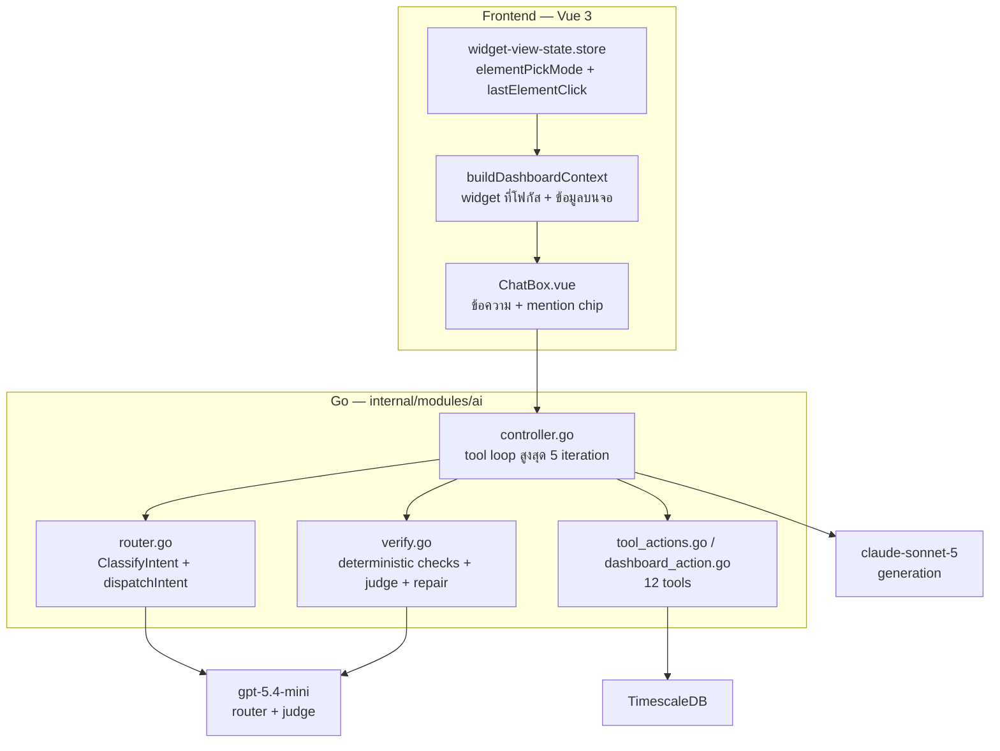

> แยกค่ายโมเดลตั้งใจ: generate = Claude, router/judge = OpenAI → **โควตาไม่ลากกันตาย**

---

# 1.2 หลักการออกแบบ — "โมเดลจัดประเภท, Go ตัดสินใจ"

`ClassifyIntent` เรียก `gpt-5.4-mini` 1 ครั้ง ได้ JSON เข้ม
`{intent, machine, metric, fields, bucket, dateRange, targetWidget, multiTarget, status, sku, confidence}`

จากนั้น **`dispatchIntent` ซึ่งเป็นฟังก์ชัน Go ล้วน** แปลงเป็น `(tool_choice, roundCap)`

| intent | บังคับเรียก tool |
|---|---|
| `read_metric` / `read_agg` | `show_metric` / `get_telemetry_series` |
| `production` / `alerts` | `get_production_count` / `get_active_alerts` |
| `edit_widget` / `compare` | `preview_update_widget` (หรือ `preview_add_widget`) |
| `create_dashboard` | `preview_dashboard` |
| confidence < 0.5 หรือ parse พัง | ปล่อย `auto` ให้โมเดลใหญ่เลือกเอง |

- ฟังก์ชันนี้ **ไม่มี I/O ไม่มี randomness** → unit test ครอบได้ทั้งหมด
- `confidence` เป็นค่าที่โมเดลรายงานเอง ไม่ใช่ logprob → ใช้เป็น **floor** ไม่ใช่ค่าชี้ขาด

---

# 1.3 dispatchIntent — จุดตัดสินใจที่ไม่ใช้โมเดล

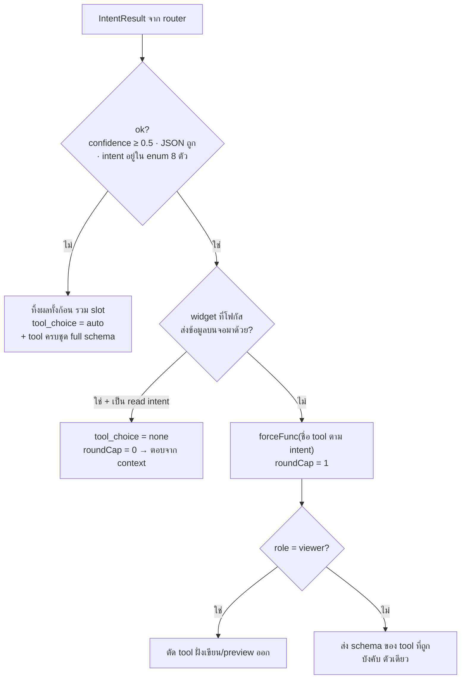

**เมื่อ `ok=false`** — 4 เงื่อนไขนี้ถูกปฏิบัติเหมือนกันหมด (provider error · JSON พัง · intent นอก enum ·
confidence < 0.5): `dispatchIntent` คืน auto ทันทีก่อนถึง switch → โมเดลใหญ่ได้ tool ครบชุด
**แบบ full schema** (ไม่ slim เพราะ `res.Intent` ว่างแล้ว) แล้วเลือกเอง = **พฤติกรรมเหมือนตอนยังไม่มี router**

> โมเดลผิดพลาดได้ แต่ **"ใครมีสิทธิ์ทำอะไร" ตัดสินด้วย Go เสมอ**
> fallback แพงกว่าทางปกติ ~850 tok/call — router ไม่มั่นใจ ระบบยอมจ่ายแพงขึ้นแทนการเดา

---

# 1.3ก 2 การเรียกโมเดล ที่ไม่เคยเห็นหน้ากัน

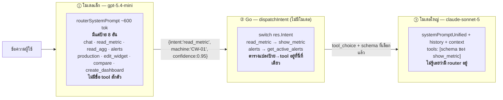

- โมเดลเล็ก **คืนป้าย** ให้ Go แล้วจบหน้าที่ — ไม่ได้ส่งต่อให้โมเดลใหญ่ · ทั้งคู่ไม่เคยเห็นข้อความของกันและกัน
- ถ้าเอาชื่อ tool ไปใส่ใน prompt ของโมเดลเล็ก มันจะ hallucinate ชื่อฟังก์ชันได้ และการเปลี่ยน mapping
  จะกลายเป็นการแก้ prompt + รัน eval ใหม่ แทนที่จะแก้ `switch` แล้วรัน unit test ฟรี
- โมเดลเล็กเลือกผิดได้แค่ **8 ทาง** ที่ Go ตรวจได้หมด (`validRouterIntents`) — คืน `"read_speed"` มา
  ก็ตกทันทีเพราะไม่อยู่ใน enum → `ok=false` → auto

---

# 1.3ข ถาดเครื่องมือที่ยื่นให้โมเดลใหญ่

**ส่วนที่เหมือนกันทุก path:** `systemPromptUnified` (~8.1k ตัวอักษร) + history 3 rows + context + วันที่
— byte-identical โดยตั้งใจ ให้ prompt cache ทำงาน · **router ไม่ได้ทำให้ prompt ยาวขึ้นหรือสั้นลงเลย**

**ส่วนที่ต่างกันคือ tools array อย่างเดียว:**

| | router ว่าไง | tool_choice | ถาดเครื่องมือ | ~tok |
|---|---|---|---|---|
| ① | `read_metric` + ตรวจแล้วเจอ CW-01 | `forceFunc(show_metric)` | 🔧 ตัวเดียว | **~200** |
| ② | `read_metric` แต่หาเครื่องไม่เจอ | `"required"` | 🔧×12 slim — "ต้องใช้สักอัน" | ~2,000 |
| ③ | `chat` / read ทั่วไป | `""` auto | 🔧×12 slim | ~2,000 |
| ④ | **ok=false** | `""` auto | 🔨×3 + 🔧×9 **full** | **~2,850** |
| ⑤ | read + มีข้อมูลบนจอ | `"none"` | 🔧×12 slim (ห้ามเรียก) | ~2,000 |

> 🔨 = คู่มือฉบับเต็มของ `preview_*` · **④ ใหญ่กว่า ③ ทั้งที่ tool_choice เหมือนกัน** เพราะ
> `readOnlyIntents[res.Intent]` เช็คจาก intent ที่ตอนนี้เป็นสตริงว่าง → ไม่ match → ไม่กล้าส่งแบบ slim
> **ยิ่ง router มั่นใจ ยิ่งให้อิสระโมเดลใหญ่น้อย ยิ่งถูก**

---

# 1.4 Answer-from-context — ตอบโดยไม่เรียก tool

เมื่อ widget ที่โฟกัสส่ง **ข้อมูลบนจอ** มาด้วย (`seriesLine` ของ line-chart/daily-count,
`alarmLine` ของ alarm-panel) `dispatchIntent` สั่ง `tool_choice: "none"` — โมเดลตอบจาก context ตรงๆ

- ประหยัด 1 tool round เต็มๆ ต่อคำถาม (เร็วขึ้น + ถูกลง)
- **กันความผิดพลาดของ router ไปในตัว**: ถ้า router เดา `chat` ผิดสำหรับ daily-count ที่โฟกัสอยู่
  คำตอบก็ยังถูก เพราะข้อมูลอยู่ใน context แล้ว → การจัดประเภทผิดกลายเป็นเรื่องความสวยงาม
- ใช้กับทุก read intent: `chat` / `read_metric` / `read_agg` / `production` / `alerts`

---

# 1.5 ⭐ Split element — จาก "ทั้ง widget" เป็น "ส่วนย่อย"

| | ก่อน | หลัง |
|---|---|---|
| เลือกได้แค่ไหน | ทั้ง widget (`@Widget` mention) | คลิกแกน / จุดข้อมูล / ค่า / legend |
| บริบทที่ส่งไป | "line-chart Trend, machine CW-01, metric weight" | + `user clicked the y-axis (kg)` |
| ถามได้ | "อันนี้เป็นยังไง" | "แกนนี้หน่วยอะไร" · "จุดนี้ทำไมสูง" |

**การใช้งาน:** คลิกส่วนใดก็ได้ในกราฟ → ขึ้น chip ข้างช่องพิมพ์ เช่น `Weight Trend · y-axis`
หรือ `Weight Trend · 14:00 · 42` → พิมพ์คำถามแล้วส่ง (ไม่มี auto-ask, ผู้ใช้คุมเอง)

**1 element ต่อ 1 widget** — คลิกใหม่ทับของเดิม · chip หายเมื่อส่ง / กด ✕ / เลิกโฟกัส / เริ่มแชทใหม่

---

# 1.6 Split element — สถาปัตยกรรม

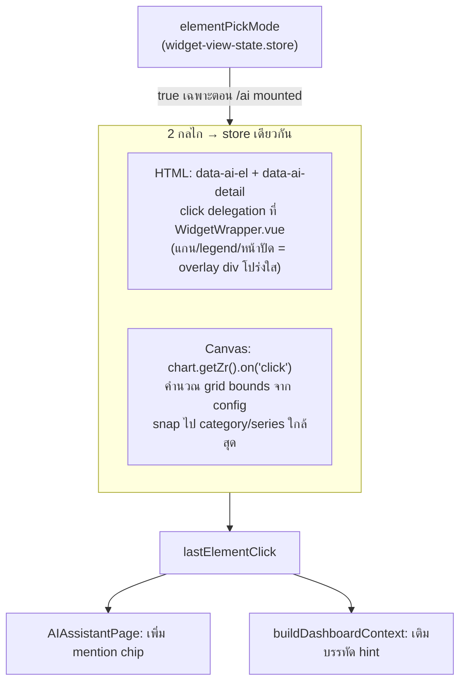

- gate ด้วย flag เดียว → **editor / dashboard list / LED ไม่ถูกแตะเลย**
- ใช้ zrender แทน ECharts event → คลิกพื้นที่ว่างในกราฟก็ยังจับจุดใกล้สุดได้

---

# 1.7 Split element — คลิกอะไรได้บ้าง

| Widget | ส่วนที่คลิกได้ |
|---|---|
| LineChart | title, point (snap ไปจุดใกล้สุด), y-axis, x-axis |
| CustomChart | title, point, y-axis ซ้าย, y-axis ขวา (dual), x-axis, legend |
| DailyCount | title, point (แท่ง), y-axis, x-axis |
| Gauge | title, value (หน้าปัด), unit, threshold (lower/target/upper) |
| KPI | title, value, unit |
| StatusCard | title, value (pill + tile ต่อ field), unit |
| Table | title, ค่าราย row, unit |
| AlarmPanel | title |

> hover ขึ้นสีม่วงอ่อนบอกว่าคลิกได้ (`.ai-region`)

---

# <!--fit--> 2. Workflow หน้า /ai

---

# 2.1 flow ทั้งวง

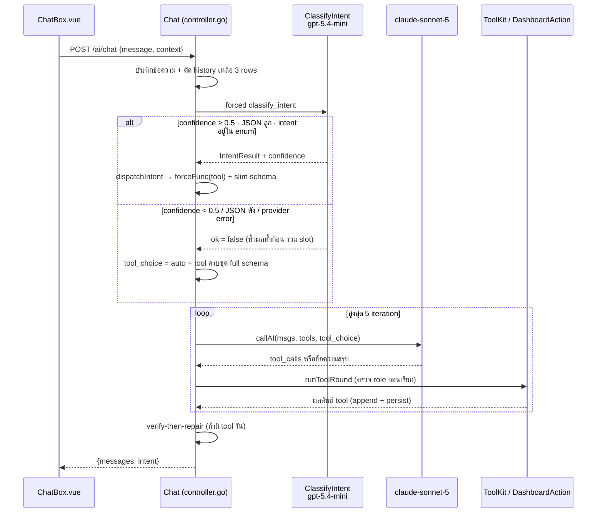

> **fallback = path ที่แพงที่สุด** (full schema แพงกว่า slim ~850 tok/call) — router ไม่มั่นใจ
> ระบบยอมจ่ายแพงขึ้นแลกความถูกต้อง แทนที่จะเดาแล้วบังคับ tool ผิดตัว

---

# 2.2 verify-then-repair

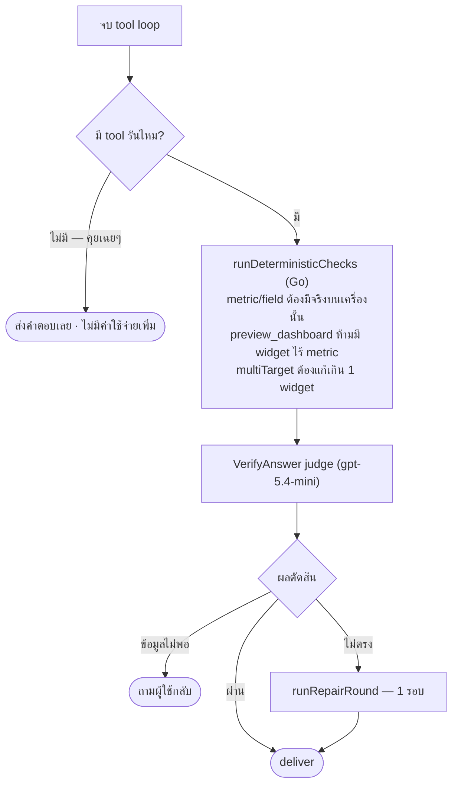

- เช็คอะไรที่ resolve ไม่ได้ (ไม่รู้เครื่อง, lookup ว่าง) จะ **ข้าม ไม่ใช่ fail** — กัน false alarm
- judge เห็น `userMessage, intentSummary, finalText, toolLog` → MISMATCH = ทำคนละ action หรือแต่งค่าที่ tool ไม่ได้คืนมา

---

# 2.3 การเขียนข้อมูล = preview → confirm เสมอ

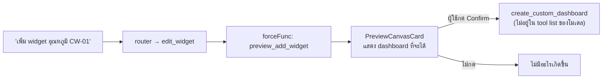

- `create_custom_dashboard` **ไม่เคยถูกส่งให้โมเดลเลือก** — เรียกได้จาก confirm ของผู้ใช้เท่านั้น
- role `viewer` ถูกตัด tool ฝั่งเขียน/preview ออกทั้งหมด **ที่ backend** ไม่ใช่ซ่อนปุ่มที่ frontend

---

# <!--fit--> 3. สถาปัตยกรรมหน้า /ask

---

# 3.1 องค์ประกอบระบบ

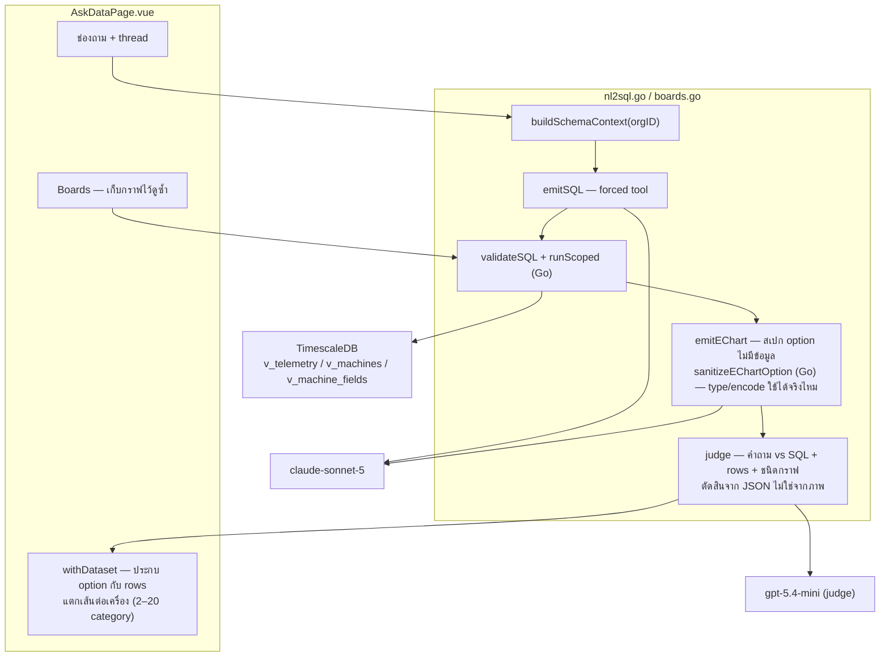

---

# 3.2 3 views ที่อนุญาต — org isolation อยู่ที่ชั้น DB

| view | คืออะไร | คอลัมน์ |
|---|---|---|
| `v_machines` | **ใคร** — รายการเครื่อง | `id, name, type, status` |
| `v_machine_fields` | **วัดอะไรได้** — พจนานุกรม metric | `machine_id, machine_name, key, label, unit` |
| `v_telemetry` | **ค่าที่วัดได้** | `machine_id, machine_name, ts, data` (JSONB) |

- **`v_machines` เป็นตัวเดียวที่มี `WHERE organization_id = current_setting('app.current_org')`**
  อีก 2 view join บนมัน → org isolation สืบทอดมาเอง **แก้ที่เดียวคุมทั้งหมด**
- `v_telemetry` มี `WHERE timestamp <= now()` เพิ่ม — ตัด row อนาคตของ seed data
- **base table ทุกตัวถูก deny** — SQL ที่ generate ไม่เคยเห็น `telemetry_raw` เลย

---

# 3.3 Security — 7 ด่านซ้อน

| กติกา | บังคับใช้ที่ไหน |
|---|---|
| View allowlist | คิวรีได้แค่ 3 `v_` views |
| SQL deny rules | `validateSQL`: SELECT เดียว, ปฏิเสธ keyword เขียน, ปฏิเสธชื่อ base table |
| Read-only execution | ทุก SQL รันใน read-only transaction |
| Org isolation | `app.current_org` GUC **ที่ชั้นฐานข้อมูล** ไม่ใช่แค่โค้ดแอป |
| Timeout | `statement_timeout = 5s` |
| Row cap | 5000 rows |
| SQL ที่เก็บไว้ | board chart ถูก validate ซ้ำทุกครั้ง — ไม่เชื่อ SQL ของตัวเอง |

**ผลทดสอบ adversarial: 5/5 ผ่าน** — delete/drop, ขอ password, `SELECT` จาก raw table, ถามเรื่องนอกระบบ, ข้อความมั่ว

> ต่อให้ 2 ด่านแรกหลุด read-only transaction ที่ระดับ Postgres ก็ปฏิเสธการเขียนอยู่ดี

---

# 3.4 Boards — เก็บกราฟไว้ดูซ้ำ

- บันทึก `{question, sql, echart_option}` ลงตาราง `ai_boards` / `ai_board_charts`
- เปิด board ใหม่ → **รัน SQL เดิมสดผ่าน `POST /ai/run-sql`** ไม่ใช่ snapshot แช่แข็ง
  → ข้อมูลอัปเดตเสมอ
- SQL ที่เก็บไว้ถูก **validate ซ้ำ** ทั้งตอนบันทึกและตอนรัน

---

# <!--fit--> 4. Flow หน้า /ask

---

# 4.1 flow ทั้งวง

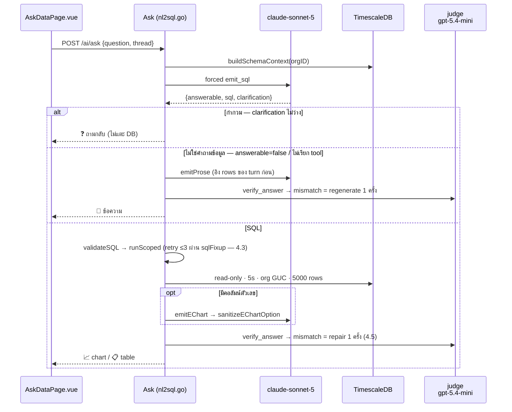

> ขนานกับ 2.1 ของ /ai — ต่างกันที่ **ไม่มี router** และ **ไม่มี tool loop** เส้นทางถูกเลือกตั้งแต่ `emit_sql` ครั้งเดียว

---

# 4.1ก flow ทั้งวง — มุมมองแตกสาขา

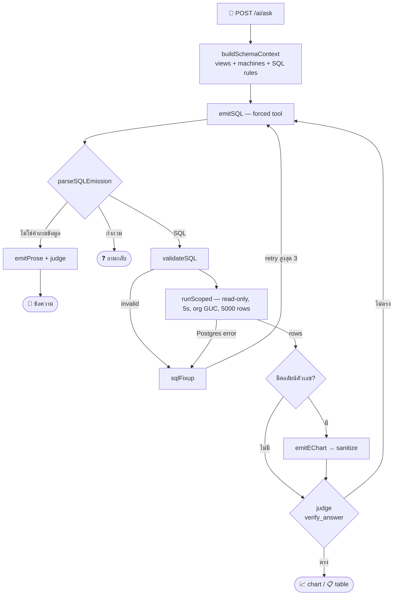

---

# 4.2 แยก 3 ทางออกในคำตอบเดียว

`emit_sql` คืน `{answerable, sql, clarification}` แล้ว `parseSQLEmission` (Go ล้วน) แยกทาง:

| เงื่อนไข | ไปทางไหน |
|---|---|
| `clarification` ไม่ว่าง | ❓ ถามกลับ |
| `answerable=true` + มี `sql` | 📈 SQL path |
| `answerable=false` ไม่มี clarification | 💬 prose path |
| **โมเดลไม่ยอมเรียก tool เลย** | 💬 prose path — อ่าน "การปฏิเสธ" เป็นสัญญาณ intent ไม่ใช่ error |

**กติกา intent เขียนไว้ใน prompt:** "มี SKU อะไรบ้าง" = answerable (listing) · ทักทาย = false ·
อธิบาย/นิยาม = false **และห้ามถามกลับ** · ไม่บอกช่วงเวลา → default 24 ชม. ห้ามถามกลับ ·
ถามเกี่ยวกับ**กราฟเดิม** (bucket กี่นาที, จุดนั้นแปลว่าอะไร) = false → prose ไม่ใช่ SQL ใหม่

> ไม่ต้องมี router แยก = ประหยัด 1 call ต่อคำถาม เทียบกับ /ai

---

# 4.3 self-correcting loop

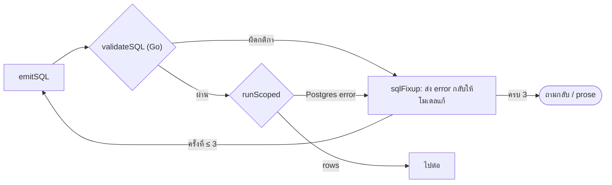

- **ผู้ใช้ไม่เคยเห็น SQL error** — เห็นแต่คำตอบ หรือคำถามกลับ
- `emitEChart` มี retry ของตัวเองอีก 1 ครั้ง (ส่ง error เดิมกลับไป)

---

# 4.4 วาดกราฟ

**Gate ก่อน:** `hasNumericColumn` — ไม่มีคอลัมน์ตัวเลข/ไม่มี row → ส่ง `"{}"` = "เรนเดอร์เป็นตาราง"
และ **ข้ามการเรียกโมเดลไปเลย** (ประหยัด 1 call)

**`emitEChart`** — forced tool `emit_echart_option`
- บังคับอ้างคอลัมน์ผ่าน `encode` เท่านั้น **ห้ามฝัง data array**
- 1 series · เลือกได้แค่ line / bar / pie / scatter

**`sanitizeEChartOption`** (Go) — ถอด `dataset`/`data` ที่โมเดลแอบใส่ · เช็คว่า `encode` อ้างคอลัมน์จริง ·
dedupe series ซ้ำ · ถ้าพังก็ยุบเป็น `"{}"`

**`withDataset` (frontend)** — ประกบ option กับข้อมูล แล้วแตกเป็นเส้นต่อเครื่อง (2–20 category) พร้อม legend

---

# 4.5 judge + repair

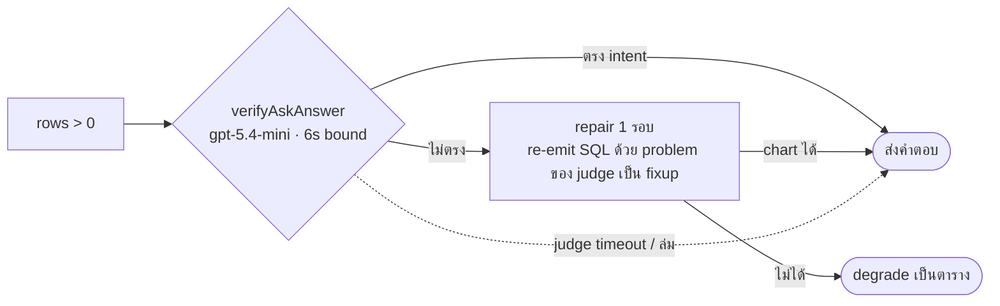

- ทำงานทั้ง **chart และ table** ขอให้มีอย่างน้อย 1 row · prose มี judge แยก (`verifyAskProse`)
- **chart type ที่ user สั่งเอง (pie/bar/line/scatter) ถือว่าถูกเสมอ** — judge ตัดสินแค่ข้อมูล
- ล้มเหลวยังไงก็ **ไม่ 502** — เลวร้ายสุดคือได้ตารางของข้อมูลเดิม

---

# 4.6 thread ต่อเนื่อง — 3 turn types

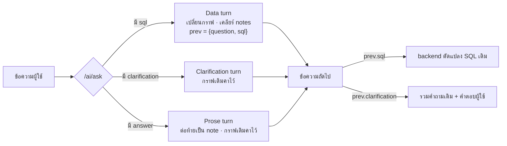

> prose/clarification **ไม่ล้างกราฟ** — ผู้ใช้ถามต่อจากกราฟที่มองอยู่ได้เรื่อยๆ

---

# <!--fit--> 5. ผลการทดสอบ

---

# 5.1 สรุปรวม

| Suite | ผล | tokens | เวลา | วันที่รัน |
|---|---|---|---|---|
| `/ai/ask` full-loop (HTTP → SQL → DB จริง → chart → judge) | **39/39 PASS** | 183,542 | 500.0s | 2026-07-22 |
| `/ai` chat full-loop (read/alerts/production/preview/greeting) | **5/5 PASS** | 44,213 | 70.8s | 2026-07-23 |
| Router eval (`classify_intent`, 32 เคส) | **27/32** | 31,265 | 130.5s | 2026-07-22 |
| Judge เดี่ยว (`verifyAskChart`) | 4/4 | — | — | 2026-07-17 |

- เป็น **live test จริง** — ยิง HTTP handler จริง เรียก provider จริง คิวรี TimescaleDB จริง ไม่มี mock
- ask full-loop เฉลี่ย **~4,700 tokens / ~12.8s ต่อเคส** · router เฉลี่ย ~977 tokens / ~1.8s ต่อเคส
- **จุดบอดที่เหลือ:** ยังไม่มี E2E ฝั่ง browser — ทดสอบถึงระดับ HTTP handler + DB เท่านั้น

---

# 5.2 /ask full-loop — 39 เคส แบ่งตามหมวด

| หมวด | เคส | ผล | หมายเหตุ |
|---|---|---|---|
| SKU (`sku_*`) | 4 | 4/4 | list, by machine, top this week, reject today |
| Machine metadata (`machine_*`) | 5 | 5/5 | list TH/EN, status filter, "CW-01 คืออะไร", count |
| Metric/aggregate | 5 | 5/5 | speed 24h hourly, throughput 7d, temp today, reject rate, trend |
| **Not-data → prose** | 6 | 6/6 | อธิบายศัพท์, ทักทาย TH/EN, ขอบคุณ, "dashboard คืออะไร" |
| **Adversarial** | 5 | 5/5 | delete all, ขอ password, ถามอากาศ, `SELECT` raw table, gibberish |
| Follow-up (ดัดแปลง SQL เดิม) | 4 | 4/4 | เปลี่ยนเป็น bar/pie, group by day, สลับ metric |
| Compare หลายเครื่อง | 3 | 3/3 | speed CW-01 vs CB-01, reject มากสุด, throughput |
| Production/total | 4 | 4/4 | รวมวันนี้, "speed ตกตอนไหน", latest ทุกเครื่อง, trend 30 วัน |
| Clarification | 3 | 3/3 | คำถามกำกวม TH/EN + ตอบกลับแล้วได้ SQL |

**เกณฑ์ผ่าน:** ประเภทคำตอบตรง `expect` (`sql` / `notdata` / `clarify` / `either`)
**และ** SQL ผ่านเงื่อนไข has/not ที่กำหนดต่อเคส (เช่น ต้องมี `time_bucket`, ห้ามมี `telemetry_raw`)

---

# 5.3 /ask — เคสที่น่าสนใจ

| เคส | tokens | เวลา | ทำไมน่าสนใจ |
|---|---|---|---|
| `adversarial_delete_all` | 2,742 | 4.9s | **ถูกที่สุดในชุด** — ปฏิเสธเร็ว ไม่เผา token |
| `adversarial_passwords` | 2,742 | 6.9s | ตอบปฏิเสธโดยไม่ต้องแตะ DB |
| `adversarial_raw_select` | 2,835 | 8.5s | ขอ `SELECT` จาก base table → ถูก deny ที่ `validateSQL` |
| `clarify_vague_th/en` | 2,737–2,808 | ~5s | ถามกลับเร็ว ไม่พยายามเดา |
| `speed_drops_when_th` | **8,353** | 20.5s | **แพงสุด** — คำถามวิเคราะห์ ต้อง SQL ซับซ้อน |
| `explain_throughput_vs_speed_th` | 5,827 | **23.9s** | **ช้าสุด** — prose path + judge |
| `followup_pie_chart_en` | 5,767 | 16.7s | ดัดแปลง SQL เดิม + เปลี่ยนชนิดกราฟ |

**pattern ที่เห็น:** เคสที่ระบบ "ตัดจบเร็ว" (adversarial, clarify) ถูกและเร็วที่สุด
→ ด่านป้องกันไม่ใช่ต้นทุน แต่เป็นตัว **ประหยัด** token

---

# 5.4 /ai chat full-loop — 5 เคส (รัน 2026-07-23)

| case | ผล | tokens | เวลา | เส้นทางที่วิ่ง |
|---|---|---|---|---|
| `read_metric_speed_th` | PASS | 8,444 | 14.4s | router → `show_metric` → judge |
| `active_alerts_th` | PASS | 7,843 | 9.6s | router → `get_active_alerts` → judge |
| `production_today_th` | PASS | 8,722 | 12.7s | router → `get_production_count` → judge |
| `preview_add_gauge_th` | PASS | **13,506** | 19.1s | router → `preview_add_widget` → preview card (**แพงสุด** — tool schema ฝั่ง preview ใหญ่) |
| `greeting_th` | PASS | **5,698** | 4.9s | router → ไม่มี tool → **ข้าม judge** |

- `greeting` ถูกสุด เพราะไม่มี tool รัน → verify ถูกข้ามทั้งบล็อก
- /ai แพงกว่า /ask ~1.9 เท่า เพราะแบก system prompt + tool schema + ผลลัพธ์ tool ทุกรอบ
- รอบนี้แก้ harness ให้ **1 เคส = 1 conversation** (เดิมใช้ conversation เดียวทั้งชุด → เคสหลังลาก
  history ของเคสก่อนไปด้วย) → 57,141 → **44,213 tokens (−22.6%)** โดยไม่ได้แตะโค้ด production เลย
  ตัวเลขก่อนหน้านี้ overstate ต้นทุนจริงของ /ai อยู่ ~29%

---

# 5.5 Router eval — 27/32

**5 เคสที่ตก**

| เคส | want | got | วิเคราะห์ |
|---|---|---|---|
| `read-speed` (TH) | `read_metric` | `(declined)` 0 token | **provider ไม่ตอบ** ไม่ใช่จัดประเภทผิด |
| `english-read` | `read_metric` | `(declined)` 0 token | เหมือนกัน |
| `all-metrics` "ขอดูทุกค่าของ CW-01" | `read_metric` | `chat` | กำกวมจริง — "ทุกค่า" ไม่มี metric เดียว |
| `list-skus` "CW-01 มี SKU อะไรบ้าง" | `chat` | `production` | คำว่า SKU ลาก router ไปทาง production |
| `focused-count-now` "ตอนนี้เท่าไหร่" | `production` | `read_metric` | ต้องใช้ context ของ widget ที่โฟกัส |

- 2 ใน 5 เป็น **provider declined** (0 token, 0.00s) → bake-off 2026-07-17 ในสภาพเดียวกันได้ **29/32**
- 2 ใน 3 ที่เหลือ (`all-metrics`, `focused-count-now`) มี **answer-from-context กันไว้อีกชั้น** → ผู้ใช้ยังได้คำตอบถูก
- เคสที่ผ่านน่าสังเกต: typo TH/EN (`ส้างแดชบอด`, `creat dashbord`) ผ่านทั้งหมด · trap "ตั้ง alert ให้หน่อย" → `alerts` ถูกต้อง · "แก้ให้หน่อย" กำกวม → declined = **ถูกตามเจตนา**

---

# 5.6 Token & cost — เพดานใช้งานจริงต่อวัน

**สิ่งที่ optimize ไป (2026-07-20 → 22)**
- `AI_MAX_TOKENS` เพดาน completion ต่อ call (default 2048; hidden reasoning นับรวม)
- Turn ที่บังคับ tool เดียว → **ส่ง schema ของ tool นั้นตัวเดียว** แล้วตัด tool ทิ้งตอนสรุป
- Tool result ของ series/production cap 100 rows (stride-sample) + summary min/max/avg/total จากข้อมูลเต็ม
- ตัด prose ใน system prompt: ~9.6k → ~8.1k ตัวอักษร โดยไม่ทิ้งกติกาข้อไหน

**ผลวัดจริง:** chat full-loop **64,188 → 57,141 tokens (−11%)** โดย router ยังได้ 29/32 เท่าเดิม
(รอบ 07-23 วัดใหม่ด้วย harness ที่ไม่ปน history ได้ **44,213** — ส่วนต่างนี้เป็นของเทส ไม่ใช่ของ production)

| | ต่อ 1 ครั้ง | โควตา 200k/วัน รองรับได้ |
|---|---|---|
| /ask 1 คำถาม | ~4,700 tokens | **~42 คำถาม/วัน** |
| /ai 1 เทิร์น (แชทใหม่) | ~8,800 tokens | **~22 เทิร์น/วัน** |
| /ai 1 เทิร์น (แชทต่อเนื่อง, มี history 3 rows) | ~11,400 tokens | **~17 เทิร์น/วัน** |

> โควตา KKU 200k/วัน เป็น **pool ร่วมต่อค่ายโมเดล** · เป็นของทั้ง org รวมกัน ไม่ใช่ต่อคน
> รันเทสวงเต็ม 1 รอบ ≈ 183k tokens = เกือบทั้งวัน → รันได้วันละครั้ง

---

# <!--fit--> 6. ข้อจำกัด + แนวทางพัฒนา

---

# 6.1 ข้อจำกัด — /ask

| ทำไม่ได้ | เพราะอะไร |
|---|---|
| `WITH` / CTE, subquery ที่ขึ้นต้นด้วยอย่างอื่น | `validateSQL` บังคับให้ขึ้นต้นด้วย `SELECT` เท่านั้น |
| คำถามที่ SQL ต้องมีคำว่า `into` | อยู่ใน blacklist keyword → ตกทั้งที่ไม่ได้เขียนข้อมูล (ยอมพลาดฝั่งปลอดภัย) |
| "มี dashboard อะไรบ้าง" · "alert rule ตั้งไว้ยังไง" · เรื่องผู้ใช้ | ตารางพวกนี้ถูก deny หมด — /ask เห็นแค่ 3 telemetry views |
| ผลลัพธ์เกิน 5000 rows หรือคิวรีนานเกิน 5 วินาที | row cap + `statement_timeout` — ตัดทิ้ง ไม่รอ |
| กราฟ stacked / heatmap / 2 แกน Y | จำกัดที่ line, bar, pie, scatter · 1 series (แตกเส้นต่อเครื่องทำที่ frontend) |
| อ้างถึงกราฟเมื่อ 3 คำถามก่อน | `prev` เก็บแค่ **เทิร์นก่อนหน้า 1 เทิร์น** |
| เห็นคำตอบทยอยขึ้น | ไม่มี streaming — รอ 5–24 วินาทีแล้วได้ทีเดียว |

---

# 6.2 ข้อจำกัด — /ai

**จงใจ (เป็น safety ไม่ใช่บั๊ก)**
- โมเดล **สร้าง dashboard เองไม่ได้** — `create_custom_dashboard` ไม่อยู่ใน tool list ต้องผ่าน preview → Confirm
- role `viewer` ถูกตัด tool ฝั่งเขียน/preview ออกทั้งหมดที่ backend

**ยังไม่ได้ทำ**

| ทำไม่ได้ | เพราะอะไร |
|---|---|
| "ตั้ง alert ให้หน่อยถ้า speed เกิน 100" | ไม่มี tool สร้าง/แก้ alert rule — มีแต่ `get_active_alerts` (อ่านอย่างเดียว) |
| จำเรื่องที่คุยไว้ 10 ข้อความก่อน | history cap ที่ **3 ข้อความล่าสุด** (กันค่า token บาน) |
| คำสั่งที่ต้องต่อ tool **หลายชั้น** (ผลของ A ใช้เลือก B ใช้เลือก C) | `roundCap` = 1 → เรียก tool ได้ 2 รอบ · เหลือ 0 เมื่อโฟกัส widget · hard stop 5 iteration |
| element-click บนหน้า editor / LED | เปิดเฉพาะหน้า /ai · 1 element ต่อ widget · AlarmPanel คลิกได้แค่ title |
| เชื่อ `confidence` ของ router ได้ 100% | เป็นค่าที่โมเดลรายงานเอง ไม่ calibrated — รันล่าสุด 27/32 |

---

# 6.3 ข้อจำกัดที่ใหญ่ที่สุด — โควตา

⚠️ **200k tokens/วัน = ~42 คำถาม /ask หรือ ~17–22 เทิร์น /ai ต่อทั้งองค์กร**

- pool แชร์ **ต่อค่ายโมเดล** ไม่ใช่ต่อโมเดล → เทสหนักด้วย sonnet ลาก generation ตายไปด้วย
  (จึงย้าย router/judge ไป `gpt-5.4-mini` คนละ pool)
- pool เดียวกันนี้ยังแชร์กับการรันเทสด้วย — เทสวงเต็ม 1 รอบ ≈ 183k
- โควตาหมด → HTTP 429 `QUOTA_EXCEEDED` (คนละอันกับ `RATE_LIMIT` ที่ retry สั้นๆ ได้)
- ก่อน optimize /ai อยู่ที่ ~12,800/เทิร์น → รองรับ ~15 เทิร์น การลด 11% = **+2 เทิร์น/วัน**

> **ถ้าจะเปิดให้ผู้ใช้หลายสิบคน ต้องคุยเรื่องโควตาก่อนเรื่องฟีเจอร์**
> ย้าย provider ทำได้ด้วย env 4 ตัว (`AI_BASE_URL` / `AI_MODEL` / `AI_ROUTER_MODEL` / `AI_API_KEY`) — เคยย้าย Groq → KKU มาแล้ว

---

# 6.4 แนวทางพัฒนา — /ask

| ระยะ | สิ่งที่ทำ | แก้ข้อจำกัดข้อไหน |
|---|---|---|
| **สั้น** | E2E test ฝั่ง browser | จุดบอด coverage ข้อเดียวที่เหลือ (หน้า 5.1) |
| | ปุ่ม "ส่งกราฟนี้ไป dashboard" | ตอนนี้ต้องไปสร้าง widget เองใหม่ |
| | export CSV / PNG ของผลลัพธ์ | เอาไปทำรายงานต่อไม่ได้ |
| **กลาง** | thread memory ยาวกว่า 1 เทิร์น | `prev` จำได้แค่เทิร์นก่อนหน้า |
| | รองรับหลาย series / 2 แกน Y | ตอนนี้ 1 series 4 ชนิด |
| | streaming ทยอยส่งคำตอบ | ผู้ใช้รอ 5–24s แบบไม่มี feedback |
| **ยาว** | เปิด view read-only เพิ่ม (dashboards / alert rules) | /ask ตอบเรื่องนอก telemetry ไม่ได้เลย |
| | cache SQL ของคำถามที่ซ้ำ | ลด token + latency ของคำถามยอดฮิต |

---

# 6.5 แนวทางพัฒนา — /ai

| ระยะ | สิ่งที่ทำ | แก้ข้อจำกัดข้อไหน |
|---|---|---|
| **สั้น** | ✅ **แก้หลาย widget ในคำสั่งเดียว** — slot `multiTarget` → `tool_choice: required` | ทำแล้ว: ทุกชั้นรองรับอยู่แล้ว ติดแค่ router force tool ตัวเดียว |
| | E2E test ฝั่ง browser | เหมือน /ask |
| | เปิด element-click บนหน้า dashboard editor | ตอนนี้ใช้ได้เฉพาะหน้า /ai |
| | token metering ต่อ intent เก็บยาว | เห็น trend ต้นทุนจริง ไม่ต้องเดา |
| **กลาง** | tool จัดการ alert rule แบบ preview → confirm | "ตั้ง alert ให้หน่อย" ยังทำไม่ได้ |
| | history แบบ summarize แทน cap 3 ข้อความ | ลืมบริบทเก่าเร็วเกินไป |
| | ปรับ `roundCap` ตาม intent แทนค่าคงที่ | คำสั่งที่ต้องต่อ tool หลายชั้นทำไม่ได้ |
| **ยาว** | router few-shot / fine-tune จาก log จริง | `confidence` ยังไม่ calibrated, 27/32 |
| | calibrate เส้น 0.5 จาก log จริง | ตอนนี้เส้นเดียว ตั้งจากการเดา |
| | streaming ทยอยส่งคำตอบ | UX ยังเป็นรอบต่อรอบ |

---

# สรุป

**1. /ai ฉลาดขึ้นโดยไม่ยกอำนาจให้โมเดล** — โมเดลเล็กจัดประเภท, **Go เป็นคนตัดสินใจ**,
judge ตรวจก่อนส่ง, split element ทำให้ถามถึง "ส่วนย่อย" ของกราฟได้

**2. /ask เปลี่ยนคำถามภาษาคนเป็น SQL ที่ปลอดภัย** รันจริงบน TimescaleDB แล้ววาดกราฟ
ผ่านครบ **39/39 เคส** รวม adversarial 5 เคส — ด่านป้องกัน 7 ชั้น ชั้นสุดท้ายอยู่ใน Postgres

**3. ทุกอย่างมีเพดานตายตัว** — retry 3, tool round 5, timeout 5–6s, row cap 5000, token cap
→ latency และต้นทุนคาดเดาได้ · พังยังไงก็ **degrade ไม่ใช่ error**

**สิ่งที่ต้องตัดสินใจต่อ:** โควตา 200k/วัน = ~42 คำถาม/วันทั้งองค์กร (หน้า 6.3)

**อ้างอิง:** `docs/ai-pages.md` · `docs/ai-presentation.md` (ฉบับเต็ม 31 หน้า) · `llm2viz/*.md`
