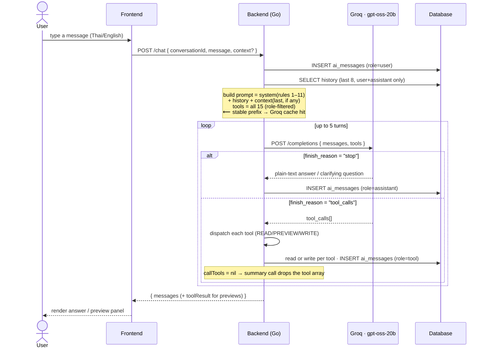
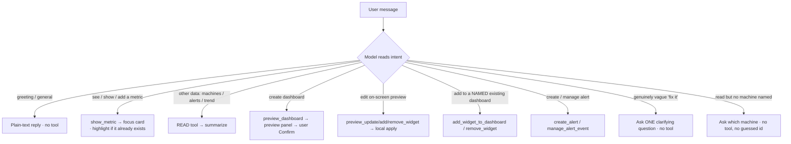
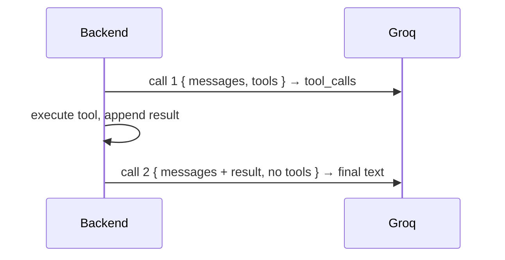

# IotVision AI — Workflow & Optimization Notes

Model: **`openai/gpt-oss-20b`** (Groq) — chosen via a Thai-first bake-off (11/11 across two runs; beat `gpt-oss-120b`, which reliably mis-fired the destructive `remove_widget` on preview edits, and `qwen3-32b`, which was flaky/rate-limited).

## What changed (and why)

Goal priority (from the user): **(1) AI understands intent — Thai-first > (2) token cost > (3) latency.**

| Change | File | Why |
|---|---|---|
| Model swap `qwen/qwen3-32b` → `openai/gpt-oss-20b` | `controller.go` | Best Thai intent in the bake-off (11/11), no language-mixing leaks, cheapest, and **Groq prompt-caches it**. |
| New `show_metric` tool + rule 11 (see/show/**add** a metric → focus card) | `schema.go`, `tool_actions.go`, `controller.go` | The AI maps the user's word (any language) → the English field key; backend resolves machine+field to a render-ready widget spec; the UI shows a live single-metric "focus" card (with an **Add to dashboard** button) or highlights the widget if it already exists. Replaces fragile frontend text-scraping of which metric was asked. |
| Server-side gate on `add_widget_to_dashboard` (empty `dashboard_name` → steer to `show_metric`) | `tool_actions.go` | Belt-and-suspenders for rule 11: a bare "add weight widget" must show a preview card, never ask "which dashboard?". |
| Machine matched by **substring**, not exact name | `tool_actions.go` `resolveMachineID` (and frontend `machineMatches`) | Display names are `"Checkweigher CW-01"` but users/AI say `"CW-01"`; exact match silently failed. |
| Deleted the unused telemetry simulator; reconciled docs Anthropic → Groq | `internal/simulator/` (removed), `config/env.go`, `CLAUDE.md` | Runs on backfill + live ingest via the broadcaster; the AI proxy is Groq, not Anthropic. |
| `callGroq` split into `callGroq` + `callGroqModel(model,…)` | `controller.go` | Lets the bake-off harness compare models without touching the request path. |
| Removed `/no_think` from system prompt | `controller.go` | qwen-specific directive; meaningless to gpt-oss. |
| Tightened rule 6 (default to `machine_overview` preview, never ask which template) | `controller.go` | "create a dashboard" should show a preview immediately — the preview *is* the confirmation step. Easier to use. |
| Rule 10 → explicit slot-filling (ask for the missing **machine**, never guess, never `get_machines` just to echo) | `controller.go` | The user's "ask if not clear", made precise: a read/alert needs a machine; if none is named, ask one short question instead of guessing a name. Still never asks which dashboard *template* (rule 6). |
| Shared `machineIDProp` description on the 4 required-`machine_id` tools | `schema.go` | `required` already forces the field; the description nudges the model to *ask* rather than invent a name. JSON Schema can't express "ask the user", so this pairs with rule 10. |
| New `eval_test.go` bake-off harness (+ `read-no-machine` / `read-no-machine-en` slot-filling cases) | `eval_test.go` | Throwaway model comparison; skips without `GROQ_API_KEY`. |

### Approaches considered and rejected
- **Semantic / embedding router** — Groq has no embeddings endpoint; for only 14 small tools the extra provider + per-request embedding call costs more than it saves.
- **Keyword / hybrid tool-gating router** — matches words, not meaning (e.g. "create dashboard, what machines do I have?" looks like an action but is a read). With *understanding* as priority #1, the model itself is the better intent-decider.
- **Greeting-skip (no tools on "hello")** — marginal once caching is on, and a bilingual matcher risks wrongly withholding tools.

### Token win without routing code
gpt-oss-20b is **prompt-cached by Groq automatically**. The request prefix
(system prompt + the 15 tool schemas, fixed order) is identical across turns, so
it gets a **50% cached-token discount and stops counting against the rate limit**.
The per-request dashboard `context` is appended *last*, after history, so it never
breaks the cached prefix.

## Tools offered to the model (role-filtered only) — 15 total

- **READ (7):** `get_machines`, `get_latest_telemetry`, `show_metric`, `get_telemetry_trend`, `get_active_alerts`, `get_daily_count`, `list_dashboards`
- **PREVIEW (4, no DB write):** `preview_dashboard`, `preview_add_widget`, `preview_remove_widget`, `preview_update_widget`
- **WRITE (4, admin/editor only):** `add_widget_to_dashboard`, `remove_widget`, `create_alert`, `manage_alert_event`

`show_metric` is read-only/display: it resolves a machine + field server-side and
returns a widget spec the UI renders as an ephemeral **focus card** (not persisted —
the user clicks **Add to dashboard** to keep it). If a widget for that metric already
exists on screen, the frontend highlights it instead of showing a card.

`create_custom_dashboard` is **not** offered to the model — it only runs when the
user clicks **Confirm** (`POST /tools/execute`). So the AI can never build a
dashboard on its own; the worst it can do is show a preview.

## Core chat flow

## The "decide what the user wants" step

The model — not a keyword layer — decides, guided by the system prompt:

## Case examples (verified in the bake-off, Thai-first)

| User says | Model does |
|---|---|
| "สวัสดีครับ" | plain Thai reply, no tool |
| "speed ของ CW-01 เท่าไหร่" / "ความเร็ว CW-01" | `show_metric({machine:"CW-01", metric:"speed"})` → focus card (or highlight if it exists) |
| "add weight widget" / "ขอ widget weight CW-01" | `show_metric({machine:"CW-01", metric:"weight"})` → focus card — **not** `add_widget_to_dashboard`, never asks which dashboard |
| "เทรนด์ speed CW-01 ย้อนหลัง" | `show_metric({…, viz:"trend"})` → line-chart focus card |
| "add a weight widget to CW-01 Overview" | `add_widget_to_dashboard({dashboard_name:"CW-01 Overview", …})` — names a dashboard |
| "มีเครื่องอะไรบ้าง" | `get_machines()` |
| "สร้าง dashboard ของ CW-01 ให้หน่อย" | `preview_dashboard({machine:"CW-01", template:"machine_overview"})` |
| "เปลี่ยน metric เป็น temperature" (preview on screen) | `preview_update_widget({widget_title:"Trend", metric:"temperature"})` |
| "สร้าง dashboard สิ แล้วตอนนี้มีเครื่องอะไรบ้าง" (trap) | `get_machines()` — reads, does **not** build |
| "แก้ให้หน่อย" (vague) | asks a clarifying question in Thai, no tool |
| "speed เท่าไหร่" (no machine named) | asks *which machine* in Thai — no tool, no guessed `machine_id` |

## Two-call pattern (data/tool turns)

A tool turn costs two Groq calls: one to pick the tool, one to summarize the
result (the tool array is dropped on the summary call). This is inherent to
function-calling. Reducing its *perceived* latency via response streaming is a
deferred follow-up (not in this change).

## Not done (future work)
- **Streaming** the final answer to the UI (cuts perceived latency on tool turns).
- Delete `eval_test.go` once the model is settled, or keep it for re-validating future model/prompt changes.
