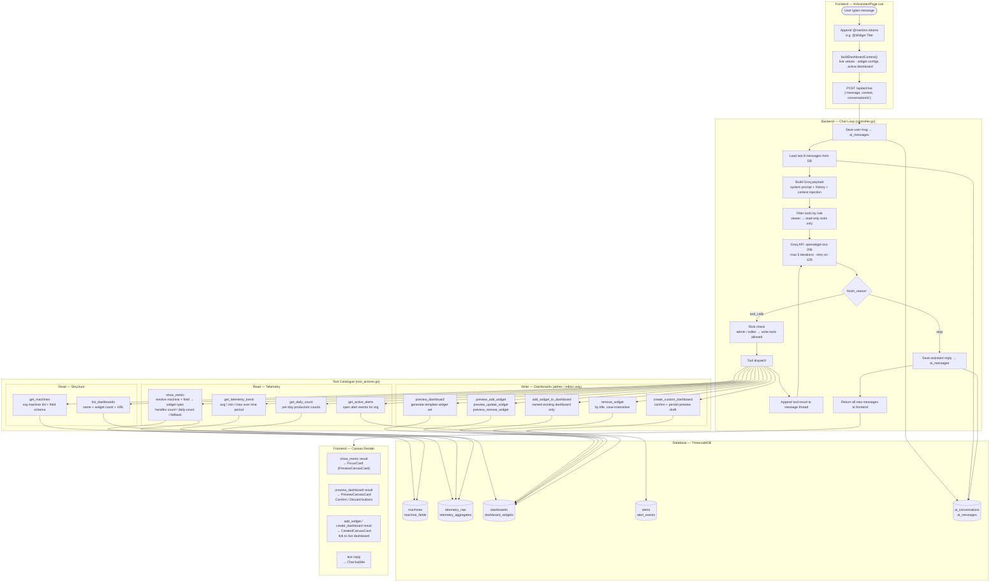

# AI Module — Architecture & Flow

IotVision AI is a Groq-backed agentic loop that reads live telemetry and manages dashboards via tool calls. This document covers the full flow from user input to frontend rendering.

---

## Full Architecture Diagram

---

## Key Design Decisions

| Decision | Reason |
|----------|--------|
| Max 5 Groq iterations per request | Prevents infinite tool-call loops; forces summary after one chained round (i ≥ 1 → tools = nil) |
| History capped at 8 messages | Groq prompt-cache friendly; stable system+tools prefix stays cached |
| `show_metric` always required for live values | Context values are snapshot-in-time; calling the tool guarantees fresh data |
| Role-check at dispatch layer | Viewer token cannot trigger any write tool even if model hallucinates a write call |
| `buildDashboardContext()` sends current telemetry values | Model sees live sensor state so it can reason about thresholds without extra tool calls |
| Preview draft stored in DB (not frontend state) | Survives page refresh; AI page restores in-progress dashboard composition |
| Tool result reconstruction from `ai_messages` | Groq requires paired `assistant tool_calls` + `tool` messages in history; DB stores them as a single row |

---

## Tool Permission Matrix

| Tool | viewer | editor | admin |
|------|--------|--------|-------|
| get_machines, list_dashboards | ✓ | ✓ | ✓ |
| show_metric, get_telemetry_trend, get_daily_count | ✓ | ✓ | ✓ |
| get_active_alerts | ✓ | ✓ | ✓ |
| preview_* | — | ✓ | ✓ |
| add_widget_to_dashboard, remove_widget | — | ✓ | ✓ |
| create_custom_dashboard | — | ✓ | ✓ |
