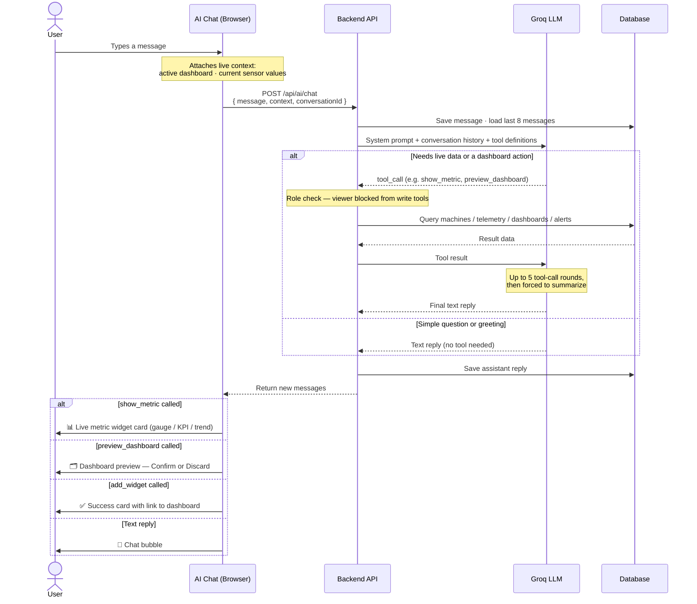
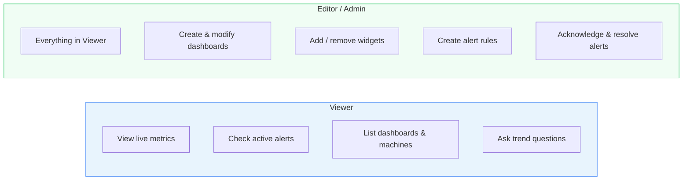

# IotVision AI — Overview & Flow

> A conversational assistant built into the dashboard. Ask questions in plain language,
> get live data, create dashboards, and manage alerts — without touching any configuration UI.

---

## What the AI Can Do

### 📊 View Live Sensor Data
Ask for any machine metric by name. The AI instantly renders a live widget card —
gauge, KPI value, or trend chart — directly in the chat canvas.

### 🗂️ Create Dashboards
Describe what you need ("a dashboard for CW-01 production"). The AI generates a
full dashboard preview with appropriate widgets. You confirm with one click to save it.

### ✏️ Modify Existing Dashboards
Add or remove widgets from any named dashboard without opening the editor.
Just tell the AI which dashboard and what you want changed.

### 🔔 Manage Alerts
Check what alerts are currently firing, acknowledge them, or resolve them —
all from the chat window.

### 📈 Analyze Trends
Ask for averages, minimums, or maximums over any time period.
The AI queries the historical sensor archive and replies in plain text.

### 🏭 Production Counts
View per-day production counts per machine, with configurable time buckets and SKU filters.

---

## What the AI Cannot Do

| Limitation | Reason |
|------------|--------|
| Access another organization's data | All queries are org-scoped at the backend |
| Modify dashboards if you are a **Viewer** | Write tools are blocked at the API layer for viewer accounts |
| Create new machines or sensor fields | Outside the AI module scope — done through the Machines page |
| Answer metric questions without calling a tool | Live sensor values are never stored in the chat; the AI always fetches fresh data |

---

## How It Works — Sequence Diagram

The diagram below shows what happens from the moment you press Send to the moment a widget appears on screen.

---

## Example Interactions

| User says | AI calls | What you see |
|-----------|----------|--------------|
| "Show me the speed of CW-01" | `show_metric` | Live gauge card for CW-01 speed |
| "What's the production count for CW-01?" | `show_metric` (daily-count) | Daily count widget card |
| "Create a production dashboard for CW-01" | `preview_dashboard` | Full dashboard preview with Confirm button |
| "Add a weight widget to CW-01 Overview" | `add_widget_to_dashboard` | Confirmation card + link to updated dashboard |
| "Are there any active alerts right now?" | `get_active_alerts` | Plain-text list of open alert events |
| "What was the average temperature last hour?" | `get_telemetry_trend` | "Average: 72.4 °C, Min: 68.1, Max: 76.0" |
| "Acknowledge alert #abc123" | `manage_alert_event` | "Alert acknowledged." |
| "Remove the pressure widget from CW-01 Overview" | `remove_widget` | Confirmation that widget was removed |

> **Note:** The AI works in both **English and Thai**. You can switch languages mid-conversation.

---

## Role & Permission Summary

---

## Technical Summary (for developers)

| Component | Detail |
|-----------|--------|
| LLM | Groq — `openai/gpt-oss-20b` (best Thai intent, prompt-cached) |
| Max tool rounds | 5 per request, then forced to plain-text summary |
| Conversation history | Last 8 messages sent to LLM per request |
| Context injection | Frontend sends live widget values + active dashboard state |
| Role enforcement | Backend blocks write tools for `viewer` role at dispatch layer |
| Persistence | Conversations + messages stored in `ai_conversations` / `ai_messages` |
| Dashboard drafts | Preview state saved in DB — survives page refresh |
